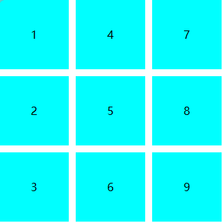

[[toc]]

## CSS {#css}

### 三栏布局 {#three-columns}

**要求**

分为左、中、右三部分，高度均为屏幕高度，左边部分宽度为200px，另外两部分等分剩下的页面宽度。

**实现**

```html
<html>
<head></head>
<body>
<div class="container">
    <aside class="left">Left</aside>
    <div class="wrapper">
        <article class="middle">Middle</article>
        <article class="right">Right</article>
    </div>
</div>
</body>
</html>
```

```less
.clearfix() {
    &:after {
        content: '';
        clear: both;
        display: block;
        height: 0;
        opacity: 0;
        visibility: hidden;
    }
    html, body, div, aside, article {
        margin: 0;
        padding: 0;
    }
    html, body, .container, .left, .wrapper, .middle, .right {
        height: 100%;
    }
    .container {
        padding-left: 200px;
        .clearfix();
        
        .left {
            float: left;
            width: 200px;
            margin-left: -200px;
            background-color: skyblue;
        }
        
        .wrapper {
            float: left;
            width: 100%;
            
            .middle, .right {
                float: left;
                width: 50%;
            }
            .middle {
                background-color: gray;
            }
            .right {
                background-color: yellow;
            }
        }
    }
}
```

### input框加入disabled属性后字体颜色变淡 {#input-disabled-color}

```css
input[disabled] {
    opacity: 1;
}
```

### z-index {#z-index}

建议使用CSS预处理器语言的情况下，对所有涉及z-index的属性的值放在一个文件中统一进行管理。这个主意是从饿了么前端团队代码风格指南中看到的。另外补充一下，应该将同一条直系链里同一层级的元素的z-index分类到一起进行管理。因为不同层级或者非直系链里的同一层级的元素是无法直接根据z-index来判断元素前后排列顺序的。

### 图片在父元素中水平、垂直居中 {#center-vertical-horizontal}

**方案1:（flex布局）**

```less
.parent {
    display: flex;
    align-items: center;
    justify-content: center;
}
```

**方法2（使用absolute绝对定位）**

```less
.parent {
    position: relative;
    display: block;

    .img {
        position: absolute;
        top: 50%;
        left: 50%;
        transform: translate(-50%, -50%);
    }
}
```

**方法3（使用table-cell）**

```less
.parent {
    display: table-cell;
    // width要写得大一点，以撑满容器之外部容器的宽度
    width: 3000px;
    text-align: center;
    vertical-align: middle;
    
    .img {
        display: inline-block;
        vertical-align: middle;
    }
}
```

**方法4（如果父元素的高度为已知的定值，使用line-height实现）**

```less
.parent {
    display: block;
    text-align: center;
    height: 300px;
    line-height: 300px;

    .img {
        display: inline-block;
    }
}
```

**方法5（写死间距）**

```less
.parent {
    display: block;
    
    .img {
        display: block;
        height: 100px;
        margin: 150px auto 0;
    }
}
```

**方案6（写死定位）**

```less
.parent {
    position: relative;
    display: block;
    width: 600px;
    height: 400px;

    .img {
        position: absolute;
        width: 100px;
        height: 300px;
        top: 50px;
        left: 250px;
    }
}
```

**方案7（撑开外部容器）**

```less
.parent {
    // 包围内部元素
    display: inline-block;
    
    .img {
        // 用来撑开父元素
        padding: 30px 20px;
    }
}
```

**方案8（作为背景图）**

```less
.parent {
    display: block;
    height: 300px;
    background: transparent url('./example.png') scroll no-repeat center center;
    background-size: 100px 200px;
}
```

### 弹性盒（Flexible Box）模型 {#flexible-box}

justify-content：

- flex-start：默认值，伸缩项目向一行的起始位置靠齐；
- flex-end：伸缩项目向一行的结束位置靠齐；
- center：项伸缩项目向一行的中间位置靠齐；
- space-between：伸缩项目会平均地分布在行里。第一个伸缩项目一行中的最开始位置，最后一个伸缩项目在一行中最终点位置；
- space-around：伸缩项目会平均地分布在行里，两端保留一半的空间；
- initial：设置该属性为它的默认值；
- inherit：从父元素继承该属性。

align-items：

- stretch：默认值，项目被拉伸以适应容器；
- center：项目位于容器的中心；
- flex-start：项目位于容器的开头；
- flex-end：项目位于容器的结尾；
- baseline：项目位于容器的基线上；
- initial：设置该属性为它的默认值；
- inherit：从父元素继承该属性。

### 弹性盒实现竖向九宫格 {#flexbox-vertical-sudoku}

**要求**

使用flexbox布局将9个格子排列成3*3的九宫格，且第一列排完才排第二列。



```html
<html>
<head></head>
<body>
    <section class="boxes-wrapper">
        <div class="box">1</div>
        <div class="box">2</div>
        <div class="box">3</div>
        <div class="box">4</div>
        <div class="box">5</div>
        <div class="box">6</div>
        <div class="box">7</div>
        <div class="box">8</div>
        <div class="box">9</div>
    </section>
</body>
</html>
```

**实现**

```less
body {
    margin: 0;
}
.boxes-wrapper {
    display: flex;
    flex-direction: column;
    align-items: flex-start;
    justify-content: flex-start;
    flex-wrap: wrap;
    gap: 10px;
    width: 320px;
    height: 320px;

    .box {
        background-color: aqua;
        width: 100px;
        height: 100px;
        text-align: center;
        line-height: 100px;
    }
}
```

### 清除浮动的原理 {#css-clearfix}

清除浮动使用clear: left/right/both。业界常用的.clearfix也是这么做的，只不过是把该样式写进了父元素的:after伪元素中，并加了opacity: 0; display: block; height: 0; visibility: hidden;等使伪元素不可见。

不清除浮动但包围浮动元素的方法有：
为浮动元素的父元素添加overflow: hidden、或将父元素也浮动起来等使父元素形成**BFC（Block Formatting Context）**的方式，但这些方式在应用上没有.clearfix这种方式理想。

### 简述position属性各个值的区别 {#css-position}

fixed：类似absolute，但是是相对浏览器窗口而非网页页面进行定位。

absolute：相对最近的position值非static的外层元素进行定位。

relative：相对自身在文档流中的原始位置进行定位。

static：position默认值，即元素本身在文档流中的默认位置（忽略top、bottom、left、right和z-index声明）。

inherit：继承父元素position属性的值。

### 边距塌陷及其修复 {#margin-collapse}

竖直方向上相接触的margin-top、margin-bottom会塌陷，若二者均为正/负值，取其绝对值大者；若二者中一负一正，取二者之和。

### 高性能动画 {#animation}

CSS动画会比JS动画的性能更好，JS动画的优势主要在于
- 更具定制性（毕竟JS比CSS更可编程）；
- 更易实现对低端浏览器的兼容。

当然，大部分业务中，主要还是使用CSS动画的，对低端浏览器进行降级就可以了（保证页面可读可操作就可以了，增加老旧设备的性能负担不是好事情）。

几个注意点：
- 利用`transform: translate3d(x, y, z);`可借助3D变形开启GPU加速（这会消耗更多内存与功耗，确有性能问题时再考虑）。
- 若动画开始时有闪烁，可尝试：`backface-visibility: hidden; perspective: 1000;`。
- 尽可能少用`box-shadows`和`gradients`这两页面性能杀手。
- CSS动画属性可能会触发整个页面的重排（reflow/relayout）、重绘（repaint）和重组（recomposite）。其中paint通常是最花费性能的，进可能避免使用触发paint的CSS动画属性。所以要尽可能通过修改translate代替修改top/left/bottom/right来实现动画效果，可以减少页面重绘（repaint），前者只触发页面的重组，而后者会额外触发页面的重排和重绘。
- 尽量让动画元素脱离文档流（document flow）中，以减少重排（reflow）。
- 操作DOM的js语句能连着写尽量连着写，这样可借助浏览器的优化策略，将可触发重排的操作放于一个队列中，然后一次性进行一次重排；如果操作DOM的语句中间被其他诸如赋值语句之类的间断了，页面可能就会发生多次重排了。
