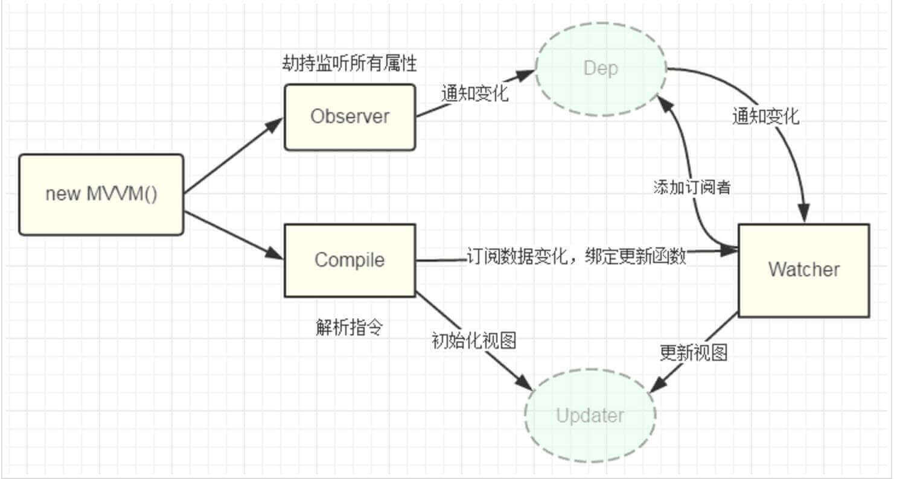

[[toc]]

## 设计模式 {#design-patterns}

设计模式是前人总结出来的一些典型的代码设计方案。了解一下，对提升架构能力会有所帮助。

### 设计模式的分类 {#design-patterns-category}

根据设计模式的参考书《Design Patterns - Elements of Reusable Object-Oriented Software》中所提到的，总共有23种设计模式。
这些模式可以分为三大类：

- 创建型模式（Creational Patterns）：这些设计模式提供了一种在创建对象的同时**隐藏创建逻辑**的方式，而不是使用 new 运算符直接实例化对象。这使得程序在判断针对某个给定实例需要创建哪些对象时更加灵活。
    - 工厂模式（Factory Pattern）
    - 抽象工厂模式（Abstract Factory Pattern）
    - 单例模式（Singleton Pattern）
    - 建造者模式（Builder Pattern）
    - 原型模式（Prototype Pattern）

- 结构型模式（Structural Patterns）：这些设计模式关注类和对象的组合。
    - 适配器模式（Adapter Pattern）
    - 桥接模式（Bridge Pattern）
    - 过滤器模式（Filter、Criteria Pattern）
    - 组合模式（Composite Pattern）
    - 装饰器模式（Decorator Pattern）
    - 外观模式（Facade Pattern）
    - 享元模式（Flyweight Pattern）
    - 代理模式（Proxy Pattern）

- 行为型模式（Behavioral Patterns）：这些设计模式特别关注对象之间的通信。
    - 责任链模式（Chain of Responsibility Pattern）
    - 命令模式（Command Pattern）
    - 解释器模式（Interpreter Pattern）
    - 迭代器模式（Iterator Pattern）
    - 中介者模式（Mediator Pattern）
    - 备忘录模式（Memento Pattern）
    - 观察者模式（Observer Pattern）
    - 状态模式（State Pattern）
    - 空对象模式（Null Object Pattern）
    - 策略模式（Strategy Pattern）
    - 模板模式（Template Pattern）
    - 访问者模式（Visitor Pattern）

另外还有一些由Sun Java Center提出的J2EE 设计模式，这些模式特别关注表示层：

- MVC 模式（MVC Pattern）
- 业务代表模式（Business Delegate Pattern）
- 组合实体模式（Composite Entity Pattern）
- 数据访问对象模式（Data Access Object Pattern）
- 前端控制器模式（Front Controller Pattern）
- 拦截过滤器模式（Intercepting Filter Pattern）
- 服务定位器模式（Service Locator Pattern）
- 传输对象模式（Transfer Object Pattern）

### 设计模式的6大原则 {#design-patterns-principles}

- Open Close Principle：开放封闭原则。面向扩展扩展开放（Open for Extension），面向修改封闭（Closed for Modification）。想要使程序的扩展性好，易于维护和升级，想要使用接口和抽象类。
- Liskov Substitution Principle。里氏代换原则。用子类替换基类。
- Dependence Inversion Principle。依赖倒转原则：针对接口编程，依赖于抽象而不依赖于具体。
- Interface Segregation Principle。接口隔离原则：使用多个隔离的接口，比使用单个接口要好。降低类之间的耦合度。
- Demeter Principle。迪米特法则，又称最少知道原则：一个实体应尽量少地与其他实体之间发生相互作用，使得系统功能模块相对独立。
- Composite Reuse Principle。合成/复用原则是指：尽量使用合成/聚合的方式，而不是使用继承。

### 观察者模式 {#design-pattern-observer}

#### 什么是观察者模式 {#design-pattern-observer-concept}

::: tip 提示
观察者模式（Observer）
通常又被称为**发布-订阅者模式**或**消息机制**，
它定义了对象间的一种一对多的依赖关系，
只要当一个对象的状态发生改变时，
所有依赖于它的对象都得到通知并被自动更新，
解决了主体对象与观察者之间功能的耦合，
即一个对象状态改变给其他对象通知的问题。
:::

下面这段代码就是一种发布-订阅模式：

```javascript
document.querySelector('#btn').addEventListener('click', function () {
    alert('You click this button');
}, false)
```

除了我们常见的 DOM 事件绑定外，观察者模式应用的范围还有很多~

比如 vue2 框架里不少地方都涉及到了观察者模式，比如：

**数据的双向绑定**



利用Object.defineProperty()对数据进行劫持，
设置一个监听器Observer，用来监听所有属性，
如果属性上发上变化了，就需要告诉订阅者Watcher去更新数据，
最后指令解析器Compile解析对应的指令，
进而会执行对应的更新函数，从而更新视图，实现了双向绑定。

**子组件与父组件通信**

Vue中我们通过props完成父组件向子组件传递数据，
子组件与父组件通信我们通过自定义事件即$on、$emit来实现，
其实也就是通过$emit来发布消息，并对订阅者$on做统一处理。

#### 创建一个观察者 {#design-pattern-create-observe}

首先我们需要创建一个观察者对象，它包含一个消息容器和三个方法，分别是：
- on：订阅消息
- off：取消订阅消息
- publish：发送订阅消息

```javascript
const Observe = (function() {
    // 防止消息队列暴露而被篡改，将消息容器设置为私有变量
    let __message = {};
    return {
        // 注册消息接口
        on: function(type, fn) {
            // 如果此消息不存在，创建一个该消息类型
            if (typeof __message[type] === 'undefined') {
                //  将执行方法推入该消息对应的执行队列中
                __message[type] = [fn];
            } else {
                // 如果此消息存在，直接将执行方法推入该消息对应的执行队列中
                __message[type].push(fn);
            }
        },

        // 发布消息接口
        publish: function(type, args) {
            // 如果该消息没有注册，直接返回
            if (!__message[type]) return;
            // 定义消息信息
            const events = {
                type, // 消息类型
                args: args || {} // 参数
            }
            // 遍历执行函数
            for (let i = 0, len = __message[type].length; i < len; i++) {
                // 依次执行注册消息对应的方法
                __message[type][i].call(this, events)
            }
        },

        // 移除消息接口
        off: function(type, fn) {
            // 如果消息执行队列存在
            if (__message[type] instanceof Array) {
                // 从最后一条依次遍历（之所以从最后一个开始遍历，是因为下面会用到splice）
                for (let i = __message[type].length - 1; i >= 0; i--) {
                    // 如果存在该执行函数则移除相应的动作
                    __message[type][i] === fn && __message[type].splice(i, 1);
                }
            }
        }
    }
})();
```

使用：

```javascript
// 订阅消息
Observe.on('say', function (data) {
  console.log(data.args.text);
})
Observe.on('success',function () {
    console.log('success')
});

//发布消息
Observe.publish('say', { text : 'hello world' } )
Observe.publish('success');
```

我们在消息类型为say、success的消息中注册了两个方法，其中有一个接受参数，另一个不需要参数，
然后通过publish发布say和success消息，结果跟我们预期的一样，
控制台输出了 hello world 以及 success。

#### 实现EventBus {#event-bus}

```javascript
class EventBus {
    constructor() {
        this.event = Object.create(null);
    };

    // 注册事件
    on(name, fn) {
        if(!this.event[name]){
            // 一个事件可能有多个监听者
            this.event[name]=[];
        };
        this.event[name].push(fn);
    };

    // 触发事件
    emit(name, ...args) {
        //给回调函数传参
        this.event[name] && this.event[name].forEach(fn => {
            fn(...args)
        });
    };

    // 只被触发一次的事件
    once(name, fn) {
        // 在这里同时完成了对该事件的注册、对该事件的触发，并在最后取消该事件。
        const cb=(...args)=>{
            //触发
            fn(...args);
            //取消
            this.off(name,fn);
        };
        //监听
        this.on(name, cb);
    };

    // 取消事件
    off(name, offCb) {
        if(this.event[name]){
            const index = this.event[name].findIndex((fn)=>{
                return offCb === fn;
            })

            if (index !== -1) {
                this.event[name].splice(index, 1);

                if(!this.event[name].length){
                    delete this.event[name];
                }
            }
        }
    }
}
```

### 单例模式 {#singleton-pattern}

```javascript
// 单例构造函数
function CreateSingleton (name) {
    this.name = name;
    this.getName();
};

// 获取实例的名字
CreateSingleton.prototype.getName = function() {
    console.log(this.name)
};
// 单例对象
const Singleton = (function(){
    var instance;
    return function (name) {
        if(!instance) {
            instance = new CreateSingleton(name);
        }
        return instance;
    }
})();

// 创建实例对象1
const a = new Singleton('a');
// 创建实例对象2
const b = new Singleton('b');

// 返回true
console.log(a===b);
// 返回true
console.log(a.name === b.name)
```
