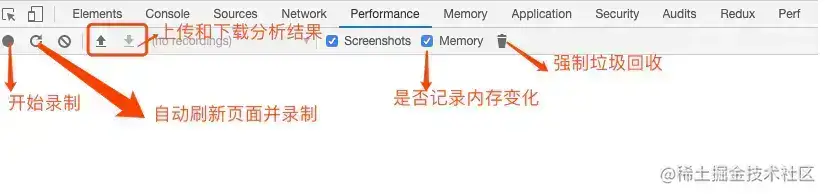

[[toc]]

## JS内存回收机制 {#garbage-collection}

由于字符串、对象和数组没有固定大小，当他们的大小已知时，才能对他们进行动态的存储分配。
JavaScript程序每次创建字符串、数组或对象时，解释器都必须分配内存来存储那个实体。
只要像这样动态地分配了内存，最终都要释放这些内存以便他们能够被再用，
否则，JavaScript的解释器将会消耗完系统中所有可用的内存，造成系统崩溃。

现在各大浏览器通常用采用的垃圾回收有两种方法：标记清除、引用计数。

### 标记清除 {#label-clear}

这是javascript中最常用的垃圾回收方式。当变量进入执行环境时，就标记这个变量为“进入环境”。
从逻辑上讲，永远不能释放进入环境的变量所占用的内存，因为只要执行流进入相应的环境，就可能会用到他们。
当变量离开环境时，则将其标记为“离开环境”。

### 引用计数 {#reference-count}

引用计数的含义是跟踪记录每个值被引用的次数。
当声明了一个变量并将一个引用类型赋值给该变量时，则这个值的引用次数就是1。
相反，如果包含对这个值引用的变量又取得了另外一个值，则这个值的引用次数就减1。
当这个引用次数变成0时，则说明没有办法再访问这个值了，因而就可以将其所占的内存空间给收回来。
这样，垃圾收集器下次再运行时，它就会释放那些引用次数为0的值所占的内存。

该策略容易在循环引用时出现问题。
因为计数记录的是被引用的次数，所以循环引用时计数并不会消除。导致无法释放内存。
IE 9 - 的问题是在环境中bom和dom不是原生的js对象，而是com对象，而com对象的垃圾收集机制是引用计数策略。
换句话说，只要ie中存在着com对象，就会存在循环引用的问题。比如

```javascript
var element=document.getElementById("someElement");
var myobject=new Object();
myobject.element=element;
element.someObject=myobject;
```

这个例子中js对象和dom对象之间建立了循环引用，由于存在这个循环引用，即使将com对象从页面移除，也永远不会被回收。为避免类似问题，应该在不使用它们的时候手动把js对象和com对象断开。

```javascript
myobject.element = null;
element.someObject = null;
```

如果要解决循环引用带来的内存泄露问题，我们只需要把循环引用中的变量设为null即可。将变量设置为null意味着切断变量与它此前引用的值之间的联系。当垃圾收集器下次运行时，就会删除这些值并回收他们占用的内存。

### 内存溢出 {#memory-overflow}

内存溢出一般是指执行程序时，程序会向系统申请一定大小的内存，当系统现在的实际内存少于需要的内存时，就会造成内存溢出。

内存溢出造成的结果是先前保存的数据会被覆盖或者后来的数据会没地方存。

### 内存泄漏 {#memory-leak}

不再用到的内存，没有及时释放，就叫做内存泄漏（memory leak）。
内存泄漏是指程序执行时，一些变量没有及时释放，一直占用着内存
而这种占用内存的行为就叫做内存泄漏。

作为一般的用户，根本感觉不到内存泄漏的存在。真正有危害的是内存泄漏的堆积，这会最终消耗尽系统所有的内存。从这个角度来说，一次性内存泄漏并没有什么危害，因为它不会堆积。

内存泄漏如果一直堆积，最终会导致内存溢出问题。

### 内存泄漏发生的原因 {#memory-leak-cause}

#### 全局变量 {#memory-leak-global-variable}

除了常规设置了比较大的对象在全局变量中，还可能是意外导致的全局变量，如：

```javascript
function foo(arg) {
    bar = "this is a hidden global variable";
}
```

在函数中，没有使用 var/let/const 定义变量，这样实际上是定义在window上面，变成了window.bar。再比如由于this导致的全局变量：

```javascript
function foo() {    
    this.bar = "this is a hidden global variable";
}
foo()
```

这种函数，在window作用域下被调用时，函数里面的this指向了window,执行时实际上为window.bar=xxx,这样也产生了全局变量。

#### 计时器中引用没有清除 {#memory-leak-clear-reference}

先看如下代码：

```javascript
var someData = getData();
setInterval(function() {    
    var node = document.getElementById('Node');
    if(node) {
        node.innerHTML = JSON.stringify(someData);
    }
}, 1000);
```

这里定义了一个计时器，每隔1s把一些数据写到Node节点里面。但是当这个Node节点被删除后，这里的逻辑其实都不需要了，可是这样写，却导致了计时器里面的回调函数无法被回收，同时，someData里的数据也是无法被回收的。

#### 闭包

```javascript
var theThing = null;
var replaceThing = function () {  
    var originalThing = theThing;  
    var unused = function () {
       if (originalThing)  console.log("hi");
    };
    theThing = {
        longStr: new Array(1000000).join('*'), 
        someMethod: function () {
           console.log(originalThing);
        }
    };
};
setInterval(replaceThing, 1000);
```

当这段代码反复运行，就会看到内存占用不断上升，垃圾回收器（GC）并无法降低内存占用。

### 闭包与内存泄漏 {#closure-memory-leak}

内存泄露是指你「用不到」（访问不到）的变量，依然占居着内存空间，不能被再次利用起来。闭包里面的变量就是我们需要的变量，不能说是内存泄露。

闭包是一个非常强大的特性，但人们对其也有诸多误解。一种耸人听闻的说法是闭包会造成内存泄露，所以要尽量减少闭包的使用。

局部变量本来应该在函数退出的时候被解除引用，但如果局部变量被封闭在闭包形成的环境中，那么这个局部变量就能一直生存下去。从这个意义上看，闭包的确会使一些数据无法被及时销毁。使用闭包的一部分原因是我们选择主动把一些变量封闭在闭包中，因为可能在以后还需要使用这些变量，把这些变量放在闭包中和放在全局作用域，对内存方面的影响是一致的，这里并不能说成是内存泄露。如果在将来需要回收这些变量，我们可以手动把这些变量设为 null。

跟闭包和内存泄露有关系的地方是，使用闭包的同时比较容易形成循环引用，如果闭包的作用域链中保存着一些DOM节点，这时候就有可能造成内存泄露。但这本身并非闭包的问题，也并非 JavaScript的问题。**在 IE浏览器中，由于BOM和DOM中的对象是使用 C++以COM对象的方式实现的，而COM对象的垃圾收集机制采用的是引用计数策略。在基于引用计数策略的垃圾回收机制中，如果两个对象之间形成了循环引用，那么这两个对象都无法被回收，但循环引用造成的内存泄露在本质上也不是闭包造成的。**

同样，如果要解决循环引用带来的内存泄露问题，我们只需要把循环引用中的变量设为null即可。将变量设置为null意味着切断变量与它此前引用的值之间的连接。当垃圾收集器下次运行时，就会删除这些值并回收它们占用的内存。

### 内存泄漏的识别方法 {#memory-leak-recognize}

**利用chrome 时间轴记录可视化内存泄漏**

Performance(时间轴)能够面板直观实时显示JS内存使用情况、节点数量、监听器数量等。

打开 chrome 浏览器，调出调试面板(DevTools),点击Performance选项(低版本是Timeline)，勾选Memory复选框。一种比较好的做法是使用强制垃圾回收开始和结束记录。在记录时点击 Collect garbage 按钮 (强制垃圾回收按钮) 可以强制进行垃圾回收。所以录制顺序可以这样：开始录制前先点击垃圾回收-->点击开始录制-->点击垃圾回收-->点击结束录制。面板介绍如图：



录制结果如图:


首先，从图中我们可以看出不同颜色的曲线代表的含义，这里主要关注JS堆内存、节点数量、监听器数量。鼠标移到曲线上，可以在左下角显示具体数据。在实际使用过程中，如果您看到这种 JS 堆大小或节点大小不断增大的模式，则可能存在内存泄漏。

**使用堆快照发现已分离 DOM 树的内存泄漏**

只有页面的 DOM 树或 JavaScript 代码不再引用 DOM 节点时，DOM 节点才会被作为垃圾进行回收。如果某个节点已从 DOM 树移除，但某些 JavaScript 仍然引用它，我们称此节点为“已分离”，已分离的 DOM 节点是内存泄漏的常见原因。

同理，调出调试面板，点击Memory，然后选择Heap Snapshot，然后点击进行录制。录制完成后，选中录制结果，在 Class filter 文本框中键入 Detached，搜索已分离的 DOM 树。以这段代码为例：

```html
<html>
    <head></head>
    <body>
        <button id="createBtn">增加节点</button>
        <script> 
            var detachedNodes;
            function create() {
                var ul = document.createElement('ul');
                for (var i = 0; i < 10; i++) {    
                    var li = document.createElement('li');
                    ul.appendChild(li);
                }
                detachedTree = ul;
            }
            document.getElementById('createBtn').addEventListener('click', create);
        </script>
    </body>
</html>
```

点击几下，然后记录。可以得到以下信息：


如上图，点开节点，可以看到下面的引用信息，上面可以看出，有个HTMLUListElement(ul节点)被window.detachedTree 引用。再结合代码，原来是没有加var/let/const声明，导致其成了全局变量,所以DOM无法释放。

### 避免内存泄漏的方法 {#avoid-memory-leak}

1、少用全局变量，避免意外产生全局变量

2、使用闭包要及时注意，有Dom元素的引用要及时清理。

3、计时器里的回调没用的时候要记得销毁。

4、为了避免疏忽导致的遗忘，我们可以使用 WeakSet 和 WeakMap结构，它们对于值的引用都是不计入垃圾回收机制的，表示这是弱引用。举个例子：

```javascript
const wm = new WeakMap();
const element = document.getElementById('example');
 
wm.set(element, 'some information');
wm.get(element) // "some information"
```

这种情况下，一旦消除对该节点的引用，它占用的内存就会被垃圾回收机制释放。Weakmap 保存的这个键值对，也会自动消失。

基本上，如果你要往对象上添加数据，又不想干扰垃圾回收机制，就可以使用 WeakMap。
