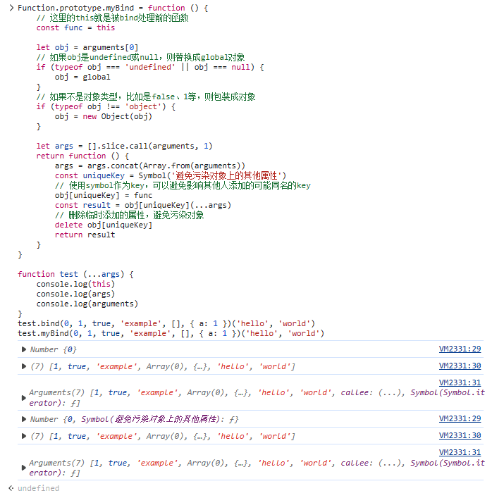

[[toc]]

## JavaScript {#javascript}

### JavaScript数据类型 {#js-data-types}

- 基本数据类型（primitive data type）：Undefined、Null、Boolean、Number、String、Symbol、BigInt。
- 对象数据类型

参考：[BigInt](https://developer.mozilla.org/en-US/docs/Web/JavaScript/Reference/Global_Objects/BigInt)

::: tip BigInt
bigint 是基础数据类型。通过在整数末尾添加 `n`，或者通过调用 `BigInt(传入整数或字符串)`，可以创建一个 `bigint` 类型的值。

```javascript
const previouslyMaxSafeInteger = 9007199254740991n;

// 十进制
const alsoHuge = BigInt(9007199254740991);
// 9007199254740991n

// 十进制
const hugeString = BigInt("9007199254740991");
// 9007199254740991n

// 十六进制
const hugeHex = BigInt("0x1fffffffffffff");
// 9007199254740991n

// 八进制
const hugeOctal = BigInt("0o377777777777777777");
// 9007199254740991n

// 二进制
const hugeBin = BigInt(
  "0b11111111111111111111111111111111111111111111111111111",
);
// 9007199254740991n
```

注意：
- 因为类型不同，`10n === 10`的值为 `false`（`10n == 10`的值为 `true`）。
- `bigint` 值不支持用 `Math` 对象的原生方法进行处理。
- `typeof 1n === "bigint";` 为 `true`。
- `typeof Object(1n) === "object";` 为 `true`。
:::

### call、apply和bind {#call-apply-bind}

`call`：`func.call(obj, param1, param2)`将`func`函数应用于`obj`对象上，此时`func`函数内部的`this`指向`obj`对象。

`apply`：与`call`类似，只是所有要传入的数据都是以**数组**的形式放到第二个参数里的，如`func.apply(obj, [arg1, arg2])`。

`bind`：与`call`类似，但*不会立即执行*，而是生成了一个**新函数**，新函数的`this`指向的是我们传入的`obj`。

::: tip 关于第一个参数
`call`、`apply`、`bind`的第一个参数，如果传了null或者undefined会被替换为global对象（浏览器环境下的话就是window对象），如果传的是其他基础类型（比如1、'a'、false等）则会被转换成基础类型对应的对象。
:::

```javascript
function test (...args) {
    console.log(this)
    console.log(args)
}

console.log('call')
test.call('a', 1, true, 'example', [], { a: 1 })

console.log('apply')
test.apply(false, [1, true, 'example', [], { a: 1 }])

console.log('bind')
// 注意末尾有个()表示直接对bind生成的函数进行调用，并且这个调用中也传入了几个参数
test.bind(0, 1, true, 'example', [], { a: 1 })('hello', 'world')
```

执行结果见下图：


#### 实现bind {#bind}

::: tip core-js的实现
core-js库中bind的实现见：[https://github.com/zloirock/core-js/blob/master/packages/core-js/internals/function-bind.js](https://github.com/zloirock/core-js/blob/master/packages/core-js/internals/function-bind.js)
:::

我们自己实现一个，注意：

- 调用bind后生成的是一个新函数（新函数名为`newFn`）。
- 调用bind时传的第二个及后续参数会和调用新函数`newFn`时传入的参数合并作为入参。
- 调用bind时会指定newFn中的this指向。

```javascript
Function.prototype.myBind = function () {
    // 这里的this就是被bind处理前的函数
    const func = this

    let obj = arguments[0]
    // 如果obj是undefined或null，则替换成global对象
    if (typeof obj === 'undefined' || obj === null) {
        obj = global
    }
    // 如果不是对象类型，比如是false、1等，则包装成对象
    if (typeof obj !== 'object') {
        obj = new Object(obj)
    }

    let args = [].slice.call(arguments, 1)
    return function () {
        args = args.concat(Array.from(arguments))
        const uniqueKey = Symbol('避免污染对象上的其他属性')
        // 使用symbol作为key，可以避免影响其他人添加的可能同名的key
        obj[uniqueKey] = func
        const result = obj[uniqueKey](...args)
        // 删除临时添加的属性，避免污染对象
        delete obj[uniqueKey]
        return result
    }
}

function test (...args) {
    console.log(this)
    console.log(args)
    console.log(arguments)
}
test.bind(0, 1, true, 'example', [], { a: 1 })('hello', 'world')
test.myBind(0, 1, true, 'example', [], { a: 1 })('hello', 'world')
```

实现结果如下：



### forEach、for-of、for-in循环 {#for-loop}

```javascript
// forEach循环无法通过break或return语句进行中断
arr.forEach(function (elem) {
    console.log(elem)
})

/**
 * for-in循环实际上是为循环对象的可枚举（enumerable）属性而设计的，
 * 也能循环数组，不过不建议，因为key变成了数字
 */
const obj = { a: 1, b: 2, c: 3 }
for (const p in obj) {
    console.log(`obj.${p} = ${obj[p]}`)
}
// 上面的代码依次输出内容如下：
// obj.a = 1
// obj.b = 2
// obj.c = 3

/**
 * for-of能循环很多东西，包括字符串、数组、map、set、DOM collection等等
 * （但是不能遍历对象，因为对象不是iterable可迭代的）
 */
const iterable = [1, 2, 3]
for (const value of iterable) {
    console.log(value)
}
```

基本上for in用于大部分常见的由key-value对构成的对象上以遍历对象内容。但是for in在遍历数组对象时并不方便，这时候用for of会很方便。

### IIFE（Immediately-Invoked Function Expression）与分号 {#iife}

如果习惯写完一条语句后不加分号的写法，碰到需要写IIFE（自执行函数）的时候容易踩到下面的坑：

``` javascript
const a = 1
(function () {})()
```

上述代码会报错，因为上一行的1会和这一行一起被程序解析成`const a = 1(function () {})()`，然后报错说1不是函数。

这时候可以这样写：

``` javascript
const a = 1
void function () {}()

// 或
const a = 1
void (function () {})()

// 或者下面这种方式，但据说会多一次逻辑运算
const a = 1
!function () {}()
```

### JS中的new {#js-new}

使用常规的{}花括号可以创建一个对象，但是当我们想要创建相似的对象时，如果还使用{}就会产生很多冗余的代码，所以为了方便，js就设计了new关键字，我们可以对构造函数使用new操作符来创建一类相似的对象。

#### 构造函数 {#js-new-constructor}

构造函数在技术上是常规函数。不过有两个约定：

- 它们的命名通常以大写字母开头（不这么做代码逻辑上是没问题的，但这是约定俗成的习惯）。
- 它们只能由`new`操作符来执行（实际上你也可以直接调用，但是这时它就不是**构造函数**了，只是普通的常规函数了）。

```javascript
function User(name) {
    this.name = name;
    this.isAdmin = false;
}

const user = new User("Jack");

console.log(user.name); // Jack
console.log(user.isAdmin); // false
```

当一个函数被使用 new 操作符执行时，它会经历以下步骤：

- 一个新的空对象被创建并赋值给 `this`。
- 函数体执行。通常它会修改 `this`，为其添加新的属性。
- 返回 `this` 对象。

换句话说，执行 `new User(...)` 时，做的就是类似下面的事情：

```javascript
function User(name) {
  // this = {};（隐式创建）

  // 添加属性到 this
  this.name = name;
  this.isAdmin = false;

  // return this;（隐式返回）
}
```

所以 `const user = new User("Jack")` 的语句可以等价为以下语句：

```javascript
const user = {
  name: "Jack",
  isAdmin: false
};
```

现在，如果我们想创建其他用户，我们可以调用 `new User("Ann")`、`new User("Alice")` 等。代码量比每次都使用字面量创建要少，而且更易阅读。

这就是构造器的主要目的 —— 实现可重用的对象创建代码。

::: tip 提示
从技术上讲，任何函数（除了箭头函数，它没有自己的 `this`）都可以用作构造器。即可以通过 new 来运行，它会执行上面的算法。“首字母大写”是一个共同的约定，以明确表示一个函数将被使用 `new` 来运行。
:::

#### new.target {#new-target}

在一个函数内部，我们可以使用 `new.target` 属性来检查它是否被使用 `new` 关键字进行调用了。

常规调用时，它为 `undefined`。使用 `new` 调用时，则等于该函数：

```javascript
function User() {
    console.log(new.target);
    console.log(new.target === User);
}

// 直接调用（不使用 `new` 关键字）：
User(); // undefined, false

// 使用 `new` 关键字调用
new User(); // function User { ... }, true
```

我们也可以让常规调用和使用 `new` 关键字调用做相同的工作，像这样：

```javascript
function User(name) {
    if (!new.target) {
        return new User(name);
    }

    this.name = name;
}

const john = User("John");
console.log(john.name);
```

这种方法有时被用在库中以使语法更加灵活。这样其他人在调用函数时，无论是否使用了 `new`，程序都能工作。

不过，到处都使用它并不是一件好事，因为省略了 `new` 使得很难直观地知道代码在干啥。而通过使用 `new` 关键字，我们都知道代码正在创建一个新对象。

#### 构造函数的 `return` {#constructor-return}

通常，构造器函数内没有 `return` 语句。它们的任务是将所有必要的东西写入 `this`，并自动返回 `this`。

但是，如果构造器函数内有 `return` 语句，那么：

- 如果 `return` 返回的是一个对象，则返回这个对象，而不是 `this`。
- 如果` return` 返回的是一个原始类型，则忽略 `return`语句，继续返回 `this`。

换句话说，带有对象的 `return` 语句返回该对象，其他情况下都返回 `this`。

例如，这里 `return` 通过返回一个对象覆盖了 `this`：

```javascript
function BigUser() {
    this.name = "小明";
    return { name: "小王" }; 
}

console.log(new BigUser().name);  // 小王
```

这里有一个 `return` 为 `undefined` 的例子（或者我们可以在它之后放置一个原始类型，结果是一样的）：

```javascript
function SmallUser() {
    this.name = "小小王";
    return;
}

console.log(new SmallUser().name);  // 小小王
```

通常构造器函数里都是没有 `return `语句的，这里只做了解即可。

::: tip 省略括号
顺便说一下，如果没有参数，我们可以省略 `new` 后的括号：

```javascript
const user = new User;
// 等同于
const user = new User();
```
这里省略括号不被认为是一种**“好风格”**，但是规范允许使用该语法。
:::

#### 构造器中的方法 {#method-in-new-constructor}

使用构造函数来创建对象会带来很大的灵活性。构造函数可能有一些参数，这些参数定义了如何构造对象。

当然，我们不仅可以在 `this` 上添加属性，还可以添加方法。

```javascript
function User(name) {
    this.name = name;

    this.sayHi = function () {
        console.log(`我的名字是: ${this.name}`);
    };
}

const user = new User("李白");

user.sayHi(); // 我的名字是李白
```

#### 手写一个new {#realize-js-new}

**实现**

```javascript
function myNew() {
    // 1、创建一个空对象
    const obj = {}
    // 获取构造方法
    const constructor = [].shift.call(arguments)

    // 2、将新对象的原型指向 构造方法的prototype对象上
    obj.__proto__ = constructor.prototype

    /**
     * 3、获取到构造方法的返回值
     * 如果原先构造方法有返回值，且是对象，那么原始的new会把这个对象返回出去
     * （基本类型会忽略）
     * 
     * 这里的arguments的第一个参数已经在最开始被shift了，
     * 所以剩下的参数全都是构造方法需要的值
     */
    const ret = constructor.apply(obj, arguments)

    // `(ret || obj)` 是为了判断 `null`，当为 `null` 时，也返回新对象
    return typeof ret === 'object' ? (ret || obj) : obj
}
```

**使用**

```javascript
function Person(name, age) {
    this.name = name
    this.age = age
}

const p = myNew(Person, 'cheny', 28)
// true
console.log(p instanceof Person);
```

### JS中除了使用new关键字还有什么方法可以创建对象？ {#create-object-except-new}

可以通过 `Object.create(proto, [, propertiesObject])` 实现。详见：[Object.create()](https://developer.mozilla.org/zh-CN/docs/Web/JavaScript/Reference/Global_Objects/Object/create)

`Object.create()` 静态方法以一个现有对象作为原型，创建一个新对象。

```javascript
const person = {
  isHuman: false,
  printIntroduction: function () {
    console.log(`My name is ${this.name}. Am I human? ${this.isHuman}`);
  },
};

const me = Object.create(person);

// `name` 是 `me` 的属性，不是 `person` 的属性
me.name = 'Matthew';
// 继承过来的属性值可以被重写
me.isHuman = true;

// 打印内容: "My name is Matthew. Am I human? true"
me.printIntroduction();
```

**用 `Object.create()` 实现类式继承**

```javascript
// Shape——父类
function Shape() {
  this.x = 0;
  this.y = 0;
}

// 父类方法
Shape.prototype.move = function (x, y) {
  this.x += x;
  this.y += y;
  console.info("Shape moved.");
};

// Rectangle——子类
function Rectangle() {
  Shape.call(this); // 调用父类构造函数。
}

// 子类继承父类
Rectangle.prototype = Object.create(Shape.prototype, {
  // 如果不将 Rectangle.prototype.constructor 设置为 Rectangle，
  // 它将采用 Shape（父类）的 prototype.constructor。
  // 为避免这种情况，我们将 prototype.constructor 设置为 Rectangle（子类）。
  constructor: {
    value: Rectangle,
    enumerable: false,
    writable: true,
    configurable: true,
  },
});

const rect = new Rectangle();

console.log("rect 是 Rectangle 类的实例吗？", rect instanceof Rectangle); // true
console.log("rect 是 Shape 类的实例吗？", rect instanceof Shape); // true
rect.move(1, 1); // 打印 'Shape moved.'
```

**使用 `Object.create()` 的 `propertyObject` 参数**

Object.create() 方法允许对对象创建过程进行精细的控制。实际上，字面量初始化对象语法是 Object.create() 的一种语法糖。使用 Object.create()，我们可以创建具有指定原型和某些属性的对象。请注意，第二个参数将键映射到属性描述符，这意味着你还可以控制每个属性的可枚举性、可配置性等，而这在字面量初始化对象语法中是做不到的。

```javascript
o = {};
// 等价于：
o = Object.create(Object.prototype);

o = Object.create(Object.prototype, {
  // foo 是一个常规数据属性
  foo: {
    writable: true,
    configurable: true,
    value: "hello",
  },
  // bar 是一个访问器属性
  bar: {
    configurable: false,
    get() {
      return 10;
    },
    set(value) {
      console.log("Setting `o.bar` to", value);
    },
  },
});

// 创建一个新对象，它的原型是一个新的空对象，并添加一个名为 'p'，值为 42 的属性。
o = Object.create({}, { p: { value: 42 } });
```

使用 `Object.create()`，我们可以创建一个原型为 `null` 的对象。在字面量初始化对象语法中，相当于使用 `__proto__` 键。

```javascript
o = Object.create(null);
// 等价于：
o = { __proto__: null };
```

你可以使用 `Object.create()` 来模仿 `new` 运算符的行为。

```javascript
function Constructor() {}
o = new Constructor();
// 等价于：
o = Object.create(Constructor.prototype);
```

当然，如果 `Constructor` 函数中有实际的初始化代码，那么 `Object.create()` 方法就无法模仿它。

### 判断JS全局变量是否存在 {#global-variable-exist}

``` javascript
if (typeof localStorage !== 'undefined') {
  // 此时访问localStorage不会出现引用错误
}
```

或者

``` javascript
// 浏览器端全局处window/this/self三者彼此全等
if ('localStorage' in self) {
  // 此时访问 localStorage 绝对不会出现引用错误
}
```

注意二者的区别：

``` javascript
var a // 或 var a = undefined
'a' in self // true
typeof a // 'undefined'
```

- `var a = undefined` 或者 `var a` 相当于是给 `window` 对象添加了 `a` 属性，但是未赋值，即 `window.a === undefined` 为 `true`
- `typeof a` 就是返回其变量类型，未赋值或者声明类型为 `undefined` 的变量，其类型就是 `undefined`

### 判断2个对象是否**相等**（不是**相同**） {#object-equality}

**前提假设**

不是只根据引用地址来判断，只要两个对象的键值对的值对的上就认为是相等的，比如分开创建的 `{ a: 1 }` 和 `{ a: 1 }`，被认为是相等的对象。

**实现**

```javascript
function isObjectEqual (obj1, obj2) {
    if (typeof obj1 !== 'object' || typeof obj2 !== 'object') {
        return obj1 === obj2
    }

    // 如果两个对象指向的是同一个引用地址，则为相同对象
    if (obj1 === obj2) {
        return true
    }

    const keys1 = Object.keys(obj1)
    const keys2 = Object.keys(obj2)

    if (keys1.length !== keys2.length) {
        return false
    }

    if (keys1.length === 0 && keys2.length === 0) {
        return true
    }

    for (let i = 0, len = keys1.length; i < len; i++) {
        if (!isObjectEqual(obj1[keys1[i]], obj2[keys2[i]])) {
            return false
        }
    }

    return true
}
```

### 生成器函数与 `yield` 语句 {#generator-yield}

```javascript
function* hello (name) {
    yield `hello ${name}!`
    yield 'I am glad to meet you!'
    if (0.6 > 0.5) {
        yield `It is a good day!`
    }
    yield 'See you later!'
}

// Generator函数执行后会返回一个迭代器，通过调用next方法依次yield相应的值
const iterator = hello('Yakima')

iterator.next() // 返回{value: "hello Yakima!", done: false}
iterator.next() // 返回{value: "I am glad to meet you!", done: false}
iterator.next() // 返回{value: "It is a good day!", done: false}
iterator.next() // 返回{value: "See you later!", done: false}
iterator.next() // 返回{value: undefined, done: true}
iterator.next() // 返回{value: undefined, done: true}
```

生成器函数（Generator）与常见的函数的差异：
- 通常的函数以 `function` 开始，而生成器函数以 `function*` 开始；
- 在生成器函数内部，`yield` 是一个关键字，和 `return` 有点像。不同点在于，所有函数（包括生成器函数）都只能返回一次，而在生成器函数中可以 `yield` 任意次。`yield` 表达式暂停了生成器函数的执行，然后可以从暂停的地方恢复执行。

常见的函数不能暂停执行，而生成器函数可以，这是两者最大的区别。

### 扩展运算符进行对象拷贝时是浅拷贝 {#spread-operator}

在[Babeljs.io Try it out](https://babeljs.io/repl)上转义的结果是：

```javascript
function _typeof(o) {
    "@babel/helpers - typeof";
    return _typeof = "function" == typeof Symbol && "symbol" == typeof Symbol.iterator
        ? function (o) {
            return typeof o;
        }
        : function (o) {
            return (
                o
                && "function" == typeof Symbol
                && o.constructor === Symbol
                && o !== Symbol.prototype
            )
                ? "symbol"
                : typeof o;
        },
        _typeof(o);
}

function ownKeys(e, r) {
    var t = Object.keys(e);
    if (Object.getOwnPropertySymbols) {
        var o = Object.getOwnPropertySymbols(e);
        r && (o = o.filter(function (r) {
            return Object.getOwnPropertyDescriptor(e, r).enumerable;
        })), t.push.apply(t, o);
    }
    return t;
}

function _objectSpread(e) {
    for (var r = 1; r < arguments.length; r++) {
        var t = null != arguments[r] ? arguments[r] : {};
        r % 2
            ? ownKeys(Object(t), !0).forEach(function (r) {
                _defineProperty(e, r, t[r]);
            })
            : Object.getOwnPropertyDescriptors
                ? Object.defineProperties(e, Object.getOwnPropertyDescriptors(t))
                : ownKeys(Object(t)).forEach(function (r) {
                    Object.defineProperty(e, r, Object.getOwnPropertyDescriptor(t, r));
                });
    }
    return e;
}

function _defineProperty(obj, key, value) {
    key = _toPropertyKey(key);
    if (key in obj) {
        Object.defineProperty(obj, key, {
            value: value,
            enumerable: true,
            configurable: true,
            writable: true
        });
    } else {
        obj[key] = value;
    }
    return obj;
}

function _toPropertyKey(t) {
    var i = _toPrimitive(t, "string");
    return "symbol" == _typeof(i) ? i : String(i);
}

function _toPrimitive(t, r) {
    if ("object" != _typeof(t) || !t) return t;
    var e = t[Symbol.toPrimitive];
    if (void 0 !== e) {
        var i = e.call(t, r || "default");
        if ("object" != _typeof(i)) return i;
        throw new TypeError("@@toPrimitive must return a primitive value.");
    }
    return ("string" === r ? String : Number)(t);
}
var a = {
  a: 1,
  b: {
    c: 3
  },
  c: 5
};
var d = _objectSpread({}, a);
```

### 普通函数的 `this` 指向 {#this-normal-function}

在绝大多数情况下，函数的调用方式决定了 `this` 的值（运行时绑定）。

写出下面代码的执行结果：

``` javascript
// 当前位于全局作用域下
function testObject () {
  alert(this)
}

testObject()
```

上题的答案：在chrome中会弹出 `[object Window]`。

`this` 关键字是函数运行时自动生成的一个内部独享，只能在函数内部使用，总指向调用它的对象。

根据不同的使用场合，`this` 有不同的值，主要分以下几种情况：

- 默认绑定。
- 隐式绑定。
- `new` 绑定。
- 显示绑定。

#### 默认绑定 {#this-default}

全局环境中定义 `person` 函数，内部使用 `this` 关键字。


上述代码输出 `Jenny`，原因是调用函数的对象在游览器中为 `window`，因此 `this` 指向 `window`，所以输出 `Jenny`。

注意：

严格模式下，不能将全局对象用于默认绑定，`this` 会绑定到 `undefined`，只有函数运行在非严格模式下，默认绑定才能绑定到全局对象。

#### 隐式绑定 {#this-implicitly}

函数还可以作为某个对象的方法调用，这时 `this` 就指这个上级对象。

```javascript
function test() {
  console.log(this.x);
}

const obj = {};
obj.x = 1;
obj.m = test;

obj.m(); // 1
```

下面这段代码中包含多级对象，注意 `this` 指向的只是它上一级的对象 `b` （由于 `b` 内部并没有属性 `a` 的定义，所以输出 `undefined`。）。

```javascript
const o = {
    a: 10,
    b: {
        fn: function(){
            console.log(this.a); // undefined
        }
    }
}
o.b.fn();
```

再举一种特殊情况：

```javascript
const o = {
    a: 10,
    b: {
        a: 12,
        fn: function(){
            console.log(this.a); //undefined
            console.log(this); //window
        }
    }
}
const j = o.b.fn;
j();
```

在上面的例子中，`this` 指向的是 `window`，这里的大家需要记住，`this` 永远指向的是最后调用它的对象，虽然`fn` 是对象 `b` 的方法，但是 `fn` 赋值给 `j` 时候并没有执行，所以最终指向 `window`。

#### `new` 绑定 {#this-new}

通过构建函数 `new` 关键字生成一个实例对象时，`this` 指向这个实例对象。

```javascript
function Test() {
　this.x = 1;
}

const obj = new Test();
obj.x // 1
```

上述代码之所以能过输出 `1`，是因为 `new` 关键字改变了 `this` 的指向。

这里再列举一些特殊情况：

`new` 过程遇到 `return` 一个对象，此时 `this` 指向为返回的对象：

```javascript
function fn() {
    this.user = 'xxx';  
    return {};  
}
const a = new fn();
console.log(a.user); // undefined
```

如果 `return` 一个简单类型的值，则 `this` 指向实例对象：

```javascript
function fn() {
    this.user = 'xxx';  
    return 1;
}
const a = new fn;
console.log(a.user); // xxx
```

注意的是 `null` 虽然也是对象，但是此时 `this` 仍然指向实例对象：

```javascript
function fn() {
    this.user = 'xxx';  
    return null;
}
const a = new fn;
console.log(a.user); // xxx
```

#### 显示修改 {#this-apparently}

`apply`、`call`、`bind`是函数的几个方法，作用是改变函数的调用对象。它的第一个参数就表示改变后的调用这个函数的对象。因此，这时 `this` 指的就是这第一个参数。

```javascript
const x = 0;
function test() {
　console.log(this.x);
}

const obj = {};
obj.x = 1;
obj.m = test;
obj.m.apply(obj) // 1
```

#### 匿名函数的 `this` {#this-anonymous}

匿名函数里的 `this` 指向 `window`。

```javascript
// 等价于 window.name = 'The Window'
var name = "The Window";
var object = {
    name : "My Object",
    getNameFunc : function() {
        return function() {
　　　　　   return this.name;
　　　　　};
　　　}
};
// 输出为 `The Window`
alert(object.getNameFunc()());
```

* 参考：[面试官：谈谈this对象的理解](https://vue3js.cn/interview/JavaScript/this.html)

### 箭头函数的 `this` 指向 {#this-arrow-function}

箭头函数体内的 `this` 对象，就是**定义该函数时所在的作用域指向的对象**，而不是使用时所在的作用域指向的对象。

下面是普通函数的列子：

```javascript
var name = 'window'; // 其实是window.name = 'window'

var A = {
   name: 'A',
   sayHello: function(){
      console.log(this.name)
   }
}

// 输出 `A`
A.sayHello();

var B = {
  name: 'B'
}

// 输出 `B`
A.sayHello.call(B);

// 不传参数指向全局 `window` 对象，输出 `window.name` 也就是 `window`
A.sayHello.call();
```

从上面可以看到，`sayHello` 这个方法是定义在 `A` 对象中的，但是当我们使用 `call` 方法，把其指向 `B` 对象后，最后输出了 `B`；可以得出，`sayHello` 的 `this` 只跟使用时的调用对象有关。

改造一下：

```javascript
var name = 'window'; 

var A = {
   name: 'A',
   sayHello: () => {
      console.log(this.name)
   }
}

// 还是以为输出 `A`? 错啦，其实输出的是 `window`
A.sayHello();
```

我相信在这里，大部分同学都会出错，以为 `sayHello` 是绑定在 `A` 上的，但其实它绑定在 `window` 上的，那到底是为什么呢？

一开始，我重点标注了**“该函数所在的作用域指向的对象”**，作用域是指函数内部，这里的箭头函数（也就是 `sayHello`）所在的作用域其实是最外层的 js 环境，因为没有其他函数包裹；然后最外层的 js 环境指向的对象是 `window` 对象，所以这里的 `this` 指向的是 `window` 对象。

那如何改造成永远绑定A呢：

```javascript
var name = 'window'; 

var A = {
   name: 'A',
   sayHello: function(){
      var s = () => console.log(this.name)
      return s//返回箭头函数s
   }
}

var sayHello = A.sayHello();
// 输出 `A` 
sayHello();

var B = {
   name: 'B'
}

// 输出 `A` 
sayHello.call(B);
// 输出 `A` 
sayHello.call();
```

OK，这样就做到了永远指向 `A` 对象了，我们再根据**“该函数所在的作用域指向的对象”**来分析一下：

- 该函数所在的作用域：箭头函数 `s` 所在的作用域是 `sayHello`，因为 `sayHello` 是一个函数。
- 作用域指向的对象：`A.sayHello` 指向的对象是 `A`。

**最后是使用箭头函数其他几点需要注意的地方**

- 不可以当作构造函数，也就是说，不可以使用 `new` 命令，否则会抛出一个错误。
- 不可以使用 `arguments` 对象，该对象在函数体内不存在。如果要用，可以用 `rest` 参数代替。
- 不可以使用 `yield` 命令，因此箭头函数不能用作 生成器（Generator）函数。

* 参考：[ES6箭头函数的this指向详解](https://www.zhihu.com/tardis/zm/art/57204184)

### 变量提升 {#hoist}

**例子1**

``` javascript
var msg = 'String A'
function test () {
  alert(msg)
  var msg = 'String A'
  alert(msg)
}
test()
```

上题的分析与答案：

在函数内部声明的变量在函数内部会覆盖掉全局同名变量。在JS预解析时，定义变量的行为会在变量作用域内的顶部实现（hoisting），但是变量的赋值行为并不会提前，所以上述代码等价于如下代码，所以第一次alert弹出的是undefined，第二次alert弹出的是“String A”。

``` javascript
var msg = 'String A'
function test () {
  var msg
  alert(msg)
  msg = 'String A'
  alert(msg)
}
```

**例子2**

写出下面代码a、b、c三行的输出分别是什么？

```javascript
// mark A
function fun (n, o) {
    console.log(o)
    return {
        // mark B
        fun: function (m) {
            // mark C
            return fun(m, n)
        }
    }
}
var a = fun(0);  a.fun(1);  a.fun(2);  a.fun(3);
var b = fun(0).fun(1).fun(2).fun(3);
var c = fun(0).fun(1); c.fun(2); c.fun(3);

// 答案：
// undefined, 0, 0, 0
// undefined, 0, 1, 2
// undefined, 0, 1, 1
```

首先，可以分析得到的结论：标记A下面的fun函数和标记C下面return的fun是同一个函数，标记B下面的fun属性对应的函数不同于标记A和标记C下方的函数。下文为了行文方便，将各个标记处下方的函数方便叫做A、B、C函数。

a行的分析：
- a = fun(0)：即a = fun (0) {console.log(undefined) return { // ... } }，故输出undefined；
- a.fun(1)：相当于给B函数传了一个参数1，返回了C函数传参(1, 0)执行后的结果，即A函数传参(1, 0)后执行的结果，故输入0；
- a.fun(2)和a.fun(2)同上，因为一开始a = fun(0)已经将n的值定为0了，后面console.log出来的就都是0了；

b行的分析：
- fun(0)：毫无疑问输出undefined；
- fun(0).fun(1)：参考a行的分析，可知这里输出的是0；
- fun(0).fun(1).fun(2)：类似的，输出1；
- fun(0).fun(1).fun(2).fun(3)：类似的，输出2；

c行的分析：
- fun(0).fun(1)：参见上面的分析，输出undefined、0；
- c.fun(2)、c.fun(3)：参见之前的分析，输出1、1。

### JS原型与原型链 {#prototype}

#### 普通对象、函数对象、原型对象 {#object-normal-function-prototype}

::: tip 普通对象和函数对象
JS中，对象分**普通对象**和**函数对象**，Object、Function是JS自带的**函数对象**。凡是通过new Function()创建的对象都是函数对象，其他的都是普通对象。
:::

```javascript
typeof Object // "function", 函数对象
typeof Function // "function", 函数对象

function f1 () {}
var f2 = function () {}
var f3 = new Function('str', 'console.log(str)')

var o1 = new f1()
var o2 = {}
var o3 = new Object()

typeof f1 // "function", 函数对象
typeof f2 // "function", 函数对象
typeof f3 // "function", 函数对象

typeof o1 // "object", 普通对象
typeof o2 // "object", normal object
typeof o3 // "object", normal object
```

::: tip 原型对象
每当定义一个对象（函数）时，对象中都会包含一些预定义的属性。

其中，函数对象会有一个`prototype`属性，就是我们所说的原型对象（普通对象没有`prototype`，但有`__proto__`属性；函数对象同时含有`prototype`和`__proto__`属性）。
:::

原型对象其实就是普通对象（Function.prototype除外，它是函数对象，单同时它又没有prototype属性）。

``` javascript
function f1 () {}

// Object{} with two properties constructor and __proto__
console.log(f1.prototype)

// "object"
typeof f1.prototype

// 'function'
typeof Object.__proto__

// 特例，没必要记住，平常根本用不到
typeof Function.prototype // "function"
typeof Function.prototype.prototype // "undefined"
typeof Object.prototype // "object"
```

**原型对象的主要作用是用于继承：**

```javascript
var Person = function (name) {
  this.name = name
}

Person.prototype.getName = function () {
  return this.name
}

var yakima = new Person('yakima')
yakima.getName() // "yakima"

// true
console.log(yakima.__proto__ === Person.prototype)
```

#### 原型链 {#prototype-chain}

上面提到原型对象的主要作用是用于继承，其具体的实现就是通过原型链实现的。创建对象（不论是普通对象还是函数对象）时，都有一个叫做`__proto__`的内置属性，用于指向**创建它的函数对象的原型对象（即函数对象的prototype属性）**

```javascript
// true，对象的内置__proto__对象指向创建该对象的函数对象的prototype
yakima.__proto__ === Person.prototype

// true
Person.prototype.__proto__ === Object.prototype

// 继续，Object.prototype对象也有__proto__属性，但它比较特殊，为null
Object.prototype.__proto__ === null // true

typeof null // "object"
```

这个由`__proto__`串起来的直到`Object.prototype.__proto__` ==> null对象的链称为原型链。

1. yakima的`__proto__`属性指向Person.prototype对象；
2. Person.prototype对象的`__proto__`属性指向Object.prototype对象；
3. Object.prototype对象的`__proto__`属性指向null**对象**；

原型和原型链是JS实现继承的一种模型。

**看个例子**

```javascript
var Animal = function () {}
var Dog = function () {}

Animal.price = 2000
Dog.prototype = Animal

var tidy = new Dog()

console.log(Dog.price) // undefined
console.log(tidy.price) // 2000
```

对上例的分析：

- Dog自身没有price属性，沿着`__proto__`属性往上找，因为Dog赋值时的`Dog = function () {}`其实使用`new Function ()`创建的Dog，所以，`Dog.__proto__` ==> `Function.prototype`, `Function.prototype.__proto__` ===> `Object.prototype`，而`Object.prototype.__proto__` ==> null。很明显，整条链上都找不到price属性，只能返回undefined了；
- tidy自身没有price属性，沿着`__proto__`属性往上找，因为tidy对象是Dog函数对象的实例，`tidy.__proto__` ==> `Dog.prototype` ==> Animal，从而`tidy.price`获取到了`Animal.price`的值。

#### constructor {#object-constructor}

原型对象中都有个constructor属性，用来引用它的函数对象。这是一种循环引用。

```javascript
Person.prototype.constructor === Person // true
Function.prototype.constructor === Function // true
Object.prototype.constructor === Object // true
```

### 闭包 {#closure}

闭包（closure）指有权访问另一个函数作用域中变量的函数。

闭包的作用：

- 延伸变量作用域范围，读取函数内部的变量。
- 让这些变量的值始终保持在内存中。

**闭包案例1**

```javascript
function fn1() {
    var num = 10;
    function fn2() {
        console.log(num);
    }
    fn2();
}
fn1(); //输出结果10
```

fn2的作用域当中访问到了fn1函数中的num这个局部变量，
所以此时 **fn1** 就是一个闭包函数（被访问的变量所在的函数就是一个闭包函数）。

**闭包案例2**

另一个例子：

```javascript
function fn() {
    var num = 10;
    return function() {
        console.log(num);
    }
}
var f = fn();
// 上面这步类似于
// var f = function() {
//         console.log(num);
//     }
f();//输出结果10
```

在上例中我们做到了在 fn() 函数外面访问 fn() 中的局部变量 num 。
闭包延伸了变量作用域范围，读取了函数内部的变量。

**闭包案例3**

```javascript
var fn  =function(){
    var sum = 0
    return function(){
        sum++
        console.log(sum);
    }
}
fn()() //1
fn()() //1
//fn()进行sum变量申明并且返回一个匿名函数，第二个()意思是执行这个匿名函数
```

我这里直接简单解释一下，执行fn()() 后，fn()()已经执行完毕，
没有其他资源在引用fn，此时内存回收机制会认为fn不需要了，就会在内存中释放它。

那如何不被回收呢？

```javascript
var fn  =function(){
    var sum = 0
    return function(){
        sum++
        console.log(sum);
    }
}
fn1=fn() 
fn1()   //1
fn1()   //2
fn1()   //3
```

这种情况下，fn1一直在引用fn()，此时内存就不会被释放，就能实现值的累加。
那么问题又来了，这样的函数如果太多，就会造成内存泄漏。

内存泄漏了怎么办呢？我们可以手动释放一下。

```javascript
var fn  =function(){
    var sum = 0
    return function(){
        sum++
        console.log(sum);
    }
}
fn1=fn() 
fn1()   //1
fn1()   //2
fn1()   //3
fn1 = null // fn1的引用fn被手动释放了
fn1=fn()  //num再次归零
fn1() //1
```

### 实现assign {#assign}

```javascript
function assign () {
    const args = Array.from(arguments)
    const target = args.shift()
    
    if (!target || typeof target !== 'object') {
        throw new TypeError('入参错误')
    }
    
    const objects = args.filter((obj) => typeof obj === 'object')
    
    objects.forEach((obj) => {
        for (const key in obj) {
            if (obj.hasOwnProperty(key)) {
                target[key] = obj[key]
            }
        }
    })
    
    return target
}
```

### merge 合并2个对象的可枚举属性 {#merge-objects}

合并对象的**可枚举的**属性/方法到指定对象

```javascript
/**
 * 判断类型
 * @param val {any}
 * @returns {string} array, object, function, null, undefined, string, number
 */
function typeOf(val) {
    return ({}).toString.call(val).slice(8, -1).toLowerCase()
}

function merge(target, obj) {
    for (const p in obj) {
        if (!obj.hasOwnProperty(p)) {
            return
        }
        if (typeOf(target[p]) === 'object' && typeOf(obj[p]) === 'object') {
            merge(target[p], obj[p])
            return
        }
        target[p] = obj[p]
    }
    return target
}
```

### 快速填充数字数组 {#quick-fill-array}

假设你需要一个数组，数据长度为100，数组元素依次为0、1、2、3、4...98、99。
该如何实现呢？直接写个for循环当然是可以的。
不过这里有更方便的方法。

```javascript
Array.from(Array(100).keys())
```

或者

```javascript
[...Array(10).keys()]
```

如果你想要直接从1开始到100，可以用Array.from方法实现
（下面这种传参方法不太常见，第二个参数是一个map function，
可以对第一个参数传进去的类数组元素进行遍历更改）：

```javascript
Array.from({ length: 100 }, (_, i) => i + 1)
```

注意，上面的例子里可以认为`{ length: 100 }`是一种对欺骗的方式，让Array.from认为这是一个类数组。

### Promise的实现 {#promise}

#### 简单版Promise {#simple-promise}

```javascript
class SimplePromise {
    // pending 初始状态，既不是成功，也不是失败状态。等待resolve或者reject调用更新状态。
    static pending = 'pending'
    // fulfilled 意味着操作成功完成。pending转换为fulfilled，只能由resolve方法完成转换
    static fulfilled = 'fulfilled'
    // rejected 意味着操作失败。pending转换为rejected，只能由reject方法完成转换
    static rejected = 'rejected'

    callbacks = []

    constructor(executor) {
        // 初始化状态为pending
        this.status = SimplePromise.pending
        // 存储 this._resolve 即操作成功 返回的值
        this.value = undefined
        // 存储 this._reject 即操作失败 返回的值
        this.reason = undefined
        /**
         * 存储then中传入的参数
         * 至于为什么是数组呢？因为同一个Promise的then方法可以调用多次
         * 比如:
         * const p = new Promise((resolve, reject) => resolve('3'));
         * p.then(console.log);
         * p.then(console.log);
         * 上面后面的两句p.then(console.log)都会打印'3'，
         * 都是基于p的结果3进行处理的（两个p.then互相无关）
         */
        this.callbacks = [];
        // 这里绑定this是为了防止执行时this的指向改变，this的指向问题，这里不过多赘述
        executor(this._resolve.bind(this), this._reject.bind(this));
    }

    // onFulfilled 是成功时执行的函数
    // onRejected 是失败时执行的函数
    then(onFulfilled, onRejected) {
        // 这里可以理解为在注册事件
        // 也就是将需要执行的回调函数存储起来
        this.callbacks.push({
            onFulfilled,
            onRejected,
        });
    }

    _resolve(value) {
        this.value = value
        // 将状态设置为成功
        this.status = SimplePromise.fulfilled
        
        // 通知事件执行
        this.callbacks.forEach((cb) => this._handler(cb))
    }

    _reject(reason) {
        this.reason = reason
        // 将状态设置为失败
        this.status = SimplePromise.rejected

        // 通知事件执行
        this.callbacks.forEach((cb) => this._handler(cb))
    }

    _handler(callback) {
        const { onFulfilled, onRejected } = callback;

        if (this.status === SimplePromise.fulfilled && onFulfilled) {
            // 传入存储的值
            onFulfilled(this.value);
        }

        if (this.status === SimplePromise.rejected && onRejected) {
            // 传入存储的错误信息
            onRejected(this.reason);
        }
    }
}
```

#### 支持链式调用的Promise {#chainable-promise}

**要求下面打印出来1、3**
```javascript
const p = new ChainablePromise((resolve) => {
    resolve(1)
})
p
    .then((val) => {
        console.log(val)
        return 3
    }, (reason) => {
        console.log(reason)
    })
    .then((val) => {
        console.log(val)
    }, (reason) => {
        console.log(reason)
    })
```

**实现方式**

```javascript
class ChainablePromise {
    static pending = 'pending';
    static fulfilled = 'fulfilled';
    static rejected = 'rejected';

    constructor(executor) {
        this.status = ChainablePromise.pending; // 初始化状态为pending
        this.value = undefined; // 存储 this._resolve 即操作成功 返回的值
        this.reason = undefined; // 存储 this._reject 即操作失败 返回的值
        // 存储then中传入的参数
        // 至于为什么是数组呢？因为同一个Promise的then方法可以调用多次
        this.callbacks = [];
        executor(this._resolve.bind(this), this._reject.bind(this));
    }

    // onFulfilled 是成功时执行的函数
    // onRejected 是失败时执行的函数
    then(onFulfilled, onRejected) {
        // 返回一个新的Promise
        return new ChainablePromise((nextResolve, nextReject) => {
            /**
             * 这里之所以把下一个Promise的resolve函数和reject函数也存在callback中
             * 是为了将onFulfilled的执行结果
             * 通过nextResolve传入到下一个Promise作为它的value值
             */
            this._handler({
                nextResolve,
                nextReject,
                onFulfilled,
                onRejected
            });
        });
    }

    _resolve(value) {
        /**
         * 处理onFulfilled执行结果是一个Promise时的情况
         * 这里可能理解起来有点困难
         * 当value instaneof ChainablePromise时，
         * 说明当前Promise肯定不会是第一个Promise
         * 而是后续then方法返回的Promise（第二个Promise）
         *
         * 我们要获取的是value中的value值
         * （有点绕，value是个promise时，那么内部存有个value的变量）
         *
         * 怎样将value的value值获取到呢，
         * 可以将传递一个函数作为value.then的onFulfilled参数
         *
         * 那么在value的内部则会执行这个函数，
         * 我们只需要将当前Promise的value值赋值为value的value即可
         */
        if (value instanceof ChainablePromise) {
            value.then(
                this._resolve.bind(this),
                this._reject.bind(this)
            );
            return;
        }

        this.value = value;
        this.status = ChainablePromise.fulfilled; // 将状态设置为成功

        // 通知事件执行
        this.callbacks.forEach(cb => this._handler(cb));
    }

    _reject(reason) {
        if (reason instanceof ChainablePromise) {
            reason.then(
                this._resolve.bind(this),
                this._reject.bind(this)
            );
            return;
        }

        this.reason = reason;
        this.status = ChainablePromise.rejected; // 将状态设置为失败

        this.callbacks.forEach(cb => this._handler(cb));
    }

    _handler(callback) {
        const {
            onFulfilled,
            onRejected,
            nextResolve,
            nextReject
        } = callback;

        if (this.status === ChainablePromise.pending) {
            this.callbacks.push(callback);
            return;
        }

        if (this.status === ChainablePromise.fulfilled) {
            // 传入存储的值
            // 未传入onFulfilled时，value传入
            const nextValue = onFulfilled
                ? onFulfilled(this.value)
                : this.value;
            nextResolve(nextValue);
            return;
        }

        if (this.status === ChainablePromise.rejected) {
            // 传入存储的错误信息
            // 同样的处理
            const nextReason = onRejected
                ? onRejected(this.reason)
                : this.reason;
            nextReject(nextReason);
        }
    }
}

const p = new ChainablePromise((resolve) => {
    resolve(1)
})
p
    .then((val) => {
        console.log(val)
        return 3
    }, (reason) => {
        console.log(reason)
    })
    .then((val) => {
        console.log(val)
    }, (reason) => {
        console.log(reason)
    })
```

### 常用的异步处理方法

回调函数、事件监听、发布/订阅、Promise对象。

### 事件循环 {#event-loop}

#### 微任务和宏任务 {#micro-macro-task}

除了广义的同步任务和异步任务，我们可以分的更加精细一点：

- macro-task(宏任务)：包括整体代码脚本，setTimeout，setInterval
- micro-task(微任务)：Promise，process.nextTick

不同的任务会进入到不同的event queue。比如setTimeout和setInterval会进入相同的Event Queue。


```javascript
setTimeout(function() {
    console.log('setTimeout');
})

new Promise(function(resolve) {
    console.log('promise');
    resolve(true)
    console.log('after resolve')
}).then(function() {
    console.log('then');
})

console.log('console');

// promise
// after resolve
// console
// then
// setTimeout
```

1. 首先会遇到setTimeout,将其放到宏任务event queue里面
2. 然后回到promise，new promise会立即执行，then会分发到微任务
3. 遇到 console 立即执行
4. 整体宏任务执行完成，接下来判断是否有微任务，刚刚放到微任务里面的then，执行
5. ok，第一轮事件结束，进行第二轮，刚刚我们放在event queue的setTimeout函数进入到宏任务，立即执行
6. 结束

#### 为何要区分微任务和宏任务 {#why-differ-micro-macro-task}

区分微任务和宏任务是为了将异步队列任务划分优先级，通俗的理解就是为了插队。

一个 Event Loop中，Microtask是在Macrotask之后调用，
Microtask 会在下一个 Event Loop 之前执行调用完，
**并且其中会将 Microtask 执行当中新注册的 Microtask 一并调用执行完，**
然后才开始下一次 Event Loop，所以如果有新的 Macrotask 就需要一直等待，等到上一个 Event Loop 当中 Microtask 被清空为止。
由此可见，**我们可以在下一次 Event Loop 之前进行插队。**

如果不区分 Microtask 和 Macrotask，
那就无法在下一次 Event Loop 之前进行插队，
其中新注册的任务得等到下一个 Macrotask 完成之后才能进行，
这中间可能你需要的状态就无法在下一个 Macrotask 中得到同步。

#### setTimeout的时间误差 {#set-timeout-accuracy}

在使用setTimeout的时候，经常会发现设定的时间与自己设定的时间有差异。

如果改成下面这段会发现执行时间远远超过预定的时间：

```javascript
setTimeout(() => {
    task()
},3000)

sleep(10000000)
```

这是为何？

我们来看一下是怎么执行的：

1. task()进入到event table里面注册计时
2. 然后主线程执行sleep函数，但是非常慢。计时任然在继续
3. 3秒到了。task()进入event queue 但是主线程依旧没有走完
4. 终于过了10000000ms之后主线程走完了，task()进入到主线程
5. 所以可以看出其真实的时间是远远大于3秒的

#### setTimeout第二个参数最小值 {#set-timeout-parameter}

HTML5标准规定了setTimeout()的第二个参数的最小值（最短间隔），不得低于4毫秒，
如果低于这个值，就会自动增加。
在此之前，老版本的浏览器都将最短间隔设为10毫秒。

#### promise和process.nextTick {#process-next-tick}

process.nextTick(callback)类似Node.js版的"setTimeout"，在事件循环的下一次循环中调用 callback 回调函数。

#### 几个例子 {#event-loop-examples}

**例1**

```javascript
setTimeout(() => {
    console.log(1)
}, 0)
new Promise((resolve) => {
    resolve()
}).then(() => {
    console.log(2)
})
```

上面的执行结果是2，1。

从规范上来讲，setTimeout有一个4ms的最短时间，也就是说不管你设定多少，反正最少都要间隔4ms（不是精确时间间隔）才运行里面的回调。
而Promise的异步没有这个问题。

从具体实现上来说，这两个的异步队列不一样，Promise所在的那个异步队列优先级要高一些。

**例2**

```javascript
(function () {
    setTimeout(() => {
        console.log(4)
    }, 0)
    new Promise((resolve) => {
        console.log(1)
        for (let i = 0; i < 10000; i++) {
            i === 9999 && resolve(null)
        }
        console.log(2)
    }).then(() => {
        console.log(5)
    })
    console.log(3)
})()
```

执行结果1，2，3，5，4

为什么执行这样的结果？

1、创建Promise实例是同步执行的。所以先输出1，2，3，这三行代码都是同步执行。

2、promise.then和setTimeout都是异步执行，会先执行谁呢？

setTimeout异步会放到异步队列中等待执行。

promise.then异步会放到microtask queue中。
microtask队列中的内容经常是为了需要直接在当前脚本执行完后立即发生的事，
所以当同步脚本执行完之后，就调用microtask队列中的内容，
然后把异步队列中的setTimeout放入执行栈中执行，
所以最终结果是先执行promise.then异步，然后再执行setTimeout异步。

这是由于：

Promise 的回调函数属于异步任务，会在同步任务之后执行。
但是，Promise的回调函数不是正常的异步任务，而是微任务（microtask）。
它们的区别在于，正常任务追加到下一轮事件循环，微任务追加到本轮事件循环。
这意味着，微任务的执行时间一定早于正常任务。
注意：目前microtask队列中常用的就是promise.then。

**例3**

```javascript
setTimeout(() => {
    console.log(7)
}, 0)
new Promise((resolve, reject) => {
    console.log(3);
    resolve();
    console.log(4);
}).then(() => {
    console.log(6)
})
console.log(5)
```

执行结果3，4，5，6，7

### [原创]不使用内置函数处理时间戳 {#timestamp}

**要求**

实现一个函数，该函数入参为一个时间戳，返回`YYYY:MM:DD HH:mm:ss`格式的字符串。不允许使用Date对象的内置方法。

已知：
- 时间戳是指格林威治时间1970年01月01日00时00分00秒（北京时间1970年01月01日08时00分00秒）起至现在的总秒数。
- 普通闰年：公历年份是4的倍数，且不是100的倍数的，为闰年（如2004年、2020年等就是闰年）。
- 世纪闰年：公历年份是整百数的，必须是400的倍数才是闰年（如1900年不是闰年，2000年是闰年）。
- 1、3、5、7、8、10、12月每月31天。
- 4、6、9、11月每月30天。

**实现**

```javascript
function toDateStr (ts) {
    // 1天的毫秒数
    const tsDay = 24 * 60 * 60 * 1000
    // 1小时的毫秒数
    const tsHour = 60 * 60 * 1000
    // 1分钟的毫秒数
    const tsMin = 60 * 1000
    // 1秒的毫秒数
    const tsSecond = 1000

    let remaining = ts
    // 天数
    const days = Math.floor(remaining / tsDay)
    remaining -= days * tsDay

    // 小时数
    const hours = Math.floor(remaining / tsHour)
    remaining -= hours * tsHour

    // 分钟数
    const mins = Math.floor(remaining / tsMin)
    remaining -= mins * tsMin

    // 秒数
    const seconds = Math.floor(remaining / tsSecond)

    // 将天数转换成年和月
    let years = 1970
    let months = 0
    let daysInLastMonth = 0
    
    // 统计过的天数
    let numOfDays = 0
    while (numOfDays < days) {
        // 2月份
        let daysInFebruary = 28
        if (years % 400 === 0) {
            daysInFebruary = 29
        }
        if (years % 100 !== 0 && years % 4 === 0) {
            daysInFebruary = 29
        }

        // 各个月份的天数
        const arrMonthAndDays = [
            31, daysInFebruary, 31, 30, 31,
            30, 31, 31, 30, 31,
            30, 31,
        ]
        for (const daysInMonth of arrMonthAndDays) {
            /**
             * 注意这里是小于，不是小于等于，
             * 因为是从1970年1月【1日】开始计算的，
             * 过30天就是1月31日，过31天已经是2月份了
             */
            if (days - numOfDays < daysInMonth) {
                daysInLastMonth = days - numOfDays
                numOfDays += days - numOfDays
                break
            }
            months++
            numOfDays += daysInMonth
        }
        
        if (numOfDays < days) {
            // 下一个年份
            years++
            months = 0
        }
    }

    /**
     * 因为时间戳是从1970年1月1日开始计时的，
     * 所以误差1天实际对应的是2号，
     * 所以我们最终算出来的误差天数需要加1
     */
    return `${years}:${months + 1}:${daysInLastMonth + 1} ${hours}:${mins}:${seconds}`
}
```


### [原创]三行代码实现函数柯里化 {#curry}

**实现一个函数，用于将目标函数柯里化**

柯里化之前的效果：

```javascript
// 柯里化之前
function add(a, b, c, d, e) {
    console.log(a + b + c + d + e)
}
add(1, 2, 3, 4, 5)
```

实现一个柯里化函数`curry`，使得下面`curryAdd(1)(2)(3)(4)(5)`的计算结果与上方`add(1, 2, 3, 4, 5)`一致：

```javascript
function curry() {}
const curryAdd = curry(add)
console.log(curryAdd(1)(2)(3)(4)(5)) // 输出：15
```

**实现方案**

判断当前传入函数的参数个数 (`args.length`) 是否大于等于**原函数**所需参数个数 (`fn.length`) ：
- 如果是，则执行当前函数；
- 如果否，则返回一个新函数，用于继续接收更多的参数。

注意，这里我们的原函数是指如下这个函数（`fn.length`为5，因为有`a`、`b`、`c`、`d`、`e`一共5个参数）：

```javascript
function add(a, b, c, d, e) {
    console.log(a + b + c + d + e)
}
```

实现方案如下：

```javascript
function curry(fn, ...args) {
    // 函数的参数个数可以直接通过函数的.length属性来访问
    return args.length === fn.length
        ? fn(...args)
        : (...newArgs) => curry(fn, ...args, ...newArgs)
}

// 使用
function add(a, b, c, d, e) {
    console.log(a + b + c + d + e)
}
const curryAdd = curry(add)
console.log(curryAdd(1)(2)(3)(4)(5)) // 输出：15
```
