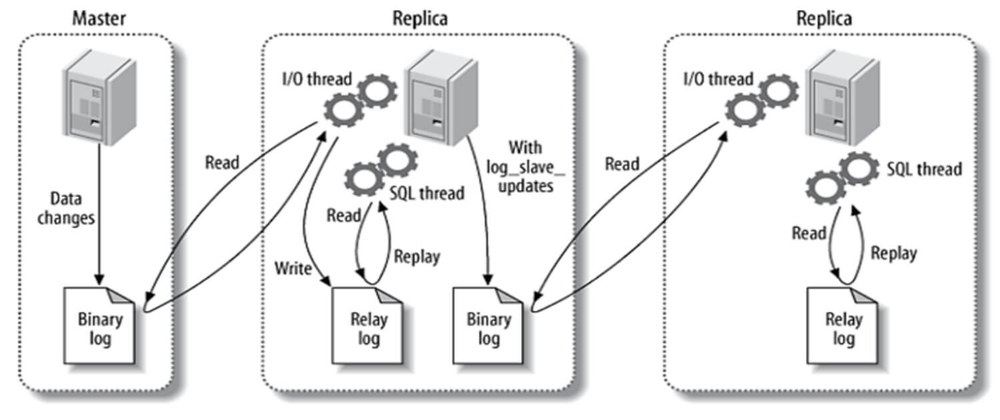

[[toc]]

## MySQL {#mysql}

基本上前端的职业发展走到后期，技能点自然而然会点到后端这块的。那么最主流的 MySQL 就是一个必须要熟悉的数据库。

::: tip MySQL
MySQL 是当下流行的关系数据库管理系统（Relational Database Management System, RDBMS），使用 C 和 C++ 语言编写而成。MySQL 支持多线程，可以充分利用CPU资源。
:::

### MySQL 基础知识 {#mysql-basic}

#### 关系数据库设计理论三大范式 {#mysql-3-normal-forms}

- 第一范式（1NF，First Normal Form）：目标是确保每列都是不可再分的最小数据单元（也被称为最小的原子单元），则满足第一范式。
- 第二范式（2NF，Second Normal Form）：要求每张表只描述一件事情。
- 第三范式（3NF，Third Normal Form）：如果一个关系满足第二范式，并且除了主键以外的其他列都不依赖于主键列，则满足第三范式。

#### 连接数据库 {#mysql-connect-database}

```bash
mysql -h host -u user -p

# 如果在运行 MySQL 的同一台机器上登录，则可以省略主机名：
mysql -u user -p
```

#### 创建数据库和表 {#mysql-create-database-table}

**创建数据库**

* 在 UNIX 操作系统中，数据库的名称是区分字母大小写的。

```mysql
CREATE DATABASE database_name;
```

**创建表**

```mysql
create table table_name (column_name column_type);
```

例子：

```mysql
create table if not exists `userinfo` (
    `id` int unsigned auto_increment,
    `name` varchar(100) not null,
    `age` int not null,
    `date` date,
    primary key ( `id` )) engine=innodb default charset=utf8;
```

说明：
- primary key：用于把列定义为主键，可以使用多列来定义主键，列之间以逗号分隔。
- engine：设置存储引擎。
- charset：设置字符集的编码。

**查询指定表的结构**

```mysql
describe table_name;
```

如上面创建的 `userinfo` 表，查询出来的信息如下：

| Field | Type | Null | Key | Default | Extra |
|:----|:----|:----|:----|:----|:----:|
| id | int unsigned | NO | PRI | NULL | auto_increment |
| name | varchar(100) | NO | | NULL | |
| age | int | NO | | NULL | |
| date | date | YES | | NULL | |

#### MySQL 数据类型 {#mysql-data-type}

##### 数字数据类型 {#mysql-data-type-number}

- 整数类型：integer、int、smallint、tinyint、mediumint、bigint。
- 定点类型：decimal、numeric。
- 浮点类型：float、double。
- 位值类型：bit。

整数类型所需的存储空间和取值范围：

| 类型 | 存储空间（字节） | 有符号的最小值 | 无符号的最小值 | 有符号的最大值    | 无符号的最大值 |
|:----|:----|:--------|:--------|:-----------|:-------:|
| tinyint | 1 | -128    | 0    | 127        |   255   |
| smallint | 2 | -32768|0| 32767      |65535|
|mediuminit|3|-8388608|0| 8388607    |16777215|
|int|4|-2147483648|0| 2147483647 |4294967295|
|bigint|8|-2^63|0| 2^63 - 1   |2^64 - 1|

decimal 列声明中，可以指定精度和小数位数：

```mysql
# 精度为5，小数位数为2，取值范围为 -999.99 ~ 999.99
salary decimal(5,2)
```

bit 类型的表示方式为 `bit(m)`，m 的取值范围为 1~64（换算成十进制的话，就是 0 ~ 2^64-1）。bit 类型存储的是二进制字符串。

##### 日期和时间数据类型 {#mysql-data-type-date}

表示时间值的日期和时间类型有这样几种：datetime、date、timestamp、time 和 year。每种时间类型都有一个有效值范围和一个“零”值，当指定的日期或时间数据不符合规则时，MySQL 将使用“零”值来替换。MySQL允许将“零”值（`0000-00-00`）存储为“虚拟日期”。在某些情况下，这比使用 `null` 值更方便，并且使用更少的数据和索引空间。

所有日期和时间类型格式的详细说明如下：

|  类型  |  存储字节 |  范围  |  格式  |  用途  |
| --- | --- | --- | --- | --- |
|  date  |  3  |  1000-01-01 到 9999-12-31  |  YYYY-MM-DD  |  日期值  |
|  time  |  3  | '-838:59:59' 到 '838:59:59' | HH:MM:SS | 时间值 |
| year | 1 | 1901 到 2155 | YYYY | 年份值 |
| datetime | 8 | 1000-01-01 00:00:00 到 9999-12-31 23:59:59 | YYYY-MM-DD HH:MM:SS | 日期和时间值 |
| timestamp | 4 | 1970-01-01 00:00:00 到 2038-01-19 11:14:07 | YYYY-MM-DD HH:MM:SS | 日期和时间值 |

##### 字符串数据类型 {#mysql-data-type-string}

在 MySQL中，字符串数据类型有：char、varchar、text、binary、varbinary、blob、enum 和 set。对于数据类型定位为 char、varchar 和 text 的列，MySQL 以字符为单位定义长度规范。对于数据类型为 binary、varbinary 和 blob 的列，MySQL 以字节为单位定义长度规范。

当列定义为 char、varchar、enum 和 set 的数据类型时，同时还可以指定列的字符集，尤其在存储中文时，建议指定字符集格式为 utf8，以防止出现乱码问题。

```mysql
create table mytable
(
    c1 varchar(255) character set utf8,
    c2 text character set latin1 collate latin1_general_cs
);
```

::: tip blob 类型
blob类型的值是一个二进制的大对象，可以容纳可变数量的数据。tinyblob、blob、mediumblob 和 longblob 类型的区别仅在于它们可以存储的值的最大长度不相同。
:::

::: tip enum 类型
enum 类型（即枚举类型）的列值表示一个字符串对象，其值选自定义列时给定的枚举值。enum 类型具有以下优点：
- 在列具有有限的数据集合的情况下压缩数据空间。输入的字符串会自动编码为数字。
- 可读的查询和输出。在查询时，实际存储的数字被转换为相应字符串。

定义时，注意枚举值必须是带引号的字符串。

```mysql
create table mytable (
    name varchar(40),
    size enum('x-small', 'small', 'medium')
);
```
:::

::: tip set 类型
set 类型（集合类型）的列值表示可以有零个或多个字符串对象。一个 set 类型的列最多可以有64个不同的成员值，并且每个值都必须从定义列时指定的值列表中选择。set 类型成员值本身不应包含英文逗号。

```mysql
create table myset (col set('a', 'b', 'c', 'd'));
```
:::

##### JSON 数据类型 {#mysql-data-type-json}

```mysql
create table mytable (jdoc json);
```

MySQL 支持 JSON 数据类型，JSON 数据类型具有如下优点：

- 存储在 JSON 类型列中的 JSON 文档会被自动验证，无效的文档会产生错误。
- 存储在 JSON 类型列中的 JSON 文档会被转换为允许快速读取文档元素的内部格式。
- 在 MySQL 8中，优化器可以执行 JSON 类型列的局部就地更新，而不用删除旧文档后再将整个新文档写入该列。

在 MySQL 中，JSON 类型列的值会被写为字符串。如果字符串不符合 JSON 数据格式，则会产生错误。

### MySQL 基本操作 {#mysql-operation}

#### 数据库和数据表的创建与查看 {#mysql-create-database-table}

查看 MySQL 服务器中的所有数据库：

```mysql
show databases;
```

切换使用指定数据库：

```mysql
USE database_name;
```

查询当前操作的数据库名称：

```mysql
SELECT DATABASE();
```

查询当前数据库下的所有表：

```mysql
SHOW TABLES;
```

删除数据库：

```mysql
drop database if exists mydb;
```

重新创建 `mydb` 数据库，指定编码为 utf8：

```mysql
create database mydb charset utf8;
```

查看建库时的雨具（并验证数据库使用的编码）：

```mysql
show create database mydb;
```

进入 `mydb` 库，然后删除 `student` 表（如果存在）：

```mysql
use mydb;

drop table if exists student;
```

创建 `student` 表：

```mysql
drop table if exists student;

create table student (
    id int primary key auto_increment,
    name varchar(50),
    gender varchar(2),
    birthday date,
    score double
);
```

上述语句创建的表结构如下：

| Field | Type | Null | Key | Default | Extra |
| --- | --- | --- | --- | --- | --- |
| id | int(11) | NO | PRI | NULL | auto_increment |
| name | varchar(50) | YES | | NULL | |
| gender | varchar(2) | YES | | NULL | |
| birthday |  date | YES | | NULL | |
| score | double | YES | | NULL | |

查看创建时的语句：

```mysql
show create table student;

# 得到如下内容：
CREATE TABLE `student` (
    `id` int(11) NOT NULL AUTO_INCREMENT,
    `name` varchar(50) DEFAULT NULL,
    `gender` varchar(20) DEFAULT NULL,
    `birthday` date DEFAULT NULL,
    `score` double DEFAULT NULL,
    PRIMARY KEY (`id`)
) ENGINE = InnoDB DEFAULT CHARSET = utf8;
```

#### 新增、修改、删除表数据 {#mysql-crud-table-data}

插入记录：

```mysql
insert into student(name,gender,birthday,score)
values('zhangsan','m','1999-2-2',70);

insert into student
values(null,'lisi','m','1997-2-2',80);

insert into student
values(null,'wangwu','m','1989-2-2',75);
```

查询表中所有学生的信息：

```mysql
select * from student;
```

得到：

|id|name|gender|birthday|score|
|---|---|---|---|---|
|1|zhangsan|m|1999-02-02|70|
|2|lisi|m|1997-02-02|80|
|3|wangwu|m|1989-02-02|75|

修改student表中所有学生的成绩，加10分特长分：

```mysql
update student set score=score+10;
```

修改 student 表中 zhangsan 的成绩，将成绩改为 98 分：

```mysql
update student set score=98 where name='zhangsan';
```

删除性别是w的数据：

```mysql
delete from student  where gender='w';
```

删除表中所有数据，数据还能找回：

```mysql
delete from student;
```

清空表数据，效率高，但是数据找不回：

```mysql
truncate studen;
```

#### MySQL 基础查询和 `where` 子查询 {#mysql-query-where}

准备数据（部门表和员工表）：

```mysql
# 创建部门表
drop table if exists dept;
create table dept (
    deptno int(2) not null,
    dname varchar(14) collate utf8_bin default null,
    loc varchar(13) collate utf8_bin default null,
    primary key (deptno)
) engine=innodb default charset = utf8 collate = utf8_bin;

# 创建员工表
drop table if exists emp;
create table emp (
    eno integer not null,
    ename varchar(20) not null,
    sex varchar(20) not null,
    birthday varchar(20) not null,
    jdate varchar(20) not null,
    salary integer not null,
    bonus integer not null,
    epost varchar(20) not null,
    deptno int(2) not null,
    primary key (eno)
);
```

查询emp表中的所有员工，显示姓名、薪资、奖金：

```mysql
select ename, salary, bonus from emp;
```

查询emp表中的所有部门和职位：

```mysql
select deptno, epost from emp;
```

查询emp表中的所有部门和职位，并对数据去重：

```mysql
select distinct deptno, epost from emp;
```

查询emp表中薪资大于5000的所有员工，显示员工姓名、薪资：

```mysql
select ename, salary from emp where salary > 5000;
```

查询emp表中总薪资（薪资+奖金）大于6500的所有员工，显示员工姓名、总薪资：

```mysql
select ename, salary + bonus from emp
where salary + bonus > 6500;
```

得到：

|ename|salary + bonus|
| --- | --- |
| wanger | 8500 |
| lisi | 7000 |
| wangming | 9000 |

注意上面查询结果中的表头，将表头中的“salavy+bonus”修改为“total-salary”：

```mysql
select ename, salary + bonus 'total-salary' from emp
where salary + bonus > 6500;
```

得到：

|ename| total-salary |
| --- |--------------|
| wanger | 8500         |
| lisi | 7000         |
| wangming | 9000         |

查询emp表中薪资在7000和10000之间的员工，显示员工姓名和薪资：

```mysql
-- 普通写法
select ename, salary
from emp
where salary >= 7000 and salary <= 10000;

-- 使用 `between and` 的写法
select ename, salary
from emp
where salary between 7000 and 10000;
```

查询emp表中薪资为5000、6000、8000的员工，显示员工姓名和薪资：

```mysql
-- 普通写法
select ename, salary
from emp
where salary = 5000 or salary = 6000 or salary = 8000;

-- 使用 `in` 的写法
select ename, salary
from emp
where salary in (5000, 6000, 8000);
```

查询emp表中薪资不为5000、6000、8000的员工，显示员工姓名和薪资：

```mysql
-- 普通写法
select ename, salary
from emp
where not (
    salary = 5000 or salary = 6000 or salary = 8000
);

-- 使用 `not in` 的写法
select ename, salary
from emp
where salary not in (5000, 6000, 8000);
```

查询emp表中薪资大于4000和薪资小于2000的员工，显示员工姓名、薪资：

```mysql
select ename, salary
from emp
where salary > 4000 or salary < 2000;
```

#### MySQL `like` 模糊查询 {#mysql-query-like}

查询emp表中姓名中以“li”开头的员工，显示员工姓名、薪资：

```mysql
select ename, salary sal
from emp where ename like 'li%';
```

查询emp表中姓名中包含“li”的员工，显示员工姓名、薪资：

```mysql
select ename, salary sal
from emp where ename like '%li%';
```

查询emp表中姓名以“li”结尾的员工，显示员工姓名、薪资：

```mysql
select ename, salary sal
from emp
where ename like '%li';
```

#### MySQL 分组查询、聚合函数、排序查询 {#mysql-query-group-order}

对emp表按照职位进行分组，并统计每个职位的人数，显示职位和对应人数：

```mysql
select epost, count(*) from emp group by epost;
```

按照部门分组，显示部门、最高薪资：

```mysql
select deptno, max(salary)
from emp
group by deptno;
```

**查询每个部门的最高薪资，显示部门、员工姓名、最高薪资：**

```mysql
select emp.deptno, ename, t1.msal
from emp,
    (
        select deptno, max(salary) msal
        from emp group by deptno
    ) t1
where emp.deptno = t1.deptno and emp.salary = t1.msal;
```

统计emp表中薪资大于3000的员工个数：

```mysql
select count(eno) from emp where salary > 3000;
```

统计emp表中所有员工的薪资总和（不包含奖金）：

```mysql
select sum(salary) from emp;
```

统计emp表中员工的平均薪资（不包含奖金）：

```mysql
-- 普通方式计算平均数
select sum(salary) / count(*) from emp;

-- 使用 `avg` 函数求平均数
select avg(salary) from emp;
```

查询emp表中所有在1978年和1985年之间出生的员工，显示姓名、出生日期：

```mysql
select ename, birthday
from emp
where year(birthday) between 1978 and 1985;
```

查询要在本月过生日的所有员工：

```mysql
SELECT *
FROM emp
WHERE MONTH(CURDATE()) = MONTH(birthday);
```

对emp表中所有员工的薪资进行升序（从低到高）排序，显示员工姓名、薪资：

```mysql
-- 默认就是升序排序，所以 `asc` 可以省略不写
select ename, salary from emp order by salary;
```

对emp表中所有员工奖金进行降序（从高到低）排序，显示员工姓名、奖金：

```mysql
select ename, bonus
from emp
order by bonus desc;
```

查询emp表中的所有记录，分页显示首页记录（前3条记录）：

```mysql
select * from emp limit 0,3;
```

查询emp表中的所有记录，分页显示（每页显示3条记录），返回第2页：

```mysql
select * from emp limit 3,3;
```

#### MySQL 关联查询 {#mysql-correlated-query}

查询部门和部门对应的员工信息：

```mysql
select *
from dept, emp
where dept.deptno = emp.deptno;
```

查询所有部门和部门下的员工，如果部门下没有员工，则员工显示为null（一定要列出所有部门）：

```mysql
select *
from dept
left join emp no dept.deptno = emp.deptno;
```

上面这个 SQL 查询语句使用了 `left join` 关键字来连接 `dept` 和 `emp` 表，并以 `deptno` 字段为连接条件，查询并返回两张表中相关记录的字段值。具体地说，该查询会遍历 `dept` 表中的每一行记录，然后查找与之对应的 `emp` 表中的记录，如果两者中存在符合连接关系的记录，则会将它们的字段值合并为一条查询结果，并以列的形式呈现在最终的查询结果中。如果某个部门在 `emp` 表中没有关联记录，则该部门在查询结果中也会被保留，但其关联字段值会被填充为 `null`。

查询每个部门的员工的数量：

```mysql
select dept.deptno, count(emp.deptno)
from dept
left join emp on dept.deptno = emp.deptno
group by dept.deptno;
```

#### MySQL 子查询、多表查询 {#mysql-sub-query}

列出与lisi从事相同职位的所有员工，显示姓名、职位、部门编号：

```mysql
select ename, epost, deptno
from emp
where epost = (
        select epost from emp where ename = 'lisi'
    );
```

列出薪资比部门编号为30（销售部）的所有员工薪资都高的员工信息，显示员工姓名、薪资和部门名称：

```mysql
-- 外连接查询：查询所有员工、员工薪资和员工对应的部门名称
select emp.ename, salary, dept.dname
from emp
left join dept on emp.deptno = dept.deptno;

-- 假设销售部门的最高薪资为 3000，列出薪资比 3000 高的员工信息
select emp.ename, salary, dept.dname
from emp
left join dept on emp.deptno = dept.deptno
where salary > 3000;

-- 求出销售部门的最高薪资
select max(salary) from emp where deptno = 30;

-- 合并两条查询 SQL
select emp.ename, salary, dept.dname
from emp
    left join dept
    on emp.deptno = dept.deptno
    where salary > (
        select max(salary) from emp where deptno = 30
        );
```

列出最低薪资大于6500的各种职位，显示职位和该职位的最低薪资：

```mysql
select epost, min(salary)
from emp
group by epost
having min(salary) > 6500;
```

::: tip `having` 子句
需要注意的是，在 `group by` 子句之后使用 `having` 子句可以对分组后的结果进行条件过滤，而在 `where` 子句中则不能使用聚合函数（如 `min` 函数）。
:::

列出在每个部门就职的员工数量、平均薪资，显示部门编号、员工数量、平均薪资：

```mysql
select deptno, count(*), AVG(salary)
from emp
group by deptno;
```

列出每个部门薪资最高的员工信息，显示部门编号、员工姓名、薪资：

```mysql
-- 查询 `emp` 表中所有员工的部门编号、姓名、薪资
select deptno, ename, salary from emp;

-- 查询 `emp` 表中每个部门的最高薪资，显示部门编号、最高薪资
select deptno, max(salary) from emp group by deptno;

-- 第二次查询的结果作为一张临时表和第一次查询进行关联查询
select emp.deptno, emp.ename, emp.salary
from emp,
    (
        select deptno, max(salary) maxsal
        from emp
        group by deptno
    ) t1
where t1.deptno = emp.deptno and emp.salary = t1.maxsal;
```

### MySQL 基础函数 {#mysql-function}

#### MySQL 字符串函数 {#mysql-string-function}

- `character_length(s)`：返回字符串长度
- `concat(s1,s2,...,sn)`：字符串合并
- `format(x,n)`：数字格式化（将数字 `x` 格式化为保留 `n` 位小数点）
- `lpad(s1,len,s2)`：该函数用于在字符串s1的开始处填充字符串s2，使字符串长度达到len。
- `field(s,s1,s2,…)`：该函数用于返回第一个字符串s在字符串列表(s1,s2,…)中的位置。
- `insert(s1,x,len,s2)`：该函数用字符串s2替换字符串s1中从x位置开始长度为len的字符串。
- `lcase(s)`：把字符串中的所有字母转换为小写字母。
- `ucase(s)`：把字符串中的所有字母转换为大写字母。
- `strcmp(s1,s2)`：比较字符串大小。该函数用于比较字符串s1和s2，如果s1与s2相等则返回0，如果s1>s2则返回1，如果s1<s2则返回‒1。
- `replace(s,s1,s2)`：字符串替换。该函数用字符串s2替换字符串s中的字符串s1。
- `position(s1 in s)`：获取子字符串 `s1` 在字符串 `s` 中出现的位置。
- `md5(s)`：字符串加密。
- `inet_aton(ip)`：把 IP 地址转换为数字。
- `inet_ntoa (s)`：把数字转换为 IP 地址。

#### MySQL 数字函数 {#mysql-number-function}

- `ceil(x)`：返回不小于x的最小整数。
- `ceiling(x)`：返回不小于x的最小整数。同 `ceil(x)`。
- `floor(x)`：返回不大于x的最大整数。
- `round(x)`：返回最接近x的整数。
- `max(expression)`：求最大值。
- `min(expression)`：求最小值。
- `sum(expression)`：求总和。
- `avg(expression)`：求平均值。
- `count(expression)`：求总记录数。
  - `count(字段名)`：计算指定列下总的行数，计算时将忽略空值的行。
  - `count(*)`：计算数据表中总的行数，无论某列是否为空值都包含在内。

#### MySQL 日期函数 {#mysql-date-function}

- `adddate(d,n)`：返回指定日期加上指定天数后的日期。
- `addtime(t,n)`：返回指定时间加上指定时间后的时间。
- `curdate()`：返回当前日期。格式为 `YYYY-MM-DD`。
- `datediff(d1,d2)`：返回两个日期相隔的天数。
- `dayofyear(d)`：返回指定日期是本年的第几天。
- `extract(type from d)`：根据对应格式返回日期。
- `now()`：返回当前日期和时间。
- `quarter(d)`：返回日期对应的季度数。
- `second(t)`：返回指定时间中的秒数。
- `timediff(time1, time2)`：计算时间差。
- `date(t)`：从指定日期时间中提取日期值。
- `hour(t)`：返回指定时间中的小时数。
- `time(expression)`：提取日期时间参数中的时间部分。
- `time_format(t,f)`：根据表达式显示时间。
- `year(d)`：返回指定日期的年份。

### MySQL 高级查询函数 {#mysql-advanced-query-function}

#### MySQL 高级函数 {#mysql-advanced-function}

#### MySQL 窗口函数 {#mysql-window-function}

### MySQL 数据表分区 {#mysql-table-partition}

MySQL 目前仅支持使用 InnoDB 和 NDB 存储引擎对数据表进行分区，不支持其他存储引擎。

使用分区的优点有：

- 数据表被分区后，其中的数据可以分布在不同的物理设备上，从而高效地利用多个硬件设备。
- 分区上的数据更容易维护。例如，想批量删除大量数据时，可以使用清楚整个分区的方式来处理。另外，还可以对一个独立分区进行优化、检查、修复等操作。
- 可以使用分区来避免某些特殊的瓶颈，例如 InnoDB 的单个索引的互斥访问。
- 在大数据集的应用场景下，可以备份和恢复独立的分区，这样能够更好地提高性能。
- 某些查询也可以被极大地优化，因为满足给定 where 子句的数据只能存储在一个或多个分区上，所以会自动搜索相关分区数据，而不是扫描所有的表数据。
- 由于在创建分区后可以更改分区，因此用户可以重新组织数据，提高查询效率。

MySQL 目前支持多种分区：

- 范围（range）分区：基于一个给定连续区间的列值，把区间列值对应的多行分配给分区。
- 列表（list）分区：类似范围分区，不同之处在于列表分区是根据列值域离散集合中的某个值的匹配来选择的。
- 列（column）分区：数据根据某个或多个列的值进行划分，是列表分区和范围分区的变体。
- 哈希（hash）分区：基于用户定义的表达式的返回值进行分区选择，该表达式使用将要插入表中的行的列值来进行计算。哈希函数可以包含**在 MySQL 中有效且产生非负整数的表达式**。
- 键（key）分区：类似哈希分区，区别在于键分区只支持计算一列或多列，并且 MySQL 服务器为此提供了自身的哈希函数。
- 子分区：又称复合分区，是对分区表中每个分区的进一步划分。

#### MySQL 范围分区 {#mysql-partition-by-range}

范围分区应该是连续且不重叠的，使用 value less than 运算符来定义。

创建表，并通过 `partition by range` 子句将表按 `salary` 列进行分区：

```mysql
create table employees
(
    empno varchar(20) not null,
    empname varchar(20),
    deptno int,
    birthdate date,
    salary int
)
partition by range(salary) (
    partition p0 values less than (5000),
    partition p1 values less than (10000),
    partition p2 values less than (15000),
    partition p3 values less than (20000),
    partition p4 values less than maxvalue
);
```

* `maxvalue` 表示是中大于最大可能得整数值。

当员工工资增长到 25000、30000 或更多时，可以使用 `alter table` 语句为 20000~25000 的工资范围添加新分区。

针对上面这个员工表，我们也可以根据员工的出生日期（`birthdate`）进行分区，把同一年出生的员工信息存储在同一个分区中，像下面这样（以 `year(birthdate)` 作为分区依据）。

```mysql
create table employees
(
    empno varchar(20) not null,
    empname varchar(20),
    deptno int,
    birthdate date,
    salary int
)
partition by range(year(birthdate) (
    partition p2018 values less than (2018),
    partition p2019 values less than (2019),
    partition p2020 values less than (2020),
    partition p2021 values less than (2021),
    partition pmax values less than maxvalue
);
```

**查询每个分区中分配的数据量**

```mysql
select partition_name as "", table_rows as "" from information_schema.partitions where table_name="employees";
```

得到结果格式如下：

| /  | / |
|----|---|
| p0 | 0 |
| p1 | 1 |
| p2 | 1 |
| p3 | 1 |
| p4 | 0 |

#### MySQL 列表分区 {#mysql-partition-by-list}

```mysql
create table employees_list
(
    empno varchar(20) not null,
    empname varchar(20),
    deptno int,
    birthdate date,
    salary int
)
partition by list(deptno) (
    partition p0 values in (10,20,30),
    partition p1 values in (40,50,60),
    partition p2 values in (70,80,90)
);
```

在列表分区的方案中，如果插入的数据中分区字段的值不在分区列表中，则会报错：`Table has no partition for value blabla`。如果要在一条语句中批量添加多条数据，并忽略错误数据，可以使用 `ignore` 关键字：

```mysql
insert ignore into employees_list (empno,empname,deptno,birthdate,salary)
values
(6, 'name1', 10, '2021-06-20', 12998),
(7, 'name2', 100, '2021-06-20', 12998);
```

#### MySQL 列分区 {#mysql-partition-by-column}

列（column）分区是范围分区和列表分区的变体，分为范围列（range column）分区和列表列（list column）分区。

**范围列分区**

```mysql
create table rtable(
    a int,
    b int,
    c char(8),
    d int
)
partition by range columns(a,d,c) (
    partition p0 values less than (5,20,'aa'),
    partition p1 values less than (10,30,'cc'),
    partition p2 values less than (15,80,'dd'),
    partition p3 values less than (maxvalue,maxvalue,maxvalue) 
);
```

**列表列分区**

```mysql
create table customers (
    name varchar(25),
    street_1 varchar(30),
    street_2 varchar(30),
    city varchar(15),
    renewal date
)
partition by list columns(city) (
    partition pregion_1 values in('河南省', '湖北省', '湖南省'),
    partition pregion_2 values in('广东省', '广西壮族自治区', '海南省'),
    partition pregion_3 values in('上海市', '江苏省', '浙江省'),
    partition pregion_4 values in('北京市', '天津市', '河北省')
);
```

#### MySQL 哈希分区 {#mysql-partition-by-hash}

##### 常规哈希分区 {#mysql-partition-by-normal-hash}

要对表进行哈希分区，必须在 `create table` 语句后附加一个子句，**这个子句可以是一个返回整数的表达式，也可以是 MySQL 整数类型列的名称**。

根据表中 `store_id` 列进行哈希分区，并分为4个分区，示例 SQL 语句如下：

```mysql
create table employees (
    id int not null,
    fname varchar(30),
    lname varchar(30),
    hired date not null default '1970-01-01',
    separated date not null default '9999-12-31',
    job_code int,
    store_id int
)
partition by hash(store_id)
partitions 4;
```

如果分区不包含 `partition` 子句，则分区数默认为1；如果分区语句包含 `partition` 子句，则必须在后面指定分区的数量，否则会提示语法错误。

哈希分区中，还可以使用为 SQL 返回整数的表达式，比如：

```mysql
create table employees (
    id int not null,
    fname varchar(30),
    lname varchar(30),
    hired date not null default '1970-01-01',
    separated date not null default '9999-12-31',
    job_code int,
    store_id int
)
partition by hash( year(hired) )
partitions 4;
```

##### 线性哈希分区 {#mysql-partition-by-linear-hash}

MySQL 还支持线性哈希，它与常规哈希的不同之处在于：线性哈希使用线性二次幂算法，二常规哈希使用哈希函数值的模数。在语法上，线性哈希分区唯一区别于常规哈希的地方是在 `partition by` 子句中添加了 `linear` 关键字。

```mysql
create table employees (
    id int not null,
    fname varchar(30),
    lname varchar(30),
    hired date not null default '1970-01-01',
    separated date not null default '9999-12-31',
    job_code int,
    store_id int
)
partition by linear hash( year(hired) )
partitions 4;
```

#### MySQL 键分区 {#mysql-partition-by-key}

键分区将表中的数据按照特定的键值进行分区。在键分区中，每个分区都包含相同键值的数据，不同键值的数据则存储在不同的分区中。

键分区和哈希分区很像，但有区别：
- 键分区支持除 text 和 blob 类型之外的所有数据类型的列，而哈希分区只支持数字类型的列；
- 键分区不允许使用用户自定义的表达式进行分区，而是使用系统提供的哈希函数进行分区。

当表中存在主键或唯一键时，如果创建键分区时没有指定列，则系统默认会选择主键列作为分区列；如果不存在主键列，则会选择**非空**的唯一键列作为分区列。

::: tip 提示
唯一列作为分区列时，唯一列不能为 `null`。
:::

```mysql
create table tb_key (
    id int,
    var char(32)
)
partition by key(var)
partitions 10;
```

#### MySQL 子分区 {#mysql-subpartition}

子分区也称复合分区，是对分区表中的每个分区的进一步划分，分为：
- 范围-哈希复合分区。
- 范围-键复合分区。
- 列表-哈希复合分区。
- 列表-键复合分区。

**范围-哈希（range-hash）复合分区**

```mysql
create table emp(
    empno varchar(20) not null,
    empname varchar(20),
    deptno int,
    birthdate date not null,
    salary int
)
partition by range(salary)
subpartition by hash(year(birthdate))
subpartitions 3(
    partition p1 values less than (2000),
    partition p2 values less than maxvalue
);
```

在上面这个例子中，先按 `salary` 列的薪资范围将表进行分区，并对 `birthdate` 列采用 `year` 进行哈希分区，子分区数为3。在此分区方案中，将数据分成了两个范围分区 p1 和 p2，每个范围分区又分为3个子分区，其中 p1 分区存储 salary 小于 2000 的数据，p2 分区存储所有大于或等于 2000 的数据。

**范围-键（range-key）复合分区**

```mysql
create table emp(
    empno varchar(20) not null,
    empname varchar(20),
    deptno int,
    birthdate date not null,
    salary int
)
partition by range(salary)
subpartition by key(birthdate)
subpartitions 3
(
    partition p1 values less than (2000),
    partition p2 values less than maxvalue
);
```

**列表-哈希（list-hash）复合分区**

```mysql
create table emp(
    empno varchar(20) not null,
    empname varchar(20),
    deptno int,
    birthdate date not null,
    salary int
)
partition by list (deptno)
subpartition by hash(year(birthdate))
subpartitions 3
(
    partition p1 values in (10),
    partition p2 values in (20),
);
```

**列表-键（list-key）复合分区**

```mysql
create table emp(
    empno varchar(20) not null,
    empname varchar(20),
    deptno int,
    birthdate date not null,
    salary int
)
partition by list (deptno)
subpartition by key(birthdate)
subpartitions 3
(
    partition p1 values in (10),
    partition p2 values in (20)
);
```

#### MySQL 分区对 `null` 的处理 {#mysql-partition-handling-null}

MySQL 中的分区不会禁止 `null` 作为分区表达式的值，无论列值还是用户提供的表达式的值，都允许 `null` 用作必须产生整数的表达式的值。MySQL 中的分区将 `null` 视为小于任何非 `null` 值。

**范围分区中如何处理 `null`**

要将一行数据插入分区中，如果用于确定范围分区的列值为 `null`，那么该行将插入最低分区中。

**列表分区中如何处理 `null`**

当且仅当定义的分区中存在分区其 `values in` 后跟的值列表中存在 `null` 值时，才允许 `null` 值插入该分区。

```mysql
create table ts2 (
    c1 int,
    c2 varchar(20)
)
partition by list(c1) (
    partition p0 values in (0, 3, 6),
    partition p1 values in (1, 4, 7),
    partition p2 values in (2, 5, 8),
    partition p3 values in (null)
);
```

**哈希分区和健分区中如何处理 `null`**

在哈希分区和键分区的表中，任何产生 `null` 值的分区表达式的返回值都为 0。

#### 范围分区和列表分区的管理 {#mysql-partition-management-range-list}

**删除分区**

```mysql
# 删除分区
alter table table_name drop partition partition_name;
```

**添加分区（范围分区）**

```mysql
CREATE TABLE employees (
  id INT NOT NULL,
  fname VARCHAR(50) NOT NULL,
  lname VARCHAR(50) NOT NULL,
  hired DATE NOT NULL
)
PARTITION BY RANGE( YEAR(hired) ) (
  PARTITION p1 VALUES LESS THAN (1991),
  PARTITION p2 VALUES LESS THAN (1996),
  PARTITION p3 VALUES LESS THAN (2001),
  PARTITION p4 VALUES LESS THAN (2005)
);

# 如果要新增的分区的范围值大于之前已有的分区范围值，可以直接添加：
ALTER TABLE employees ADD PARTITION (
    PARTITION p5 VALUES LESS THAN (2010),
    PARTITION p6 VALUES LESS THAN MAXVALUE
);

# 否则需要像下面这样处理：
ALTER TABLE employees
    REORGANIZE PARTITION p1 INTO (
        PARTITION n0 VALUES LESS THAN (1970),
        PARTITION n1 VALUES LESS THAN (1991)
);

# 如果要对上面的操作反向处理：
ALTER TABLE employees REORGANIZE PARTITION n0,n1 INTO (
    PARTITION p1 VALUES LESS THAN (1991)
);
```

**添加分区（列表分区）**

```mysql
CREATE TABLE tt (
    id INT,
    data INT
)
PARTITION BY LIST(data) (
    PARTITION p0 VALUES IN (5, 10, 15),
    PARTITION p1 VALUES IN (6, 12, 18)
);

# 如果新增的分区的范围值大于之前已有分区的范围值，可以直接添加：
ALTER TABLE tt ADD PARTITION (
    PARTITION p2 VALUES IN (7, 14, 21)
);
```

**拆分、合并分区**

在保证数据不丢失的情况下，可以拆分、合并分区：

```mysql
create table members (
    id int(11) default null,
    fname varchar(25) default null,
    lname varchar(25) default null,
    dob date default null
) engine=InnoDB default charset=latin1
partition by range (year(dob))
(
    partition n0 values less than (1970) engine = InnoDB,
    partition n1 values less than (1980) engine = InnoDB,
    partition p1 values less than (1990) engine = InnoDB,
    partition p2 values less than (2000) engine = InnoDB,
    partition p3 values less than (2010) engine = InnoDB
);

# 把 n0 分区拆分成2个分区：s0、s1
alter table members reorganize partition n0 into (
    partition s0 values less than (1960),
    partition s1 values less than (1970)
);

# 把 s0、s1 分区合并成一个分区
alter table members reorganize s0, s1 into (
    partition p0 values less than (1970)
);
```

* `dob` 是出生日期（date of birth）的缩写。

#### 哈希分区和键分区的管理 {#mysql-partition-management-hash-key}

**哈希分区**

```mysql
# 创建一张具有10个哈希分区的数据表
create table clients (
    id int,
    fname varchar(30),
    lname varchar(30),
    signed date
)
partition by hash( month(signed) )
partitions 10;

# 把分区数量从 10 个变成 6 个 （即，合并掉 4 个分区）
alter table clients coalesce partition 4;
```

::: tip `coalesce partition`
需要注意，`coalesce partition` 后面的数字表示要删除的分区数。
:::

**键分区**

```mysql
# 创建一张具有 10 个键分区的表
create table clients (
    id int,
    fname varchar(30),
    lname varchar(30),
    signed date
)
partition by linear key(signed)
partitions 10;

# 把键分区数量从 10 个变成 6 个
alter table clients coalesce partition 4;
```

#### 分区管理和维护操作 {#mysql-management-partition}

**删除分区（仅限于范围分区和列表分区，会丢失数据）**

```mysql
# 一次性删除一个分区
alter table emp drop partition p1;

# 一次性删除多个分区
alter table emp drop partition p1,p2;
```

**增加分区**

```mysql
# 增加范围分区
alter table emp add partition (partition p3 values less than (5000));

# 增加列表分区
alter table emp add partition (partition p3 values in (5000));
```

**分解分区（不会丢失数据）**

`reorganize partition` 关键字可以对表的部分分区或全部分区进行修改，并且不会丢失数据。分解前后分区的整体范围应该一致。

```mysql
alter table t
reorganize partition p1 into
(
    partition p1 values less than (1000),
    partition p3 values less than (2000)
);
```

**合并分区（不会丢失数据）**

随着分区数量的增多，有时需要把多个分区合并成一个分区，可以使用 `into` 指令实现。

```mysql
alter table t
reorganize partition p1,p3 into
(partition p1 values less than (10000));
```

**重新定义哈希分区（不会丢失数据）**

想要对哈希分区进行扩容或缩容，可以对现有的哈希分区进行重新定义。

```mysql
alter table t partition by hash(salary) partitions 8;
```

**重新定义范围分区（不会丢失数据）**

想要对范围分区进行扩容或缩容，可以对现有范围分区进行重新定义。

```mysql
alter table t partition by range(salary)
(
    partition p1 values less than (20000),
    partition p2 values less than (30000)
);
```

**删除表的所有分区（不会丢失数据）**

如果要删除表的所有分区，但又不想删除数据，可以执行如下语句：

```mysql
# 注意是 `partitioning`，不是 `partition`
alter table emp remove partitioning;
```

**重建分区**

这和先删除保存在分区中的所有记录，然后重新插入它们具有同样的效果，可用于**整理分区碎片**。

```mysql
alter table emp rebuild partition p1,p2;
```

**优化分区**

如果从分区中删除了大量的行，或者对一个带有可变长度的行做了许多修改，那么可以使用 `alter table ... optimize partition` 来收回没有使用的空间，并整理分区数据文件的碎片。

```mysql
alter table t optimize partition p1,p2;
```

**分析分区**

想要对现有的分区进行分析，可以执行如下语句：

```mysql
-- 读取并保存分区的键分布
alter table t analyze partition p1,p2;
```

**修补分区**

```mysql
-- 修补被破坏的分区
alter table t repairpartition p1,p2;
```

**检查分区**

想要查看现有的分区是否被破坏，可以执行如下语句：

```mysql
-- 检查表指定的分区
alter table t check partition p1,p2;
```

这条语句可以告诉我们表 `t` 的分区 `p1`、`p2` 中的数据或索引个是否已经被破坏了。如果分区被破坏了，那么可以使用 `alter table ... repairpartition` 来修补该分区。

#### 分区的限制 {#mysql-partition-limit}

在业务中可以对分区进行一些限制：

- 分区键必须包含在表的主键、唯一键中。
- MySQL 只能在使用分区函数的列进行比较时才能筛选分区，而不能根据表达式的值去筛选分区，即使这个表达式就是分区函数也不行。
- 不使用NDB存储引擎的数据表的最大分区数为8192。
- InnoDB存储引擎的分区不支持外键。
- 服务器 SQL 模式（可以通过 SQL-MODE 参数进行配置）影响分区表的同步复制。主节点和从节点上不同的SQL模式可能会导致相同的数据存储在主从节点的不同分区中，甚至可能导致数据插入主节点成功，而插入从节点失败。为了获得最佳效果，应该始终在主机和从机上使用相同的服务器SQL模式，强烈建议不要在创建分区后更改服务器SQL模式。
- 分区不支持全文索引，即使是使用 InnoDB 或 MyISAM 存储引擎的分区也不例外。
- 分区无法使用外键约束。
- 临时表不能进行分区。

#### 分区键和主键、唯一键的关系 {#mysql-relationship-partition}

控制分区键与主键、唯一键关系的规则是：分区表达式中使用的所有列必须是该数据表可能具有的每个唯一键的一部分。换句话说，分区键必须包含在表的主键、唯一键中。

##### 错误示例 {#mysql-wrong-examples-relationship-partition}

**唯一键是 `col1` 和 `col2` 的组合，分区键是 `col3`**

```mysql
create table t1 (
    col1 int not null,
    col2 date not null,
    col3 int not null,
    col4 int not null,
    unique key (col1, col2)
)
partition by hash(col3)
partitions 4;

-- 报错如下：
ERROR 1503 (HY000): A PRIMARY KEY must include all columns in the table's partitioning function (prefixed columns are not considered).
```

**两个唯一键分别是 `col1` 和 `col3`，分区键是 `col1 + col3`**


```mysql
create table t2 (
    col1 int not null,
    col2 date not null,
    col3 int not null,
    col4 int not null,
    unique key (col1),
    unique key (col3)
)
partition by hash(col1 + col3)
partitions 4;

-- 报错如下：
ERROR 1503 (HY000): A PRIMARY KEY must include all columns in the table's partitioning function (prefixed columns are not considered).
```

**两个唯一键分别是 `(col1, col2)` 和 `col3`，分区键是 `col1 + col3`**

```mysql
create table t3 (
    col1 int not null,
    col2 date not null,
    col3 int not null,
    col4 int not null,
    unique key (col1, col2),
    unique key (col3)
)
partition by hash(col1 + col3)
partitions 4;

-- 报错如下：
ERROR 1491 (HY000): A PRIMARY KEY must include all columns in the table's partitioning function.
```

**主键是 `col1` 和 `col2`，分区键是 `col3`**

```mysql
create table t4 (
    col1 int not null,
    col2 date not null,
    col3 int not null,
    col4 int not null,
    primary key(col1, col2)
)
partition by hash(col3)
partitions 4;

-- 报错如下：
ERROR 1503 (HY000): A PRIMARY KEY must include all columns in the table's partitioning function (prefixed columns are not considered).
```

**主键是 `col1` 和 `col3`，唯一键为 `col2`，分区键为 `year(col2)`**

```mysql
create table t5 (
    col1 int not null,
    col2 date not null,
    col3 int not null,
    col4 int not null,
    primary key(col1, col3),
    unique key(col2)
)
partition by hash( year(col2) )
partitions 4;

-- 报错如下：
ERROR 1503 (HY000): A PRIMARY KEY must include all columns in the table's partitioning function (prefixed columns are not considered).
```

##### 正确示例 {#mysql-correct-examples-partition-key-relationship}

```mysql
create table t1 (
    col1 int not null,
    col2 date not null,
    col3 int not null,
    col4 int not null,
    unique key (col1, col2, col3)
)
partition by hash(col3)
partitions 4;
```

```mysql
create table t2 (
    col1 int not null,
    col2 date not null,
    col3 int not null,
    col4 int not null,
    unique key (col1, col3)
)
partition by hash(col1 + col3)
partitions 4;
```

```mysql
create table t3 (
    col1 int not null,
    col2 date not null,
    col3 int not null,
    col4 int not null,
    unique key (col1, col2, col3),
    unique key (col3)
)
partition by hash(col3)
partitions 4;
```

**以下两种情况，主键都不包括分区表达式中引用的所有列，但语句都是有效的**

```mysql
create table t4 (
    col1 int not null,
    col2 date not null,
    col3 int not null,
    col4 int not null,
    primary key(col1, col2)
)
partition by hash(col1 + year(col2))
partitions 4;
```

```mysql
create table t5 (
    col1 int not null,
    col2 date not null,
    col3 int not null,
    col4 int not null,
    primary key (col1, col2, col4),
    unique key (col2, col1)
)
partition by hash(col1 + year(col2))
partitions 4;
```

### MySQL 视图、存储过程 {#mysql-view-procedure}

### MySQL 数据查询优化 {#mysql-query-optimization}

### MySQL 数据运维和读写分离架构 {#mysql-maintenance}

#### 基准测试 {#mysql-base-test}

基准测试可以理解为针对系统的一种压力测试。基准测试不关心业务逻辑，更加简单、直接，易于测试，数据可以由工具生成，不要求真实；而压力测试一般考虑业务逻辑，要求真实的数据。

对于大多数Web应用来说，整个系统的瓶颈在于数据库，原因很简单：Web应用中的其他因素（例如网络带宽、负载均衡节点、应用服务器（包括CPU、内存、硬盘灯、连接数等）、缓存）都很容易通过增加机器水平的扩展来实现性能的提高。而对于MySQL，由于数据一致性的要求，无法通过增加机器来分散向数据库写数据带来的压力，虽然可以通过读写分离、分库、分表来减轻压力，但是与系统其他组件的水平扩展相比，数据库仍然受到了太多的限制。

对数据库进行基准测试的作用是分析在当前配置（硬件配置、操作系统配置、数据库配置等）下，其数据库的性能表现，从而找出MySQL的性能阈值，并根据实际系统的要求调整配置。基准测试的指标有如下几个：

- 每秒查询数(Query Per Second，QPS)：是对一个特定的查询服务器在规定时间内处理查询数量的衡量标准，对应fetches/sec，即每秒的响应请求数。
- 每秒处理的事务数(Transaction Per Second，TPS)：是指系统在单位时间内处理事务的数量。对于非并发的应用系统而言，TPS与响应时间呈反比关系，实际上此时TPS就是响应时间的倒数。前面已经讲过，对于单用户的系统，响应时间（或者系统响应时间和应用延迟时间）可以很好地度量系统的性能，但对于并发系统而言，通常需要用TPS作为性能指标。
- 响应时间：包括平均响应时间、最小响应时间、最大响应时间、时间百分比等，其中时间百分比参考意义较大，如前90%的请求的最大响应时间。
- 并发量：同时处理的查询请求的数量，即可以同时承载的正常业务功能的请求数量。

在对MySQL进行基准测试时，一般使用专门的工具，例如MySQLslap、Sysbench等。其中，Sysbench比MySQLslap更通用、更强大。

Sysbench是一个开源的、模块化的、跨平台的多线程性能测试工具，可以用来进行CPU、内存、磁盘I/O、线程、数据库的性能测试。目前支持的数据库有MySQL、Oracle和PostgreSQL。它主要包括以下几种测试：

- CPU性能。
- 磁盘I/O性能。
- 调度程序性能。
- 内存分配及传输速度。
- 数据库性能基准测试。

#### 读写分离 {#mysql-read-write-separation}

随着应用业务数据的不断增多，程序应用的响应速度会不断下降，在检测过程中不难发现大多数的请求都是查询操作。此时，我们可以将数据库扩展成主从复制模式，将读操作和写操作分离开来，多台数据库分摊请求，从而减少单库的访问压力，进而使应用得到优化。

读写分离的基本原理是让主数据库处理对数据的增、改、删操作，进而让从数据库处理查询操作。数据库复制用来把事务性操作导致的变更同步到集群的从数据库中。由于数据库的操作比较耗时，因此让主服务器处理写操作以及实时性要求比较高的读操作，而让从服务器处理读操作。读写分离能提高性能的原因在于主、从服务器负责各自的读和写，极大地缓解了锁的争用，其架构图如下图所示。


上图所示架构有一个主库与两个从库：主库负责写数据，从库复制读数据。随着业务发展，如果还想增加从节点来提升读性能，那么可以随时进行扩展。

#### 数据库备份 {#mysql-database-backup}

mysqldump是MySQL用于转存数据库的实用程序。它主要产生一个SQL脚本，其中包含从头重新创建数据库所必需的命令 `create table insert` 等。

要使用mysqldump导出数据，需要使用 `--tab` 选项来指定导出文件存储的目录，该目录必须有写操作权限。

**备份 `demo` 数据库下的 `userinfo` 数据表**

```bash
# 到 /tmp 目录下查看，该目录下会多出一个 userinfo.sql 文件
mysqldump -uroot -p123456 --no-create-info --tab=/tmp demo userinfo
```

**备份数据库**

语法：

```bash
mysqldump -h 服务器 -u用户名 -p密码 数据库名 > 备份文件.sql
```

单库备份：

```bash
mysqldump -uroot -p123456 db1 > db1.sql
mysqldump -uroot -p123456 db1 table1 table2 > db1-table1-table2.sql
```

多库备份：

```bash
mysqldump -uroot -p123456 --databases db1 db2 mysql db3 > db1_db2_mysql_db3.sql
```

备份所有库：

```bash
mysqldump -uroot -p123456 --all-databases > all.sql
```

#### 数据库还原 {#mysql-database-restore}

**利用 `source` 命令导入数据库**

需要先登录数据库终端。

```mysql
-- 创建数据库
create database demo;

-- 使用已创建的数据库
use demo;

-- 设置编码
set names utf8;

-- 导入备份数据库
source /home/data/userinfo.sql;
```

**使用 `load data infile` 导入数据**

MySQL提供了load data infile语句来插入数据。

```mysql
LOAD DATA LOCAL INFILE 'dump.txt' INTO TABLE mytbl;
```

**使用 `mysqlimport` 导入数据**

```bash
mysqlimport -u root -p --local mytbl dump.txt
```

#### MySQL 主从复制 {#mysql-master-replication}

如果需要使用MySQL服务器提供读写分离支持，则需要MySQL的一主多从架构。在一主多从的数据库体系中，多个从服务器采用异步的方式更新主数据库的变化，业务服务器执行写操作或者相关修改数据库的操作直接在主服务器上执行，读操作在各从服务器上执行。MySQL主从复制实现原理如下图所示。



上图所示是典型的MySQL一主二从的架构图，其中主要涉及3个线程：binlog线程、I/O线程和SQL线程。每个线程说明如下：

- binlog线程：负责将主服务器上的数据更改写入二进制日志中。
- I/O线程：负责从主服务器上读取二进制日志，并写入从服务器的中继日志中。- SQL线程：负责读取中继日志并重放其中的SQL语句。

MySQL服务之间数据复制的基础是二进制日志文件。一个MySQL数据库一旦启用二进制日志后，其作为主服务器，它的数据库中所有操作都会以“事件”的方式记录在二进制日志中，其他数据库作为从服务器，通过一个I/O线程与主服务器保持通信，并监控主服务器的二进制日志文件的变化。如果发现主服务器的二进制日志文件发生变化，则会把变化复制到自己的中继日志中，然后从服务器的一个SQL线程把相关的“事件”触发操作在自己的数据库中执行，以此实现从数据库和主数据库的一致性，也就实现了主从复制。
