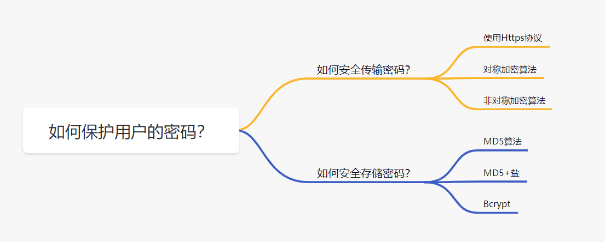
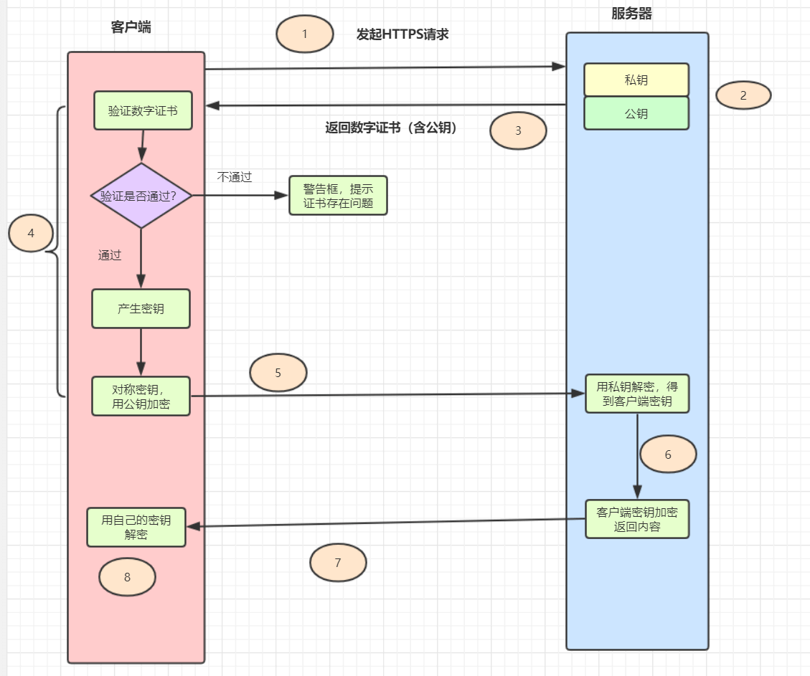
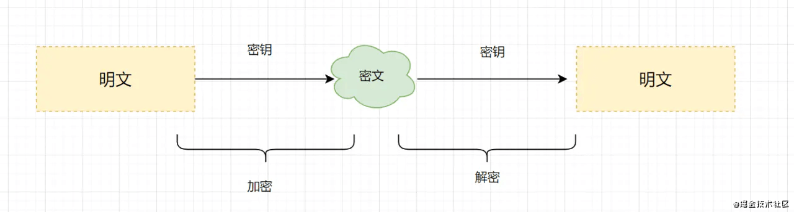
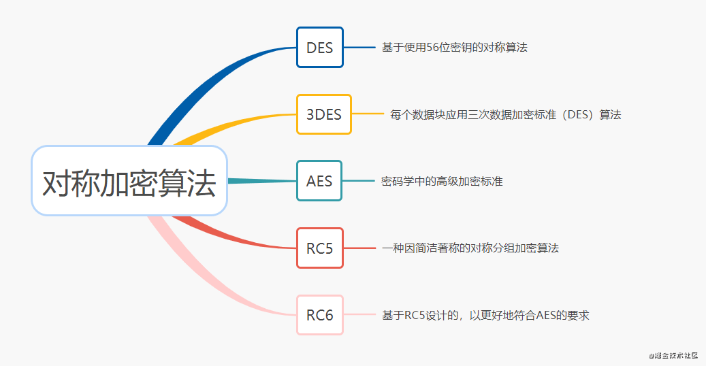
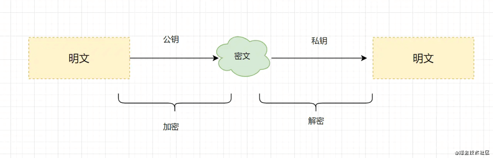
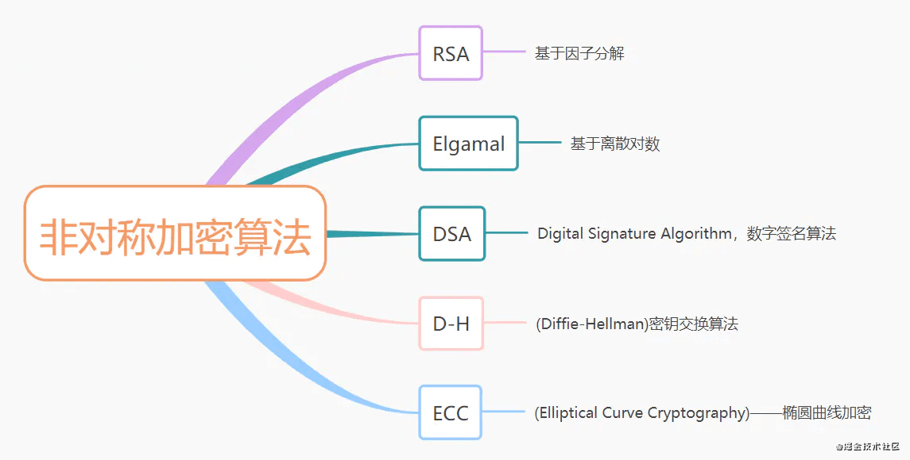
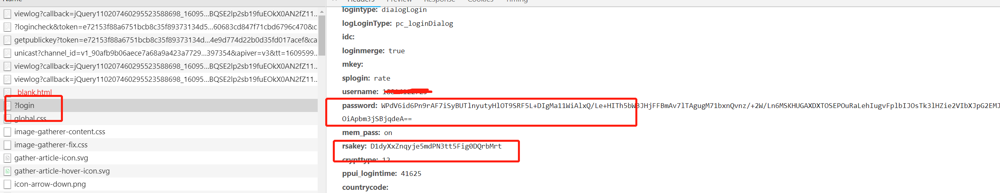
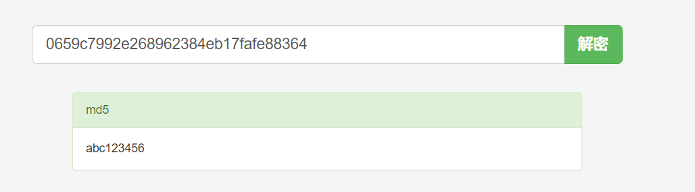

# 安全传输和存储用户密码



## 1、安全传输密码

### 1.1、使用https

拒绝用户密码在网络上裸奔，需要使用https协议。因为http协议是明文传输的，故有3大风险：

- 窃听/嗅探风险：第三方可以截获通信数据。
- 数据篡改风险：第三方获取到通信数据后，会进行恶意修改。
- 身份伪造风险：第三方可以冒充他人身份参与通信。

https原理是什么呢？为什么它能解决http的三大风险呢？

> https = http + SSL/TLS, SSL/TLS 是传输层加密协议，
它提供内容加密、身份认证、数据完整性校验，
以解决数据传输的安全性问题。

一次完整的https请求流程如下：



- 1.客户端发起https请求
- 2.服务器必须要有一套数字证书，可以自己制作，也可以向权威机构申请。这套证书其实就是一对公私钥。
- 3.服务器将自己的数字证书（含有公钥、证书的颁发机构等）发送给客户端。
- 4.客户端收到服务器端的数字证书之后，会对其进行验证，主要验证公钥是否有效，比如颁发机构，过期时间等等。如果不通过，则弹出警告框。如果证书没问题，则生成一个密钥（对称加密算法的密钥，其实是一个随机值），并且用证书的公钥对这个随机值加密。
- 5.客户端会发起https中的第二个请求，将加密之后的客户端密钥(随机值)发送给服务器。
- 6.服务器接收到客户端发来的密钥之后，会用自己的私钥对其进行非对称解密，解密之后得到客户端密钥，然后用客户端密钥对返回数据进行对称加密，这样数据就变成了密文。
- 7.服务器将加密后的密文返回给客户端。
- 8.客户端收到服务器发返回的密文，用自己的密钥（客户端密钥）对其进行对称解密，得到服务器返回的数据。

https的数据传输过程，数据都是密文的，但是，即时使用了https协议传输密码信息，也不一定就安全了。

比如，https完全就是建立在证书可信的基础上的。如果遇到中间人伪造证书，一旦客户端通过验证，安全性顿时就没了！
平时各种钓鱼不可描述的网站，很可能就是黑客在诱导用户安装它们的伪造证书！通过伪造证书，https也是可能被抓包的哦。

### 1.2、对称加密算法

既然使用了https协议传输用户密码，还是「不一定安全」，那么，我们就给用户密码「加密再传输」呗~

加密算法有「对称加密」和「非对称加密」两大类。用哪种类型的加密算法「靠谱」呢？

对称加密：加密和解密使用「相同密钥」的加密算法。



常用的对称加密算法主要有以下几种：



如果使用对称加密算法，需要考虑「密钥如何给到对方」，如果密钥还是网络传输给对方，传输过程，被中间人拿到的话，也是有风险的哦。

再考虑一下非对称加密算法呢？

> 「非对称加密：」非对称加密算法需要两个密钥（公开密钥和私有密钥）。
公钥与私钥是成对存在的，如果用公钥对数据进行加密，只有对应的私钥才能解密。



常用的非对称加密算法主要有以下几种：



> 如果使用非对称加密算法，也需要考虑「密钥公钥如何给到对方」，
如果公钥还是网络传输给对方，传输过程，被中间人拿到的话，会有什么问题呢？
「他们是不是可以伪造公钥，把伪造的公钥给客户端，
然后，用自己的私钥等公钥加密的数据过来？」 大家可以思考下这个问题哈~

我们直接「登录一下百度」，抓下接口请求，验证一发大厂是怎么加密的。可以发现有获取公钥接口，如下:

再看下登录接口，发现就是RSA算法，RSA就是「非对称加密算法」。其实百度前端是用了JavaScript库「jsencrypt」，在github的star还挺多的。



因此，我们可以用「https + 非对称加密算法（如RSA）」 传输用户密码~

## 2、安全存储密码

假设密码已经安全到达服务端啦，那么，如何存储用户的密码呢？一定不能明文存储密码到数据库哦！可以用「哈希摘要算法加密密码」，再保存到数据库。

> 哈希摘要算法： 只能从明文生成一个对应的哈希值，不能反过来根据哈希值得到对应的明文。

### 2.1、MD5摘要算法保护你的密码

MD5 是一种非常经典的哈希摘要算法，被广泛应用于数据完整性校验、数据（消息）摘要、数据加密等。
但是仅仅使用 MD5 对密码进行摘要，并不安全。我们看个例子，如下：

```java
public class MD5Test {
    public static void main(String[] args) {
        String password = "abc123456";
        System.out.println(DigestUtils.md5Hex(password));
    }
}
```

运行结果为：

```bash
0659c7992e268962384eb17fafe88364
```

在MD5免费破解网站一输入，马上就可以看到原密码了。。。



试想一下，如果黑客构建一个超大的数据库，把所有20位数字以内的数字和字母组合的密码全部计算MD5哈希值出来，
并且把密码和它们对应的哈希值存到里面去（这就是**「彩虹表」**）。
在破解密码的时候，只需要查一下这个彩虹表就完事了。所以**「单单MD5对密码取哈希值存储」，已经不安全**了

### 2.2、MD5+盐摘要算法保护用户的密码

什么是「加盐」？

> 在密码学中，是指通过在密码任意固定位置插入特定的字符串，
让散列后的结果和使用原始密码的散列结果不相符，这种过程称之为“加盐”。

用户密码+盐之后，进行哈希散列，再保存到数据库。
这样可以有效应对彩虹表破解法。
但是呢，使用加盐，需要注意一下几点：

- 不能在代码中写死盐，且盐需要有一定的长度（盐写死太简单的话，黑客可能注册几个账号反推出来）
- 每一个密码都有独立的盐，并且盐要长一点，比如超过 20 位。(盐太短，加上原始密码太短，容易破解)
- 最好是随机的值，并且是全球唯一的，意味着全球不可能有现成的彩虹表给你用

### 2.3、提升密码存储安全的利器登场，Bcrypt

即使是加了盐，密码仍有可能被暴力破解。
因此，我们可以采取更「慢一点」的算法，让黑客破解密码付出更大的代价，甚至迫使他们放弃。
提升密码存储安全的利器~Bcrypt，可以闪亮登场啦。

> 实际上，Spring Security 已经废弃了MessageDigestPasswordEncoder，
推荐使用BCryptPasswordEncoder，也就是BCrypt来进行密码哈希。
BCrypt生而为保存密码设计的算法，相比MD5要慢很多。

```java
public class BCryptTest {
    public static void main(String[] args) {
        String password = "123456";
        long md5Begin = System.currentTimeMillis();
        DigestUtils.md5Hex(password);
        long md5End = System.currentTimeMillis();
        System.out.println("md5 time:"+(md5End - md5Begin));
        long bcrytBegin = System.currentTimeMillis();
        BCrypt.hashpw(password, BCrypt.gensalt(10));
        long bcrytEnd = System.currentTimeMillis();
        System.out.println("bcrypt Time:" + (bcrytEnd- bcrytBegin));
    }
}
```

运行结果：

```bash
md5 time:47
bcrypt Time:1597
```

粗略对比发现，BCrypt比MD5慢几十倍，黑客想暴力破解的话，就需要花费几十倍的代价。
因此一般情况，建议使用Bcrypt来存储用户的密码。

## 3、总结

- 一般使用https 协议 + 非对称加密算法（如RSA）来传输用户密码，为了更加安全，可以在前端构造一下随机因子。
- 使用BCrypt + 盐存储用户密码。
- 在感知到暴力破解危害的时候，「开启短信验证、图形验证码、账号暂时锁定」等防御机制来抵御暴力破解。

## 参考资料

- [程序员必备基础：如何安全传输存储用户密码？](https://juejin.cn/post/6913331501887127566)
- [如何正确保存和传输敏感数据？](https://time.geekbang.org/column/article/239150)
- [如何加密传输和存储用户密码](https://juejin.cn/post/6844903604944371726)
