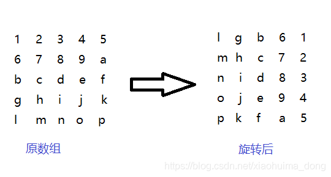

[[toc]]

## 数据结构和算法 {#data-structure-algorithm}

除了个别岗位，大部分前端都是很偏向应用层面的（不管是电商还是低代码平台）。对数据结构和算法的要求并不高。

但是为什么面试的时候还是有很多人喜欢问算法这块的东西呢？因为它是一个很有区分度的话题。
算法差的人，写业务代码的能力有好有差，上下限都很大。算法好的人，往往下限不会太低（但上限也未必高）。
就为了这一点，面一些算法题就已经无可厚非了。
当然还有些情况纯粹是面试官偷懒，这就不赘述了。

一个人是否擅长编写复杂的业务逻辑，主要是看他是否擅长进行反思总结。
这是一个需要长期编码、迭代、反思、重构的过程。靠面对算法题进行乌托邦式实验是没有多少帮助的。

个人的建议是，你需要了解一些基本的数据结构和算法知识，但不必过多涉猎。
以我自己为例，我并不擅长数据结构和算法，但是仅仅是因为有所了解，也就可以写出类似这样的文字：

> 在我自己的电脑上，编译1组路由时用时大概是2分钟，同时编译2组路由时用时大概5分钟，
> 同时编译3组路由时用时大概30分钟，同时编译4组路由时用时大概75分钟。
> 可以发现编译时长和代码量总体上并不是一个线性增长的关系。
> 猜测是因为计算需要从入口文件开始去爬引用到的文件，然后一层层去爬，不同入口爬到的文件有交集文件，也有各自独立的文件，
> 毛估估很像是数据结构里的图（遍历时间复杂度为O(N^2)），而且我大致去算了下也能找到一个合适的模拟函数曲线，
> 不过鉴于样本量有限，每个页面大小差别也很大，也没啥科学性。
> 我在IDE里跳转到webpack源码后发现不是很好确认这点，便作罢。……

以上节选自2021年撰写的博文[《编译要1小时的Webpack项目优化思路和条件编译方案》](https://www.orzzone.com/webpack-conditional-compile.html)。

我认为需要了解的数据结构和算法知识如下：

- 冒泡排序。
- 二分法查找。
- 链表、循环链表、合并两个排序链表。
- 栈、单调栈。
- 快排。
- 队列。
- 二叉树：如何构造、前/中/后序遍历的递归与非递归实现、层次遍历。
- 图：了解下概念和时间、空间复杂度即可。

**在你还没法清楚地知道是否需要了解这块的情况下**，了解这些内容已经足够了。

### Bubble Sort 冒泡排序 {#bubble-sort}

冒泡排序的思想是，比较相邻两个数，如果前者大于后者，就把两个数交换位置；这样一来，第一轮就可以选出一个最大的数放在最后面；那么经过n-1轮，就完成了所有数的排序。

**基本实现**

```javascript
function bubbleSort (arr) {
  let len = arr.length
  while (len > 0) {
    for (let i = 0; i < len - 1; i++) {
      if (arr[i] > arr[i + 1]) {
        const temp = arr[i]
        arr[i] = arr[i + 1]
        arr[i + 1] = temp
      }
    }
    len--
  }
  return arr
}
```

**优化思路**

在上面的方案中，如果我们经过第一轮排序就成功将所有元素正确排好序了的话，仍然会继续遍历。
这里可以每一轮开始遍历时，加一个初始值为false的changeFlag标记，
当本轮有进行过换位的话，就接着遍历下一轮。
当本轮没有进行过换位操作的话，则说明已经排序完毕，就可以直接退出循环，没必要接着遍历了。

具体实现还是比较简单的，大家自行尝试，这里就不写了。

### Dichotomy 二分法 {#dichotomy}

**在已从小到大排序的数组（数组内元素均为数字）中找到给定的数字对应的下标**

```javascript
function dichotomySearch (arr, num) {
  var low = 0
  var high = arr.length - 1
  var mid = Math.floor((low + high) / 2)

  // while循环的判断条件是high - low > 1
  while (high - low > 1) {
    if (num === arr[low]) {
      return low
    }
    if (num === arr[high]) {
      return high
    }
    if (num === arr[mid]) {
      return mid
    }
    if (num > arr[mid]) {
      low = mid
      mid = Math.floor((low + high) / 2)
    } else {
      high = mid
      mid = Math.floor((low + high) / 2)
    }
  }

  // 如果没找到，则返回-1
  return -1
}
```

**求一个数n的平方根**

```javascript
/**
 * 计算平方根
 * @param  {number} n         需要求平方根的目标数字
 * @param  {number} deviation 偏离度（允许的误差范围）
 * @return {number}           返回平方根
 */
function square (n, deviation) {
	let max = n
	let min = 0
	let mid = (max - min) / 2
	const isAlmost = (val) => (
        (val * val - n <= deviation) &&
        (n - val * val <= deviation)
    )
	while (isAlmost(mid) === false) {
		if (mid * mid > n) {
			max = mid
			mid = (max + min) / 2
		} else if (mid * mid < n) {
			min = mid
			mid = (max + min) / 2
		}
	}
	return mid
}
```

### Link 链表 {#link}

#### 约瑟夫环问题 {#josephus}

据说著名犹太历史学家 Josephus有过以下的故事：

> 在罗马人占领乔塔帕特后，39 个犹太人与Josephus及他的朋友（共41个人）躲到一个洞中，
> 39个犹太人决定宁愿死也不要被敌人抓到，于是决定了一个自杀方式：
> 41个人排成一个圆圈，由第1个人开始报数，每报数到第3人该人就必须自杀，
> 然后再由下一个重新报数，直到所有人都自杀身亡为止。
> 然而Josephus 和他的朋友并不想遵从。
> 首先从一个人开始，越过k-2个人（因为第一个人已经被越过），
> 并杀掉第k个人。接着，再越过k-1个人，并杀掉第k个人。
> 这个过程沿着圆圈一直进行，直到最终只剩下一个人留下，这个人就可以继续活着。
> 问题是一开始要站在什么地方才能避免自杀？Josephus要他的朋友先假装遵从，
> 他将朋友与自己安排在第16个与第31个位置，于是逃过了这场死亡游戏。

**数组下标方案**

```javascript
// 初始状态各坐标都赋值为0，被选中则标记为1
const arr = new Array(41).fill(0)
const key = 3

// 最后会剩下2人，走掉39人
const numOfPeopleToLeave = arr.length - 2

let count = 0
while (arr.filter((checked) => checked === 1).length < numOfPeopleToLeave) {
    for (let i = 0, len = arr.length; i < len; i++) {
        // 如果数组中该坐标已被标记，则直接跳过
        if (arr[i] === 1) {
            continue
        }
        count++
        // 每到第key个人
        if (count === key) {
            // 标记数组中该坐标已被占位
            arr[i] = 1
            count = 0
        }
    }
}
// 输出标记情况，标记为0的表示未被选中，标记为1表示被选中
console.log(arr)

// 输出被留下的人（值为0）对应的坐标
console.log(
    arr
      .map((checked, idx) => checked === 0 ? idx : undefined)
      .filter((idx) => typeof idx === 'number')
)
```

**链表方案（单向循环链表）**

如果是单向循环链表的话，对单个链表节点，有：

```javascript
function Node (next) {
    this.next = next || null
}
```

每当计数计到3时，将当前node节点的上一个节点的next指向当前node节点的下一个节点，
然后继续从1开始计数，代码就不写了，虽说数据结构上和数组下标方案不同，
逻辑是差不多的，while循环的终止条件可以换成当当前节点next指向null时。

#### 合并2个排序链表

输入两个单调递增的链表，输出两个链表合成后的链表，当然我们需要合成后的链表满足单调不减规则。

**递归版本**

```javascript
function merge(pHead1, pHead2) {
    let node = null;
    if (pHead1 === null) {
        return pHead2;
    } else if (pHead2 === null) {
        return pHead1;
    }

    if (pHead1.val >= pHead2.val) {
        node = pHead2;
        node.next = merge(pHead1, pHead2.next);
    } else {
        node = pHead1;
        node.next = merge(pHead1.next, pHead2);
    }
    return node;
}
```

**非递归版本**

```javascript
function merge(pHead1, pHead2) {
    if (pHead1 === null) {
        return pHead2;
    } else if (pHead2 === null) {
        return pHead1;
    }
    let node = null;
    let startNode = null;
    if (pHead1.val <= pHead2.val) {
        node = pHead1;
        startNode = pHead1;
        pHead1 = pHead1.next;
    } else {
        node = pHead2;
        startNode = pHead2;
        pHead2 = pHead2.next;
    }
    while (pHead1 !== null && pHead2 !== null) {
        if (pHead1.val <= pHead2.val) {
            node.next = pHead1;
            node = pHead1;
            pHead1 = pHead1.next;
        } else {
            node.next = pHead2;
            node = pHead2;
            pHead2 = pHead2.next;
        }
    }
    if (pHead1 !== null) {
        node.next = pHead1;
    } else if (pHead2 !== null) {
        node.next = pHead2;
    }
    return startNode;
}
```

### 快速排序与分治法 {#quick-sort}

**介绍**

快速排序由于排序效率在同为O(N*logN)的几种排序方法中效率较高，
因此经常被采用，再加上快速排序思想——分治法也确实实用，
因此很多软件公司的笔试面试，包括像腾讯，微软等知名IT公司都喜欢考这个。

::: tip 分治法
快速排序是C.R.A.Hoare于1962年提出的一种划分交换排序。
它采用了一种分治的策略，通常称其为分治法(Divide-and-Conquer Method)。
:::

该方法的基本思想是：
- 先从数列中取出一个数作为基准数（一般是以中间项为基准）；
- 分区过程，将比这个数大的数全放到它的右边，小于或等于它的数全放到它的左边；
- 再对左右区间重复第二步，直到各区间只有一个数。

**代码实现**

```javascript
function quickSort (arr) {
  if (arr.length <= 1) {
    return arr
  }

  // pivot：枢纽、中心点
  var pivotIndex = Math.floor(arr.length / 2)
  // 找基准，并把基准从原数组中删除
  var pivot = arr.splice(pivotIndex, 1)[0]
  // 定义左右数组
  var left = []
  var right = []

  // 比基准小的放在left，比基准大的放在right
  arr.forEach(function (val) {
    if (val <= pivot) {
      left.push(val)
    } else {
      right.push(val)
    }
  })

  // 递归
  return quickSort(left).concat([pivot], quickSort(right))
}
```

### Stack 栈 {#stack}

#### 括号闭合问题 {#stack-parentheses-pairs}

**问题描述**

给定一个只包括`'('`，`')'`，`'{'`，`'}'`，`'['`，`']'`的字符串`s`，
判断字符串是否有效。

有效字符串需满足：

- 左括号必须用相同类型的右括号闭合。
- 左括号必须以正确的顺序闭合。

如：

- 有效的字符串：`"()"`、`"()[]{}"`、`"{[]}"`。
- 无效的字符串：`"(]"`、`"([)]"`。

**解法**

```javascript
function isStrValid (str) {
    const matches = ['()', '[]', '{}']
    const arr = []
    for (let i = 0, len = str.length; i < len; i++) {
        const char = str.charAt(i)
        if (arr.length === 0) {
            arr.push(char)
            continue
        }
        const last = arr[arr.length - 1]
        if (matches.includes(last + char)) {
            arr.pop()
            continue
        }
        arr.push(char)
    }
    return arr.length === 0
}
```

#### 字符消消乐 {#string-match-game}

**问题描述**

给定一个字符串，消除其中所有的字符串 `ac` 和 `b`，如果消掉之后获得的新字符串中仍存在可消内容则需要继续消，直到没有可继续消的字符串为止。

比如字符串 `aaaaaaaaabbbbbbbcccccbbbbbcccc` 经过处理后应该得到空字符串。

**解决方案**

```javascript
function deleteMatchStr (str) {
    const arr = str.split('')
    const tempArr = []
    arr.forEach((item) => {
        const last = tempArr.length ? tempArr[tempArr.length - 1] : ''
        if (last + item === 'ac') {
            tempArr.pop()
            return
        }
        if (item !== 'b') {
            tempArr.push(item)
        }
    })
    return tempArr.join('')
}
deleteMatchStr('aaaaaaaaabbbbbbbcccccbbbbbcccc')
```

#### Monotone stack 单调栈 {#monotone-stack}

单调栈是一种特殊的栈结构，其内部元素的排序是单调朝一个方向的。
在许多数组的范围查询问题上，用上单调栈可显著降低时间复杂度——毕竟其时间复杂度只有O(N)。

**去重返回最小数**

这是LeetCode里的一道难度级别显示为中等的题目。

题目：给定一串数字, 去除字符串中重复的数字, 而且不能改变数字之间的顺序,
使得返回的数字最小 "23123" => "123" "32134323" => "1342"。

解法如下：

```javascript
function handleArray(strings) {
    const array = strings.split('')
    const stack = []
    const obj = {}

    for (let i = 0, len = array.length; i < len; i++) {
        const item = array[i]
        if (stack.length === 0) {
            stack.push(item)
            continue
        }
        const lastStackItem = stack[stack.length - 1]
        while (lastStackItem >= item && array.slice(i).includes(lastStackItem)) {
            stack.pop()
        }
        if (!stack.includes(item)) {
            stack.push(item)
        }
    }

    return stack.join('')
}
handleArray('23123')
handleArray('32134323')
```

### 二叉搜索树及其遍历 {#binary-search-tree}


#### 排序类型 {#binary-search-type}

- 前序遍历（根节点 > 左子树 > 右子树）：8 => 3 => 1 => 6 => 4 => 7 => 10 => 14 => 13
- 中序遍历（左子树 > 根节点 > 右子树）：1 => 3 => 4 => 6 => 7 => 8 => 10 => 13 => 14
- 后序遍历（左子树 > 右子树 > 根节点）：1 => 4 => 7 => 6 => 3 => 13 => 14 => 10 => 8
- 层次遍历（从上往下一层层来）：8 => 3 => 10 => 1 => 6 => 14 => 4 => 7 => 13

#### 二叉树的构造 {#build-binary-search-tree}

```javascript
// 节点对象的构造函数
function Node (data, left, right) {
  this.data = data
  this.left = left
  this.right = right
}

Node.prototype.getData = function () {
  return this.data
}

// 二叉搜索树的构造函数
function BST () {
  this.root = null
}

// 插入方法
BST.prototype.insert = function (data) {
  const n = new Node(data, null, null)
  if (this.root === null) {
    this.root = n
    return
  }
  let current = this.root
  let parent
  while (true) {
    parent = current
    if (data < current.data) {
      current = current.left
      if (current === null) {
        parent.left = n
        break
      }
    } else {
      current = current.right
      if (current === null) {
        parent.right = n
        break
      }
    }
  }
}

const nums = new BST()
nums.insert(8)
nums.insert(3)
nums.insert(10)
nums.insert(1)
nums.insert(6)
nums.insert(14)
nums.insert(4)
nums.insert(7)
nums.insert(13)
```

#### 前/中/后序遍历的递归实现 {#pre-in-post-order-traverse-recursion}

这个算法很好实现：

```javascript
// 前序遍历二叉树
BST.prototype.preOrder = function (node) {
  if (node !== null) {
    console.log(node.getData())
    this.preOrder(node.left)
    this.preOrder(node.right)
  }
}

// 中序遍历二叉树
BST.prototype.inOrder = function (node) {
  if (node !== null) {
    this.inOrder(node.left)
    console.log(node.getData())
    this.inOrder(node.right)
  }
}

// 后序遍历二叉树
BST.prototype.postOrder = function (node) {
  if (node !== null) {
    this.postOrder(node.left)
    this.postOrder(node.right)
    console.log(node.getData())
  }
}

// 测试

nums.inOrder(nums.root)

// 依次输出如下内容：
// 1 3 4 6 7 8 10 13 14
```

#### 前序遍历的非递归实现 {#pre-order-traverse-non-recursion}

根据前序遍历访问的顺序，优先访问根结点，然后再分别访问左孩子和右孩子。
即对于任一结点，其可看做是根结点，因此可以直接访问，访问完之后，若其左孩子不为空，
按相同规则访问它的左子树；访问其左子树后，再访问它的右子树。因此其处理过程如下：

对于任一结点P：

1. 访问结点P，并将结点P入栈;

2. 判断结点P的左孩子是否为空，
    - 若为空，则取栈顶结点并进行出栈操作，并将栈顶结点的右孩子置为当前的结点P，循环至1；
    - 若不为空，则将P的左孩子置为当前的结点P;

3. 直到P为NULL并且栈为空，则遍历结束。

```javascript
function preOrder (bst) {
    let p = bst.root
    const arr = []
    while (p !== null || arr.length > 0) {
        while (p !== null) {
            console.log(p.getData())
            arr.push(p)
            p = p.left
        }

        if (arr.length > 0) {
            p = arr.pop()
            p = p.right
        }
    }
}
```

#### 中序遍历的非递归实现 {#in-order-traverse-non-recursion}

根据中序遍历的顺序，对于任一结点，优先访问其左孩子，而左孩子结点又可以看做一根结点，
然后继续访问其左孩子结点，直到遇到左孩子结点为空的结点才进行访问，
然后按相同的规则访问其右子树。因此其处理过程如下：

对于任一结点P，

1. 若其左孩子不为空，则将P入栈并将P的左孩子置为当前的P，然后对当前结点P再进行相同的处理；

2. 若其左孩子为空，则取栈顶元素并进行出栈操作，访问该栈顶结点，然后将当前的P置为栈顶结点的右孩子；

3. 直到P为NULL并且栈为空则遍历结束。

```javascript
function inOrder (bst) {
    let p = bst.root
    const arr = []
    while (p !== null || arr.length > 0) {
        while (p !== null) {
            arr.push(p)
            p = p.left
        }

        if (arr.length > 0) {
            p = arr.pop()
            console.log(p.getData())
            p = p.right
        }
    }
}
```

#### 后序遍历的非递归实现 {#post-order-traverse-non-recursion}

后续遍历比前中/序遍历是要麻烦一些的。

遍历顺序：左右根。左路的遍历和上面的思路是类似的，区别是元素出栈时不能直接打印，
因为如果有**没访问过**右侧子树的话，需要先访问右侧子树。
右侧子树访问结束后才访问根节点。

```javascript
function postOrder (bst) {
    let p = bst.root
    let last = null
    const arr = []
    while (p !== null || arr.length > 0) {
        while (p !== null) {
            arr.push(p)
            p = p.left
        }

        if (arr.length > 0) {
            p = arr[arr.length - 1] // 栈顶元素
            // 当p不存在右子树或右子树已被访问过的话，直接访问当前节点数据
            if (!p.right || p.right === last) {
                p = arr.pop()
                console.log(p.getData())
                last = p // 记录上一次访问过的节点
                p = null // 这个容易漏掉，避免下个循环继续访问左子树
            } else {
                p = p.right
            }
        }
    }
}
```

#### 层次遍历 {#binary-level-traverse}

**递归方案**

```javascript
// 遍历到某个节点后，将该节点的值推入到指定深度对应的数组中
function level(node, idx,  arr) {
    if (arr.length < idx) {
        arr.push([])
    }
    
    arr[idx - 1].push(node.value)
  
    if (node.left !== null) {
        level(node.left, idx + 1, arr)
    }
    
    if (node.right !== null) {
        level(node.right, idx + 1, arr)
    }
}

function levelOrder(root) {
    if (root === null) {
        return []
    }
    
    const arr = []
    level(root, 1, arr)
    return arr
}
```

**非递归方案**

使用队列实现。

```javascript
function levelOrder(root) {
    const arr = []
    if (root === null) {
        return arr
    }

    const queue = [root]

    while (queue.length > 0) {
        const currentLevel = []
        const currentLevelLength = queue.length
        for (let i = 0; i <= currentLevelLength; i++) {
            const node = queue.pop()
            currentLevel.push(node.value)
          
            if (node.left !== null) {
                queue.push(node.left)
            }
            if (node.right !== null) {
                queue.push(node.right)
            }
        }
        arr.push(currentLevel)
    }

    return arr
}
```

### 其他 {#algorithm-questions}

#### 实现对象深拷贝 {#object-deep-clone}

``` javascript
function deepClone(obj) {
    // if not object
    if (typeof obj !== 'object') {
        return obj
    }

    // if null
    if (obj === null) {
        return null
    }

    // if array
    if (Array.isArray(obj)) {
        return obj.map((elem) => deepClone(elem))
    }

    // if obj
    const tempObj = {}
    for (const key in obj) {
        if (obj.hasOwnProperty(key)) {
            tempObj[key] = deepClone(obj[key])
        }
    }
    return tempObj
}
```

#### 数组扁平化 {#flatten-array}

**问题**

- 将数组中的所有数组元素扁平化成顶层元素，返回新数组，不修改原数组
- 增加去重功能，重复的**为基本数据类型的元素**不显示（只是不显示重复的部分，即如果有两个2，第二个重复的2不显示，第一个2还是要显示的）

**解答**

``` javascript
function flattenArray(arr) {
    if (!Array.isArray(arr)) {
        throw new TypeError('You should pass in an Array parameter')
    }
    const tempArr = []
    const tempObj = {}

    void function recurison(item) {
        if (Array.isArray(item)) {
            item.forEach(recurison)
        } else {
            if (typeof item === 'object') {
                tempArr.push(item)
            } else if (!tempObj[item]) {
                tempArr.push(item)
                tempObj[item] = true
            }
        }
    }(arr)

    return tempArr
}
```

#### 数字数组奇偶排序 {#odd-even-sort}

**问题**

将数组中奇数放在右边，偶数放在左边，不允许使用额外空间。

说明：从一个数组中间删除元素splice的运行代价是比较大的。

**方案**

``` javascript
const arr = [1, 4, 5, 2, 3, 7, 8]
arr.sort(function (a, b) {
  return a % 2 !== 0
})
```

#### 求数组中第二大的数 {#find-second-big-number}

**问题**

要求：
- 不能对这个数组进行整体排序；
- 若要用循环，只能一重循环；
- 不使用额外空间。

**解答**

思路：把最大的数字标记为null，然后再求此时的最大数字。

``` javascript
const arr = [1, 3, 5, 2, 7, 6]
arr[arr.indexOf(Math.max.apply(null, arr))] = null
Math.max.apply(null, arr)
```

#### 90度旋转二维数组  {#rotate-2d-array}



```javascript
const rawArr = [
    ['1', '2', '3', '4', '5'],
    ['6', '7', '8', '9', 'a'],
    ['b', 'c', 'd', 'e', 'f'],
    ['g', 'h', 'i', 'j', 'k'],
    ['l', 'm', 'n', 'o', 'p']
]
```

**使用新数组再覆盖原数组**

如果直接先生成一个新数组，
然后逐个将旧数组里的元素赋值到新数组中的对应位置，那就很简单了。

先列数据看规律：
- (0, 0) => (0, 4)
- (0, 1) => (1, 4)
- (0, 2) => (2, 4)
- (0, 3) => (3, 4)
- (0, 4) => (4, 4)
- ...
- (2, 0) => (0, 2)
- (2, 1) => (1, 2)
- (2, 2) => (2, 2)
- (2, 3) => (3, 2)
- (2, 4) => (4, 2)
- ...
- (4, 0) => (0, 0)
- (4, 1) => (1, 0)
- (4, 2) => (2, 0)
- (4, 3) => (3, 0)
- (4, 4) => (4, 0)

可以看出规律是：oldArray(x, y) => newArray(y, 5 - 1 - x)

```javascript
const rawArr = [
  ['1', '2', '3', '4', '5'],
  ['6', '7', '8', '9', 'a'],
  ['b', 'c', 'd', 'e', 'f'],
  ['g', 'h', 'i', 'j', 'k'],
  ['l', 'm', 'n', 'o', 'p']
]

function rotate90(arr) {
    const length = arr.length
    // 直接这样写是不行的，5个子数组实际对应的是同一个对象，修改一个其实是5个子数组里的值都变了
    // const tempArr = new Array(length).fill(new Array(length))
    // 这里去掉fill(1)的话就无法构造成二维数组了
    const tempArr = new Array(5).fill(1).map(() => new Array(5))
    arr.forEach((row, rowIdx) => {
        row.forEach((col, colIdx) => {
            tempArr[colIdx][length - rowIdx - 1] = arr[rowIdx][colIdx]
            console.log(`(${rowIdx}, ${colIdx}) => (${colIdx}, ${length - rowIdx - 1})`)
        })
    })
    return tempArr
}
console.log(rotate90(rawArr))
```

#### 画星号 {#draw-asterisk}

**问题描述**

实现一个函数，入参为数字 `n`，输出如下图所示的字符串。


**解决方案**

```javascript
function drawAsterisk(n) {
    function getRepeatStr (num, repeatStr) {
        return new Array(num).fill(repeatStr).join('')
    }
    function log (str) {
        console.log(str)
    }

    const arr = []
    const sumLength = 2 * n - 1
    for (let i = 0; i < n - 1; i++) {
        const numOfStar = 2 * i + 1
        const numOfSpaces = sumLength - numOfStar
        const sideSpaces = getRepeatStr(numOfSpaces / 2, ' ')
        arr.push(sideSpaces + getRepeatStr(numOfStar, '*') + sideSpaces)
    }
    // 画上半部分
    arr.forEach(log)
    // 画中间一行
    console.log(getRepeatStr(2 * n - 1, '*'))
    // 下半部分与上半部分层是轴对称的，直接 `reverse()` 反转下就可以直接用
    arr.reverse()
    // 画下半部分
    arr.forEach(log)
}
drawAsterisk(2)
```
