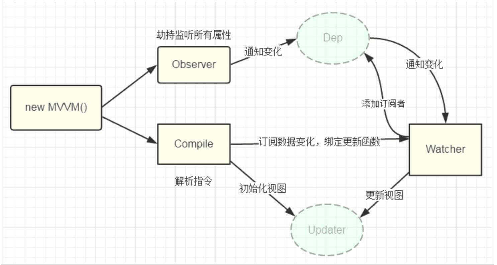
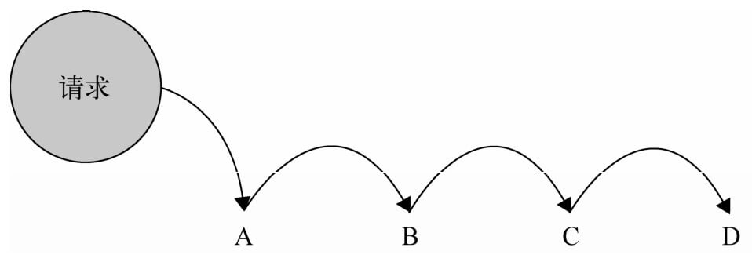
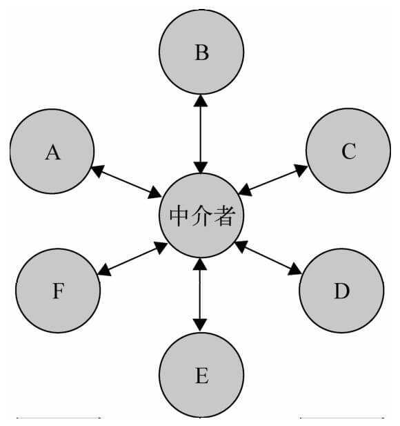

[[toc]]

## 设计模式 {#design-patterns}

设计模式是前人总结出来的一些典型的代码设计方案。了解一下，对提升架构能力会有所帮助。

### 设计模式的分类 {#design-patterns-category}

根据设计模式的参考书《Design Patterns - Elements of Reusable Object-Oriented Software》中所提到的，总共有23种设计模式。
这些模式可以分为三大类：

- 创建型模式（Creational Patterns）：这些设计模式提供了一种在创建对象的同时**隐藏创建逻辑**的方式，而不是使用 new 运算符直接实例化对象。这使得程序在判断针对某个给定实例需要创建哪些对象时更加灵活。
    - 工厂模式（Factory Pattern）
    - 抽象工厂模式（Abstract Factory Pattern）
    - 单例模式（Singleton Pattern）
    - 建造者模式（Builder Pattern）
    - 原型模式（Prototype Pattern）

- 结构型模式（Structural Patterns）：这些设计模式关注类和对象的组合。
    - 适配器模式（Adapter Pattern）
    - 桥接模式（Bridge Pattern）
    - 过滤器模式（Filter、Criteria Pattern）
    - 组合模式（Composite Pattern）
    - 装饰器模式（Decorator Pattern）
    - 外观模式（Facade Pattern）
    - 享元模式（Flyweight Pattern）
    - 代理模式（Proxy Pattern）

- 行为型模式（Behavioral Patterns）：这些设计模式特别关注对象之间的通信。
    - 责任链模式（Chain of Responsibility Pattern）
    - 命令模式（Command Pattern）
    - 解释器模式（Interpreter Pattern）
    - 迭代器模式（Iterator Pattern）
    - 中介者模式（Mediator Pattern）
    - 备忘录模式（Memento Pattern）
    - 观察者模式（Observer Pattern）
    - 状态模式（State Pattern）
    - 空对象模式（Null Object Pattern）
    - 策略模式（Strategy Pattern）
    - 模板模式（Template Pattern）
    - 访问者模式（Visitor Pattern）

另外还有一些由Sun Java Center提出的J2EE 设计模式，这些模式特别关注表示层：

- MVC 模式（MVC Pattern）
- 业务代表模式（Business Delegate Pattern）
- 组合实体模式（Composite Entity Pattern）
- 数据访问对象模式（Data Access Object Pattern）
- 前端控制器模式（Front Controller Pattern）
- 拦截过滤器模式（Intercepting Filter Pattern）
- 服务定位器模式（Service Locator Pattern）
- 传输对象模式（Transfer Object Pattern）

### 设计模式的6大原则 {#design-patterns-principles}

- Open Close Principle：开放封闭原则。面向扩展扩展开放（Open for Extension），面向修改封闭（Closed for Modification）。想要使程序的扩展性好，易于维护和升级，想要使用接口和抽象类。
- Liskov Substitution Principle。里氏代换原则。用子类替换基类。
- Dependence Inversion Principle。依赖倒转原则：针对接口编程，依赖于抽象而不依赖于具体。
- Interface Segregation Principle。接口隔离原则：使用多个隔离的接口，比使用单个接口要好。降低类之间的耦合度。
- Demeter Principle。迪米特法则，又称最少知道原则：一个实体应尽量少地与其他实体之间发生相互作用，使得系统功能模块相对独立。
- Composite Reuse Principle。合成/复用原则是指：尽量使用合成/聚合的方式，而不是使用继承。

### 观察者模式 {#design-pattern-observer}

#### 什么是观察者模式 {#design-pattern-observer-concept}

::: tip 提示
观察者模式（Observer）
通常又被称为**发布-订阅者模式**或**消息机制**，
它定义了对象间的一种一对多的依赖关系，
只要当一个对象的状态发生改变时，
所有依赖于它的对象都得到通知并被自动更新，
解决了主体对象与观察者之间功能的耦合，
即一个对象状态改变给其他对象通知的问题。
:::

下面这段代码就是一种发布-订阅模式：

```javascript
document.querySelector('#btn').addEventListener('click', function () {
    alert('You click this button');
}, false)
```

除了我们常见的 DOM 事件绑定外，观察者模式应用的范围还有很多~

比如 vue2 框架里不少地方都涉及到了观察者模式，比如：

**数据的双向绑定**



利用Object.defineProperty()对数据进行劫持，
设置一个监听器Observer，用来监听所有属性，
如果属性上发上变化了，就需要告诉订阅者Watcher去更新数据，
最后指令解析器Compile解析对应的指令，
进而会执行对应的更新函数，从而更新视图，实现了双向绑定。

**子组件与父组件通信**

Vue中我们通过props完成父组件向子组件传递数据，
子组件与父组件通信我们通过自定义事件即$on、$emit来实现，
其实也就是通过$emit来发布消息，并对订阅者$on做统一处理。

#### 创建一个观察者 {#design-pattern-create-observe}

首先我们需要创建一个观察者对象，它包含一个消息容器和三个方法，分别是：
- on：订阅消息
- off：取消订阅消息
- publish：发送订阅消息

```javascript
const Observe = (function() {
    // 防止消息队列暴露而被篡改，将消息容器设置为私有变量
    let __message = {};
    return {
        // 注册消息接口
        on: function(type, fn) {
            // 如果此消息不存在，创建一个该消息类型
            if (typeof __message[type] === 'undefined') {
                //  将执行方法推入该消息对应的执行队列中
                __message[type] = [fn];
            } else {
                // 如果此消息存在，直接将执行方法推入该消息对应的执行队列中
                __message[type].push(fn);
            }
        },

        // 发布消息接口
        publish: function(type, args) {
            // 如果该消息没有注册，直接返回
            if (!__message[type]) return;
            // 定义消息信息
            const events = {
                type, // 消息类型
                args: args || {} // 参数
            }
            // 遍历执行函数
            for (let i = 0, len = __message[type].length; i < len; i++) {
                // 依次执行注册消息对应的方法
                __message[type][i].call(this, events)
            }
        },

        // 移除消息接口
        off: function(type, fn) {
            // 如果消息执行队列存在
            if (__message[type] instanceof Array) {
                // 从最后一条依次遍历（之所以从最后一个开始遍历，是因为下面会用到splice）
                for (let i = __message[type].length - 1; i >= 0; i--) {
                    // 如果存在该执行函数则移除相应的动作
                    __message[type][i] === fn && __message[type].splice(i, 1);
                }
            }
        }
    }
})();
```

使用：

```javascript
// 订阅消息
Observe.on('say', function (data) {
  console.log(data.args.text);
})
Observe.on('success',function () {
    console.log('success')
});

//发布消息
Observe.publish('say', { text : 'hello world' } )
Observe.publish('success');
```

我们在消息类型为say、success的消息中注册了两个方法，其中有一个接受参数，另一个不需要参数，
然后通过publish发布say和success消息，结果跟我们预期的一样，
控制台输出了 hello world 以及 success。

#### 实现EventBus {#event-bus}

```javascript
class EventBus {
    constructor() {
        this.event = Object.create(null);
    };

    // 注册事件
    on(name, fn) {
        if(!this.event[name]){
            // 一个事件可能有多个监听者
            this.event[name]=[];
        };
        this.event[name].push(fn);
    };

    // 触发事件
    emit(name, ...args) {
        //给回调函数传参
        this.event[name] && this.event[name].forEach(fn => {
            fn(...args)
        });
    };

    // 只被触发一次的事件
    once(name, fn) {
        // 在这里同时完成了对该事件的注册、对该事件的触发，并在最后取消该事件。
        const cb=(...args)=>{
            //触发
            fn(...args);
            //取消
            this.off(name,fn);
        };
        //监听
        this.on(name, cb);
    };

    // 取消事件
    off(name, offCb) {
        if(this.event[name]){
            const index = this.event[name].findIndex((fn)=>{
                return offCb === fn;
            })

            if (index !== -1) {
                this.event[name].splice(index, 1);

                if(!this.event[name].length){
                    delete this.event[name];
                }
            }
        }
    }
}
```

### 单例模式 {#singleton-pattern}

通用的单例构造函数：

```javascript
const getSingle = function (fn) {
    let result
    return function () {
        return result || (result = fn.apply(this, arguments))
    }
}
```

```javascript
// 单例构造函数
function CreateSingleton (name) {
    this.name = name;
    this.getName();
};

// 获取实例的名字
CreateSingleton.prototype.getName = function() {
    console.log(this.name)
};
// 单例对象
const Singleton = (function(){
    var instance;
    return function (name) {
        if(!instance) {
            instance = new CreateSingleton(name);
        }
        return instance;
    }
})();

// 创建实例对象1
const a = new Singleton('a');
// 创建实例对象2
const b = new Singleton('b');

// 返回true
console.log(a===b);
// 返回true
console.log(a.name === b.name)
```

#### 使用单例模式 {#singleton-pattern-use}

责任链模式、观察者模式、策略模式 这三种在日常的前端开发中，经常遇到：

- 责任链模式通常在分布提交表单中，前一步表单满足后才能进入下一步，例如新建商品、营促销活动等；

- 观察者模式通常应用在组件之间的通讯中；

- 策略模式通常用来优化过多的 `if`/`else` 或 `switch`/`case`；

那么单例模式有哪些场景使用呢？

不借助第三方库，我们可以使用单例模式来制作一个全局的状态存储。

例如在小程序这种移动端，需要开发一个新建商品的需求，由于商品的属性很多，会将基本信息、规格属性、商品详情（富文本）等做成三个页面，规格属性选择又会多出一个页面。

总共 4 个页面以及各种组件，都需要能共享到“商品”这个对象用来进行回显。

这个时候就可以用单例模式来存储“商品”数据：

```javascript
// store.js

const PRODUCT_MODEL = Object.freeze({
    productName: "",
    productBrand: "",
    productSkuList: [],
    // etc...
});

class Storage {
    static getInstance() {
        if (!this.instance) {
            this.instance = new Storage();
        }

        return this.instance;
    }

    constructor() {
        this.data = Object.assign({}, PRODUCT_MODEL);
    }

    init(obj) {
        this.data = { ...this.data, ...obj };
    }

    set(key, value) {
        if (!key) {
            throw new Error("A store key must be provided");
        }

        this.data[String(key)] = value;

        return this;
    }

    get(key) {
        const value = key ? this.data[String(key)] : this.data;

        return value;
    }

    removeItem(key) {
        delete this.data[String(key)];
    }

    reset(obj = {}) {
        this.data = Object.assign({}, PRODUCT_MODEL, obj);
    }
}

module.exports = Storage.getInstance();
```

这份 `store.js` 模块，暴露了几个函数用来共享给页面和组件：

- `init()` 用来在编辑模式下回填接口返回的商详数据；
- `reset()` 用来清空并重置当前存储的数据；

  ```javascript
  // 在保存或某个场景结束操作时，需要重置单例所存储的数据
  const store = require("./store.js");

  onUnload() {
  	storage.reset();
  }
  ```

- `set()` 用来设置某个属性的值，同时它返回了 `this`，这样可以**链式调用**：

  ```javascript
  const store = require("./store.js");

  store
      .set("productName", "商品名称")
      .set("productBrand", "商品品牌");
  ```

- `get()` 用来获取指定属性或全部属性的值；

  ```javascript
  const store = require("./store.js");

  onShow() {
  	// 获取全部属性的值
  	const productInfo = storage.get();
  	// 获取指定属性的值
  	const productName = storage.get("productName");
  }
  ```

- `removeItem()` 用来移除某个属性的值；

### 策略模式 {#strategy-design-pattern}

策略模式有时是违法最少知识原则的，因为使用者可能要了解所有的 strategy 才能判断应该具体使用哪种 strategy。

例1：

```javascript
const strategy = new SomeStrategy()
context.setStrategy(strategy)
context.doSomething()
```

例2：

```javascript
const eventStrategies = {
    commandStart: {
        editor: async () => {},
    },
    commandEnd: {
        editor: async () => {},
    },
    *: async () => {}
}
addEventListener((type, msg) => {
    const strategy = eventStrategies[type][msg]
    if (typeof strategy === 'function') {
        strategy()
        return
    }
    eventStrategies['*']()
})
```

### 外观模式 {#appearance-design-pattern}

例1：

```javascript
class ObjType1 {
    static add () {}
}
class ObjType2 {
    static add () {}
}
function addElement(type) {
    switch (type) {
        case 'objType1':
            ObjType1.add()
            break
        case 'objType2':
            ObjType2.add()
            break
        default:
            break
    }
}

// 调用者无需关心具体有哪些对象类自己去调用对应对象类的 add 静态方法
addElement('objType1')
```

例2：

```javascript
/**
 * 调用者只需要知道对象 id，
 * 就可以初始化对象实例，
 * 不用关心具体代码是如何判断某个 id 对应的对象是哪个 class 的实例，
 * 也不用关心里面的是否有缓存逻辑和是否有优先调用批查询命令替换多次调用单查询命令的情况
 * 高级开发可以慢慢完善内部的具体实验，普通开发可以直接开发业务功能，只要确定好输入和输出即可
 */
batchGetElementInstanceList([id1, id2, id3, id4])
```

### 备忘录模式 {#memento-design-pattern}

本文参考了以下文章：

- [备忘录模式](https://www.runoob.com/design-pattern/memento-pattern.html)

备忘录模式（Memento Pattern）保存一个对象的某个状态，以便在适当的时候恢复对象。备忘录模式属于行为型模式。

备忘录模式使用三个类 Memento、Originator 和 CareTaker。Memento 包含了要被恢复的对象的状态。Originator 创建并在 Memento 对象中存储状态。Caretaker 对象负责从 Memento 中恢复对象的状态。


创建 `Memento` 类：

```java
public class Memento {
   private String state;
 
   public Memento(String state){
      this.state = state;
   }
 
   public String getState(){
      return state;
   }
}
```

创建 `Originator` 类。

```java
public class Originator {
   private String state;
 
   public void setState(String state){
      this.state = state;
   }
 
   public String getState(){
      return state;
   }
 
   public Memento saveStateToMemento(){
      return new Memento(state);
   }
 
   public void getStateFromMemento(Memento Memento){
      state = Memento.getState();
   }
}
```

创建 `CareTaker` 类。

```java
import java.util.ArrayList;
import java.util.List;
 
public class CareTaker {
   private List<Memento> mementoList = new ArrayList<Memento>();
 
   public void add(Memento state){
      mementoList.add(state);
   }
 
   public Memento get(int index){
      return mementoList.get(index);
   }
}
```

使用 `CareTaker` 和 `Originator` 对象。

```java
public class MementoPatternDemo {
   public static void main(String[] args) {
      Originator originator = new Originator();
      CareTaker careTaker = new CareTaker();
      originator.setState("State #1");
      originator.setState("State #2");
      careTaker.add(originator.saveStateToMemento());
      originator.setState("State #3");
      careTaker.add(originator.saveStateToMemento());
      originator.setState("State #4");
 
      System.out.println("Current State: " + originator.getState());    
      originator.getStateFromMemento(careTaker.get(0));
      System.out.println("First saved State: " + originator.getState());
      originator.getStateFromMemento(careTaker.get(1));
      System.out.println("Second saved State: " + originator.getState());
   }
}
```

验证输出：

```text
Current State: State #4
First saved State: State #2
Second saved State: State #3
```

### 代理模式 {#proxy-design-pattern}

本文参考了曾探的《JavaScript设计模式与开发实践》一书。

其实代理模式很常见：

- 比如我之前写项目时，一般不喜欢同事直接使用第三方的 api，或者直接使用未确定具体实现的 api，喜欢再嵌一层。举个例子，封装一个 storage 对象来代替 localStorage，这样以后要把 localStorage 替换成别的存储引擎也无需大动干戈。再举个例子，比如接口请求，我不会直接用 axios，而是会再封装一层，这样以后不想用 axios 想用别的比如 jQuery 的话，要替换起来会很方便。
- 不只是方便替换，有时候我们想增加更多的细节功能，如果之前多了一层代理，这样都会方便很多。比如对第三方的日志打印功能不满意，可以自己代理一下，然后在里面加上打印正文前加上时间戳前缀等逻辑。或者对 query 方法增加缓存和打日志功能，对 execute 方法增加打日志功能。

注意：代理和本地的接口需要保持一致。

虚拟代理模式示例：

```javascript
var myImage = (function(){
    var imgNode = document.createElement( 'img' );
    document.body.appendChild( imgNode );

    return function( src ){
      imgNode.src = src;
    }
})();

var proxyImage = (function(){
    var img = new Image;

    img.onload = function(){
      myImage( this.src );
    }

    return function( src ){
      myImage( 'file:// /C:/Users/svenzeng/Desktop/loading.gif' );
      img.src = src;
    }
})();

proxyImage( 'http://imgcache.qq.com/music// N/k/000GGDys0yA0Nk.jpg' );
```

虚拟代理合并 HTTP 请求：

```javascript
var synchronousFile = function( id ){
    console.log( ’开始同步文件，id为： ' + id );
};

var proxySynchronousFile = (function(){
    var cache = [],    // 保存一段时间内需要同步的ID
      timer;    // 定时器

    return function( id ){
      cache.push( id );
      if ( timer ){    // 保证不会覆盖已经启动的定时器
          return;
      }

      timer = setTimeout(function(){
          synchronousFile( cache.join( ', ' ) );    // 2秒后向本体发送需要同步的ID集合
          clearTimeout( timer );    // 清空定时器
          timer = null;
          cache.length = 0; // 清空ID集合
      }, 2000 );
    }
})();

var checkbox = document.getElementsByTagName( 'input' );

for ( var i = 0, c; c = checkbox[ i++ ]; ){
    c.onclick = function(){
        if ( this.checked === true ){
          proxySynchronousFile( this.id );
        }
    }
};
```

### 命令模式 {#command-design-pattern}

本文参考了曾探的《JavaScript设计模式与开发实战》。

有时候需要向某些对象发送请求，但是并不知道请求的接收者是谁，也不知道被请求的操作是什么，此时希望用一种松耦合的方式来设计软件，使得请求发送者和请求接收者能够消除彼此之间的耦合关系。

### 享元模式 {#flyweight-design-pattern}

本文参考了曾探的《JavaScript设计模式与开发实战》。

享元（flyweight）模式是一种用于性能优化的模式，“fly”在这里是苍蝇的意思，意为蝇量级。**享元模式的核心是运用共享技术来有效支持大量细粒度的对象。**

如果系统中因为创建了大量类似的对象而导致内存占用过高，享元模式就非常有用了。在JavaScript中，浏览器特别是移动端的浏览器分配的内存并不算多，如何节省内存就成了一件非常有意义的事情。

::: tip 对象池

一个典型的例子就是对象池。对象池维护一个装载空闲对象的池子，如果需要对象的时候，不是直接new，而是转从对象池里获取。如果对象池里没有空闲对象，则创建一个新的对象，当获取出的对象完成它的职责之后，再进入池子等待被下次获取。

示例代码如下：

```javascript
        var toolTipFactory = (function(){
    var toolTipPool = [];    // toolTip对象池

    return {
        create: function() {
            // 如果对象池为空
            if ( toolTipPool.length === 0 ) {
                // 创建一个dom
                var div = document.createElement( 'div' );
                document.body.appendChild( div );
                return div;
            } else {
                // 如果对象池里不为空
                // 则从对象池中取出一个dom
                return toolTipPool.shift();
            }
        },
        recover: function( tooltipDom ){
            // 对象池回收dom
            return toolTipPool.push( tooltipDom );
        }
    }
})();
```

:::

### 职责链模式 {#chain-of-responsibility--pattern}

本文参考了曾探的《JavaScript设计模式与开发实战》。

职责链模式的定义是：使多个对象都有机会处理请求，从而避免请求的发送者和接收者之间的耦合关系，将这些对象连成一条链，并沿着这条链传递该请求，直到有一个对象处理它为止。

职责链模式的名字非常形象，一系列可能会处理请求的对象被连接成一条链，请求在这些对象之间依次传递，直到遇到一个可以处理它的对象，我们把这些对象称为链中的节点。



一般情况下我们会利用一个 `Chain` 类来把普通函数包装成职责链的节点。但是利用 JavaScript 的函数式特性，有一种更加方便的方法来创建职责链：

```javascript
Function.prototype.after = function( fn ){
    var self = this;
    return function(){
      var ret = self.apply( this, arguments );
      if ( ret === 'nextSuccessor' ){
          return fn.apply( this, arguments );
      }

      return ret;
    }
};

var order = order500yuan.after( order200yuan ).after( orderNormal );

order( 1, true, 500 );    // 输出：500元定金预购，得到100优惠券
order( 2, true, 500 );    // 输出：200元定金预购，得到50优惠券
order( 1, false, 500 );   // 输出：普通购买，无优惠券
```

用 AOP 来实现职责链既简单又巧妙，但这种把函数叠在一起的方式，同时也叠加了函数的作用域，如果链条太长的话，也会对性能有较大的影响。

::: tip AOP

AOP 是 Aspect Oriented Programming 的缩写，即“面向切面编程”。编程中，对象之间、方法之间、模块之间，都是一个个的切面。

:::

### 中介者模式 {#mediator-pattern}

本文参考了曾探的《JavaScript设计模式与开发实战》。

面向对象设计鼓励将行为分布到各个对象中，把对象划分成更小的粒度，有助于增强对象的可复用性，但由于这些细粒度对象之间的联系激增，又有可能会反过来降低它们的可复用性。

中介者模式的作用就是解除对象与对象之间的紧耦合关系。增加一个中介者对象后，所有的相关对象都通过中介者对象来通信，而不是互相引用，所以当一个对象发生改变时，只需要通知中介者对象即可。中介者使各对象之间耦合松散，而且可以独立地改变它们之间的交互。中介者模式使网状的多对多关系变成了相对简单的一对多关系。



有个购买商品（比如内存条）时选规则然后校验库存的场景：现在我们来引入中介者对象，所有的节点对象只跟中介者通信。当下拉选择框colorSelect、memorySelect和文本输入框numberInput发生了事件行为时，它们仅仅通知中介者它们被改变了，同时把自身当作参数传入中介者，以便中介者辨别是谁发生了改变。剩下的所有事情都交给中介者对象来完成，这样一来，无论是修改还是新增节点，都只需要改动中介者对象里的代码。

```javascript
var goods = {   // 手机库存
    "red|32G": 3,
    "red|16G": 0,
    "blue|32G": 1,
    "blue|16G": 6
};

var mediator = (function(){

    var colorSelect = document.getElementById( 'colorSelect' ),
      memorySelect = document.getElementById( 'memorySelect' ),
      numberInput = document.getElementById( 'numberInput' ),
      colorInfo = document.getElementById( 'colorInfo' ),
      memoryInfo = document.getElementById( 'memoryInfo' ),
      numberInfo = document.getElementById( 'numberInfo' ),
      nextBtn = document.getElementById( 'nextBtn' );

    return {
      changed: function( obj ){
          var color = colorSelect.value,   // 颜色
              memory = memorySelect.value, // 内存
              number = numberInput.value,   // 数量
              stock = goods[ color + '|' + memory ];   // 颜色和内存对应的手机库存数量

          if ( obj === colorSelect ){     // 如果改变的是选择颜色下拉框
              colorInfo.innerHTML = color;
          }else if ( obj === memorySelect ){
              memoryInfo.innerHTML = memory;
          }else if ( obj === numberInput ){
              numberInfo.innerHTML = number;
          }

          if ( ! color ){
              nextBtn.disabled = true;
              nextBtn.innerHTML = ’请选择手机颜色’;
              return;
          }

          if ( ! memory ){
              nextBtn.disabled = true;
              nextBtn.innerHTML = ’请选择内存大小’;
              return;
          }

          if ( Number.isInteger ( number -0 ) && number > 0 ){   // 输入购买数量是否为正整数
              nextBtn.disabled = true;
              nextBtn.innerHTML = ’请输入正确的购买数量’;
              return;
          }

          nextBtn.disabled = false;
          nextBtn.innerHTML = ’放入购物车’;
      }
    }

})();

// 事件函数：
colorSelect.onchange = function(){
    mediator.changed( this );
};
memorySelect.onchange = function(){
    mediator.changed( this );
};
numberInput.oninput = function(){
    mediator.changed( this );
};
```

可以想象，某天我们又要新增一些跟需求相关的节点，比如CPU型号，那我们只需要稍稍改动 `mediator` 对象即可：

```javascript
        var goods = {    // 手机库存
    "red|32G|800": 3,    // 颜色red，内存32G, cpu800，对应库存数量为3
    "red|16G|801": 0,
    "blue|32G|800": 1,
    "blue|16G|801": 6
};

var mediator = (function(){
    // 略
    var cpuSelect = document.getElementById( 'cpuSelect' );
    return {
        change: function(obj){
            // 略
            var cpu = cpuSelect.value,
                stock = goods[ color + '|' + memory + '|' + cpu ];
            if ( obj === cpuSelect ){
                cpuInfo.innerHTML = cpu;
            }
            // 略
        }
    }
})();
```

### 装饰者模式 {#decorator-pattern}

本文参考了曾探的《JavaScript设计模式与开发实战》。

装饰者模式可以动态地给某个对象添加一些额外的职责，而不会影响从这个类中派生的其他对象。

JavaScript语言动态改变对象相当容易，我们可以直接改写对象或者对象的某个方法，并不需要使用“类”来实现装饰者模式。

在JavaScript中，几乎一切都是对象，其中函数又被称为一等对象。在平时的开发工作中，也许大部分时间都在和函数打交道。在JavaScript中可以很方便地给某个对象扩展属性和方法，但却很难在不改动某个函数源代码的情况下，给该函数添加一些额外的功能。在代码的运行期间，我们很难切入某个函数的执行环境。

这里我们可以用 AOP 的方式来装饰函数：

```javascript
Function.prototype.before = function( beforefn ){
    // 保存原函数的引用
    var __self = this;
    // 返回包含了原函数和新函数的"代理"函数
    return function(){
        /**
         * 执行新函数，且保证this不被劫持，新函数接受的参数
         * 也会被原封不动地传入原函数，新函数在原函数之前执行
         */
        beforefn.apply( this, arguments );
        /**
         * 执行原函数并返回原函数的执行结果，
         * 并且保证this不被劫持
         */
        return __self.apply( this, arguments );
    }
}

Function.prototype.after = function( afterfn ){
    var __self = this;
    return function(){
        var ret = __self.apply( this, arguments );
        afterfn.apply( this, arguments );
        return ret;
    }
};
```

使用示例：

```javascript
window.onload = function(){
    console.log(1);
}

// 该回调被触发时，会依次输出数字：0、1、2、3、4。
window.onload = ( window.onload || function(){} )
    .before(function () {
        console.log(0)
    })
    .after(function(){
        console.log(2);
    })
    .after(function(){
        console.log(3);
    })
    .after(function(){
        console.log(4);
    });
```

案例：数据统计上报

分离业务代码和数据统计代码，无论在什么语言中，都是 AOP 的经典应用之一。

```html
<html>
    <button tag="login" id="button">点击打开登录浮层</button>
    <script>

    Function.prototype.after = function( afterfn ){
      var __self = this;
      return function(){
          var ret = __self.apply( this, arguments );
          afterfn.apply( this, arguments );
          return ret;
      }
    };

    var showLogin = function(){
      console.log('打开登录浮层');
    }

    var log = function(){
      console.log('上报标签为： ' + this.getAttribute( 'tag' ) );
    }

    // 打开登录浮层之后上报数据
    showLogin = showLogin.after( log );

    document.getElementById( 'button' ).onclick = showLogin;
    </script>
</html>
```

案例：用 AOP 动态改变函数的参数

```javascript
var getToken = function(){
    return 'Token';
}

ajax = ajax.before(function( type, url, param ){
    param.Token = getToken();
});

ajax( 'get', 'http://xxx.com/userinfo', { name: 'sven' } );
```

案例：插件式的表单校验

```javascript
Function.prototype.before = function( beforefn ){
    var __self = this;
    return function(){
      if ( beforefn.apply( this, arguments ) === false ){
          // beforefn返回false的情况直接return，不再执行后面的原函数
          return;
      }
      return __self.apply( this, arguments );
    }
}

var validata = function(){
    if ( username.value === '' ){
      alert ( ’用户名不能为空’ );
      return false;
    }
    if ( password.value === '' ){
      alert ( ’密码不能为空’ );
      return false;
    }
}

var formSubmit = function(){
    var param = {
      username: username.value,
      password: password.value
    }
    ajax( 'http://xxx.com/login', param );
}

formSubmit = formSubmit.before( validata );

submitBtn.onclick = function(){
    formSubmit();
}
```

值得注意的是，因为函数通过Function.prototype.before或者Function.prototype.after被装饰之后，返回的实际上是一个新的函数，如果在原函数上保存了一些属性，那么这些属性会丢失。

另外，这种装饰方式也叠加了函数的作用域，如果装饰的链条过长，性能上也会受到一些影响。

::: tip 装饰者模式和代理模式

代理模式和装饰者模式最重要的区别在于它们的意图和设计目的。代理模式的目的是，当直接访问本体不方便或者不符合需要时，为这个本体提供一个替代者。本体定义了关键功能，而代理提供或拒绝对它的访问，或者在访问本体之前做一些额外的事情。装饰者模式的作用就是为对象动态加入行为。换句话说，代理模式强调一种关系（Proxy与它的实体之间的关系），这种关系可以静态的表达，也就是说，这种关系在一开始就可以被确定。而装饰者模式用于一开始不能确定对象的全部功能时。代理模式通常只有一层代理-本体的引用，而装饰者模式经常会形成一条长长的装饰链。

:::

### 适配器模式 {#adapter-pattern}

本文参考了曾探的《JavaScript设计模式与开发实战》。

适配器模式是一对相对简单的模式。有一些模式跟适配器模式的结构非常相似，比如装饰者模式、代理模式和外观模式。这几种模式都属于“包装模式”，都是由一个对象来包装另一个对象。区别它们的关键仍然是模式的意图。

- 适配器模式主要用来解决两个已有接口之间不匹配的问题，它不考虑这些接口是怎样实现的，也不考虑它们将来可能会如何演化。适配器模式不需要改变已有的接口，就能够使它们协同作用。
- 装饰者模式和代理模式也不会改变原有对象的接口，但装饰者模式的作用是为了给对象增加功能。装饰者模式常常形成一条长的装饰链，而适配器模式通常只包装一次。代理模式是为了控制对对象的访问，通常也只包装一次。
- 外观模式的作用倒是和适配器比较相似，有人把外观模式看成一组对象的适配器，但外观模式最显著的特点是定义了一个新的接口。


### 重构 {#refactor}

本文参考了曾探的《JavaScript设计模式与开发实战》。

**提炼函数**

如果一个函数过长，不得不加上若干注释才能让这个函数显得易读一些，那这些函数就很有必要进行重构。

如果在函数中有一段代码可以被独立出来，那我们最好把这些代码放进另外一个独立的函数中。这是一种很常见的优化工作，这样做的好处主要有以下几点。

- 避免出现超大函数。
- 独立出来的函数有助于代码复用。
- 独立出来的函数更容易被覆写。
- 独立出来的函数如果拥有一个良好的命名，它本身就起到了注释的作用。


**合并重复的条件片段**

比如把这段代码：

```javascript
var paging = function( currPage ){
    if ( currPage <= 0 ){
      currPage = 0;
      jump( currPage );    // 跳转
    }else if ( currPage >= totalPage ){
      currPage = totalPage;
      jump( currPage );    // 跳转
    }else{
      jump( currPage );    // 跳转
    }
};
```

修改成：

```javascript
var paging = function( currPage ){
    if ( currPage <= 0 ){
      currPage = 0;
    }else if ( currPage >= totalPage ){
      currPage = totalPage;
    }
    jump( currPage );    // 把jump函数独立出来
};
```

**把条件分支语句提炼成函数**

比如把下面这段代码：

```javascript
var getPrice = function( price ){
    var date = new Date();
    if ( date.getMonth() >= 6 && date.getMonth() <= 9 ){    // 夏天
      return price * 0.8;
    }
    return price;
};
观察这句代码：
if ( date.getMonth() >= 6 && date.getMonth() <= 9 ){
    // ...
}
```

修改成：

```javascript
var isSummer = function(){
    var date = new Date();
    return date.getMonth() >= 6 && date.getMonth() <= 9;
};

var getPrice = function( price ){
    if ( isSummer() ){    // 夏天
      return price * 0.8;
    }
    return price;
};
```

**合理使用循环**

比如将下面这段代码：

```javascript
var createXHR = function(){
    var xhr;
    try{
      xhr = new ActiveXObject( 'MSXML2.XMLHttp.6.0' );
    }catch(e){
      try{
          xhr = new ActiveXObject( 'MSXML2.XMLHttp.3.0' );
      }catch(e){
          xhr = new ActiveXObject( 'MSXML2.XMLHttp' );
      }
    }
    return xhr;
};

var xhr = createXHR();
```

修改成：

```javascript
var createXHR = function(){
var versions= [
    'MSXML2.XMLHttp.6.0ddd',
    'MSXML2.XMLHttp.3.0',
    'MSXML2.XMLHttp'
];
    for ( var i = 0, version; version = versions[ i++ ]; ){
      try{
          return new ActiveXObject( version );
      }catch(e){
      }
    }
};

var xhr = createXHR();
```

**提前让函数退出代替嵌套条件分支**

比如将下面这段代码：

```javascript
var del = function( obj ){
    var ret;
    if ( ! obj.isReadOnly ){    // 不为只读的才能被删除
        if ( obj.isFolder ){    // 如果是文件夹
            ret = deleteFolder( obj );
        }else if ( obj.isFile ){    // 如果是文件
            ret = deleteFile( obj );
        }
    }
    return ret;
};
```

修改为：

```javascript
var del = function( obj ){
    if ( obj.isReadOnly ){    // 反转if表达式
      return;
    }
    if ( obj.isFolder ){
      return deleteFolder( obj );
    }
    if ( obj.isFile ){
      return deleteFile( obj );
    }
};
```

**传递对象参数代替过长的参数列表**

比如将下面的代码：

```javascript
var setUserInfo = function( id, name, address, sex, mobile, qq ){
    console.log( 'id= ' + id );
    console.log( 'name= ' +name );
    console.log( 'address= ' + address );
    console.log( 'sex= ' + sex );
    console.log( 'mobile= ' + mobile );
    console.log( 'qq= ' + qq );
};

setUserInfo( 1314, 'sven', 'shenzhen', 'male', '137********', 377876679 );
```

修改为：

```javascript
var setUserInfo = function( obj ){
    console.log( 'id= ' + obj.id );
    console.log( 'name= ' + obj.name );
    console.log( 'address= ' + obj.address );
    console.log( 'sex= ' + obj.sex );
    console.log( 'mobile= ' + obj.mobile );
    console.log( 'qq= ' + obj.qq );
};

setUserInfo({
    id: 1314,
    name: 'sven',
    address: 'shenzhen',
    sex: 'male',
    mobile: '137********',
    qq: 377876679
});
```

**尽量减少参数数量**

比如将下面这段代码：

```javascript
var draw = function( width, height, square ){};
```

修改为：

```javascript
// square 完全可以在函数内部自行计算出来，不需要从外部传入
var draw = function( width, height ){
    var square = width * height;
};
```

**少用三目运算符**

如果条件分支逻辑简单且清晰，这无碍我们使用三目运算符：

```javascript
var global = typeof window ! == "undefined" ? window : this;
```

但是像下面这样就不合适了：

```javascript
if ( ! aup || ! bup ) {
    return a === doc ? -1 :
      b === doc ? 1 :
      aup ? -1 :
      bup ? 1 :
      sortInput ?
      ( indexOf.call( sortInput, a ) - indexOf.call( sortInput, b ) ) :
      0;
}
```

**合理使用链式调用**

在JavaScript中，可以很容易地实现方法的链式调用，即让方法调用结束后返回对象自身，如下代码所示：

```javascript
        var User = function(){
    this.id = null;
    this.name = null;
};

User.prototype.setId = function( id ){
    this.id = id;
    return this;
};

User.prototype.setName = function( name ){
    this.name = name;
    return this;
};

console.log( new User().setId( 1314 ).setName( 'sven' ) );
```

或者这样写也可以：

```javascript
var User = {
    id: null,
    name: null,
    setId: function( id ){
      this.id = id;
      return this;
    },
    setName: function( name ){
      this.name = name;
      return this;
    }
};

console.log( User.setId( 1314 ).setName( 'sven' ) );
```

使用链式调用的方式并不会造成太多阅读上的困难，也确实能省下一些字符和中间变量，但节省下来的字符数量同样是微不足道的。链式调用带来的坏处就是在调试的时候非常不方便，如果我们知道一条链中有错误出现，必须得先把这条链拆开才能加上一些调试log或者增加断点，这样才能定位错误出现的地方。

如果该链条的结构相对稳定，后期不易发生修改，那么使用链式调用无可厚非。但如果该链条很容易发生变化，导致调试和维护困难，那么还是建议使用普通调用的形式：

```javascript
var user = new User();

user.setId( 1314 );
user.setName( 'sven' );
```

**分解大型类**

示例代码：

```javascript
var Spirit = function( name ){
    this.name = name;
    this.attackObj = new Attack( this );
};

Spirit.prototype.attack = function( type ){    // 攻击
    this.attackObj.start( type );
};

var spirit = new Spirit( 'RYU' );

spirit.attack( 'waveBoxing' );    // 输出：RYU：使用波动拳
spirit.attack( 'whirlKick' );    // 输出：RYU：使用旋风腿
```

**用return退出多重循环**
