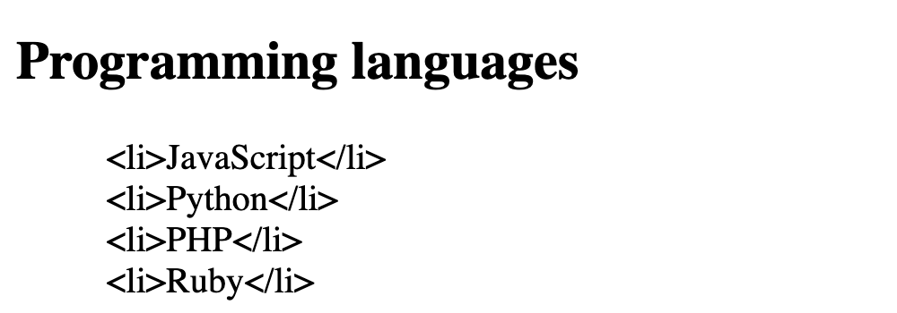

[[toc]]

## DOM {#dom}

### 获取元素 {#get-element}

**书写原生js脚本将body下的第二个div隐藏**

```javascript
var oBody = document.getElementsByTagName('body')[0]
var oChildren = oBody.childNodes
var nDivCounter = 0

for (var i = 0, len = oChildren.length; i < len; i++) {
    if (oChildren[i].nodeName === 'DIV') {
        nDivCounter++
        if (nDivCounter === 2) {
            oChildren[i].style.display = 'none'
        }
    }
}
```

### 创建元素 {#create-element}

**问题**

现有：

```html
<ul id="list" class="foo">
    <li>#0</li>
    <li><span>#1</span></li>
    <li>#2</li>
    <li>#3</li>
    <li>
        <ul>
            <li>#4</li>
        </ul>
    </li>
    <!-- ... -->
    <li><a href="//v2ex.com">#99998</a></li>
    <li>#99999</li>
    <li>#100000</li>
</ul>
```

要求：

- 为ul元素添加一个类.bar
- 删除第10个li
- 在第500个li后面添加一个li，其文字内容为“&lt;v2ex.com />”
- 点击任意li弹框显示其为**当前列表**中的第几项

**解答**

```javascript
// 还原题目真实DOM结构
var list = document.getElementById('list')
void function() {
    var html = ''
    for (var i = 0; i <= 10000; i++) {
        if (i === 1) {
            html += '<li><span>#1</span></li>'
        } else if (i === 4) {
            html += '<li><ul><li>#4</li></ul></li>'
        } else if (i === 9998) {
            html += '<li><a href="//v2ex.com">#9998</a></li>'
        } else {
            html += '<li>#' + i + '</li>'
        }
    }
    list.innerHTML = html
}()

// or, list.className += ' bar'
list.classList.add('bar')

var li10 = document.querySelector('#list > li:nth-of-type(10)')
li10.parentNode.removeChild(li10)

var newItem = document.createElement('LI')
var textNode = document.createTextNode('<v2ex.com />')
newItem.appendChild(textNode)

// index for css nth-of-type is 1-based
var li501 = document.querySelector('#list > li:nth-of-type(501)')
list.insertBefore(newItem, li501)

list.addEventListener('click', function(e) {
    var target = e.target || e.srcElement
    if (target.id === 'list') {
        alert('你点到最外层的ul上了，叫我怎么判断？')
        return
    }
    while (target.nodeName !== 'LI') {
        target = target.parentNode
    }

    var parentUl = target.parentNode
    var children = parentUl.childNodes
    var count = 0
    for (var i = 0, len = children.length; i < len; i++) {
        var node = children[i]
        if (node.nodeName === 'LI') {
            count++
        }
        if (node === target) {
            alert('是当前第' + count + '项')
            break
        }
    }
}, false)

// PS: if querySelector method is not available, the following can be changed.
var li10 = document.querySelector('#list > li:nth-of-type(10)')
var li501 = document.querySelector('#list > li:nth-of-type(501)')

// As below:
function getLiByIndex(index /* 0-based index */ ) {
    var count = -1
    for (var i = 0, len = list.childNodes.length; i < len; i++) {
        if (list.childNodes[i].nodeName === 'LI') {
            count++
            if (count === index) {
                return list.childNodes[i]
            }
        }
    }
}
var li10 = getLiByIndex(9)
var li501 = getLiByIndex(500)
```

### 事件的冒泡和捕获 {#event-bubble-capture}

JS 中事件流的三个阶段：捕获（低版本 IE 不支持）==> 目标 ==> 冒泡。

- 捕获（Capture）：从外到内。
- 冒泡（Bubbling）：从内到外。

如果不同层的元素使用 `useCapture` 不同，会先从最外层元素往目标元素寻找设定为 捕获（capture）模式的事件，到达目标元素后执行目标元素的事件后，在循原路往外寻找设定为冒泡（bubbling）模式的事件。

### `addEventListener` {#add-event-listener}

语法如下：

```javascript
element.addEventListener(type, listener, useCapture)
element.addEventListener(type, listener, options)
```

- `element`: 要绑定事件的对象，或 HTML 节点；
- `type`：事件名称（不带“on”），如 “click”、“mouseover”；
- `listener`：要绑定的事件监听函数；
- `useCapture`：事件监听方式，只能是 `true` 或 `false`。`true`，采用捕获（capture）模式；`false`，采用冒泡（bubbling）模式。若无特殊要求，一般是 `false`。
- `options`
    - `options.capture`：一个布尔值，表示 `listener` 会在该类型的事件捕获阶段传播到该 EventTarget 时触发。
    - `options.once`：一个布尔值，表示 `listener` 在添加之后最多只调用一次。如果为 `true`，`listener` 会在其被调用之后自动移除。
    - `options.passive`：一个布尔值，设置为 `true` 时，表示 `listener` 永远不会调用 `preventDefault()`。如果 `listener` 仍然调用了这个函数，客户端将会忽略它并抛出一个控制台警告。

::: tip `addEventListener`

`addEventListener()` 的工作原理是将实现 EventListener 的函数或对象添加到调用它的 EventTarget 上的指定事件类型的事件侦听器列表中。**如果要绑定的函数或对象已经被添加到列表中，该函数或对象不会被再次添加**。

`addEventListener` 允许对同一个 target 同时绑定多个事件，且可以控制是在冒泡阶段还是捕获阶段触发。`onclick`、`onmouseover` 这种方式只能绑定一个事件监听回调（最后绑定的生效），**且只能在冒泡阶段触发**。

:::

::: warning `removeEventListener`

`removeEventListener` 的入参和 `addEventListener` 一样。

警告：如果同一个事件监听器分别为“事件捕获（`capture` 为 `true`）”和“事件冒泡（`capture` 为 `false`）”各注册了一次，这两个版本的监听器需要分别移除。移除捕获监听器不会影响非捕获版本的相同监听器，反之亦然。

:::

#### 使用 `passive` 改善滚屏性能

将 `passive` 设为 `true` 可以启用性能优化，并可大幅改善应用性能（副作用是不能 `preventDefault` 了），正如下面这个例子：

```javascript
/* 检测浏览器是否支持该特性 */
let passiveIfSupported = false;

try {
  window.addEventListener(
    "test",
    null,
    Object.defineProperty({}, "passive", {
      get() {
        passiveIfSupported = { passive: true };
      },
    }),
  );
} catch (err) {}

window.addEventListener(
  "scroll",
  (event) => {
    /* do something */
    // 不能使用 event.preventDefault();
  },
  passiveIfSupported,
);
```

根据规范，`addEventListener()` 的 `passive` 默认值始终为 `false`。然而，这会导致触摸事件和滚轮事件（如 `wheel`、`mousewheel`、`touchstart`、`touchmove`）的事件监听器在浏览器尝试滚动页面时可能会**阻塞浏览器主线程——这可能会大大降低浏览器处理页面滚动时的性能**。

* [EventTarget.addEventListener()](https://developer.mozilla.org/zh-CN/docs/Web/API/EventTarget/addEventListener)

### 事件代理/委托 {#event-delegate}

事件代理/委托，是靠事件的冒泡机制实现的（所以，对于一些不具有冒泡特性的事件，比如focus、blur，就没有事件代理/委托这种说法了）。

**优缺点**

优点有：

- 可以大量节省内存占用，减少事件注册，比如在table上代理所有td的click事件就非常棒；
- 可以实现当新增子孙节点时无需再次对其绑定事件，对于动态内容部分尤为合适。

缺点有：

- 如果把所有事件都代理到一个比较顶层的 DOM 节点上的话，比较容易出现误判，给不需要执行逻辑的节点执行了逻辑。比如把页面中所有事件都绑定到 document 上进行委托，就不是很合适；
- 事件逐级冒泡到外层 DOM 上再执行肯定没有直接执行快。

**实现**

```javascript
// 只考虑IE 9&+
function delegate(element, targetSelector, type, handler) {
    element.addEventListener(type, function(e) {
        var targets = Array.prototype.slice.call(
            element.querySelectorAll(targetSelector)
        )
        var target = e.target
        if (targets.indexOf(target) !== -1) {
            return handler.apply(target, arguments)
        }
    })
}
```

### 阻止事件传播和默认行为 {#event-stop-propagation-prevent-default}

#### 阻止事件的默认行为 {#prevent-default}

```javascript
e = e || window.event
e.preventDefault()
```

#### 阻止事件传播 {#stop-propagation}

```javascript
e = e || window.event
e.stopPropagation()
```

#### stopImmediatePropagation {#stop-immediate-propagation}

`stopImmediatePropagation` 方法可阻止同元素或外层元素上相同事件上绑定的其他监听器函数被触发。

::: tip 触发顺序

如果同类型事件的几个监听器函数被绑定到了同一个对象上，且它们处于相同的阶段（冒泡、捕获），它们会按照添加的顺序被触发。

:::

::: tip `stopPropagation` 和 `stopImmediatePropagation的区别`
- stopPropagation will prevent any **parent** handlers from being executed;
- stopImmediatePropagation will prevent any **parent** handlers and also any **other handlers from executing**.
  :::

### 事件的几种 target {#event-kinds-of-target}

#### target {#event-target}

触发事件的对象，也就是用户实际操作（比如点击）的对象。

**获取事件对象和目标对象：**

``` javascript
function (e) {
  e = e ? e : window.event
  var target = e.target || e.srcElement
  // do some things here
}
```

#### currentTarget {#event-current-target}

绑定事件的对象。对应的就是element.addEventListener(eventName, handler, options)里的element。

#### currentTarget 和 target的比较

- target指向事件直接作用的对象，而currentTarget指向绑定该事件的对象；
- 当处于捕获或冒泡阶段时，两者指向不一致；当处于目标阶段时，两者指向一致。

```html
<html>
<body>
<div id="a">
    <div id="b">
        <div id="c">
            <div id="d">最里层</div>
        </div>
    </div>
</div>
<script>
    const a = document.querySelector('#a')
    const b = document.querySelector('#b')
    const c = document.querySelector('#c')
    const d = document.querySelector('#d')
    const getHandler = (elem, useCapture) => {
        return (e) => {
            const target = e.target
            const currentTarget = e.currentTarget
            const payload = {
                elemId: elem.id,
                useCapture,
                targetId: target.id,
                currentTargetId: currentTarget.id,
            }
            console.log(JSON.stringify(payload))
        }
    }
    d.addEventListener('click', () => {
        console.log('冒泡 d1')
    }, { capture: false })
    const elems = [a, b, c, d]
    elems.forEach((elem) => {
        elem.addEventListener('click', getHandler(elem, false), { capture: false })
        elem.addEventListener('click', getHandler(elem, true), { capture: true })
    })
    d.addEventListener('click', () => {
        console.log('捕获 d2')
    }, { capture: true })
    d.addEventListener('click', () => {
        console.log('捕获 d3')
    }, { capture: true })
    d.addEventListener('click', () => {
        console.log('冒泡 d4')
    }, { capture: false })
</script>
</body>
</html>
```

点击#d元素，控制台打印内容如下：

```text
{"elemId":"a","useCapture":true,"targetId":"d","currentTargetId":"a"}
{"elemId":"b","useCapture":true,"targetId":"d","currentTargetId":"b"}
{"elemId":"c","useCapture":true,"targetId":"d","currentTargetId":"c"}
{"elemId":"d","useCapture":true,"targetId":"d","currentTargetId":"d"}
捕获 d2
捕获 d3
冒泡 d1
{"elemId":"d","useCapture":false,"targetId":"d","currentTargetId":"d"}
冒泡 d4
{"elemId":"c","useCapture":false,"targetId":"d","currentTargetId":"c"}
{"elemId":"b","useCapture":false,"targetId":"d","currentTargetId":"b"}
{"elemId":"a","useCapture":false,"targetId":"d","currentTargetId":"a"}
```

可以看到：

- 捕获阶段：先由外至内按捕获的顺序触发了事件回调。
- 目标阶段：其实就是先捕获后冒泡，在此前提下各自按注册的先后顺序执行。
- 冒泡阶段：最后由内而外按冒泡的顺序又触发了对应的事件回调。


### `innerHTML`、`innerText` 和 `textContent` {#inner-html-text-content}

本文参考资料如下：

- [innerHTML vs innerText vs textContent – What's the Difference?](https://www.freecodecamp.org/news/innerhtml-vs-innertext-vs-textcontent/)

这几个元素都是 DOM 对象的属性，可以用来读取、更新 HTML 中元素的内容。

**读取内容**

假设现在有如下 HTML 代码片段：

```html
<nav>
    <a>Home</a>
    <a>About</a>
    <a>Contact</a>
    <a style="display: none">Pricing</a>
</nav>
```

通过 `document.querySelector('nav').innerHTML` 获取到的内容如下：

```text
    <a>Home</a>
    <a>About</a>
    <a>Contact</a>
    <a style="display: none">Pricing</a>
```

通过 `document.querySelector('nav').innerText` 获取到的内容如下（内容为渲染到屏幕上的内容，会忽略所有 HTML 标签，也**会忽略被隐藏的元素**）：

```text
Home About Contact
```

通过 `document.querySelector('nav').textContent` 获取到的内容如下（会忽略 HTML 标签，但**不会忽略被隐藏的元素**）：

```text
    Home
    About
    Contact
    Pricing
```

**设置内容**

假设现有如下 HTML 代码片段：

```html
<h2>Programming languages</h2>
<ul class="languages-list"></ul>
```

使用 `innerHTML` 像下面这样更新内容，可以增加4个由 &lt;li&gt; 标签组成的列表：

```javascript
const langListElement = document.querySelector('.languages-list')

// Setting or updating content with innerHTML
langListElement.innerHTML = `
  <li>JavaScript</li>
  <li>Python</li>
  <li>PHP</li>
  <li>Ruby</li>
`
```


使用 `innerText` 像下面这样更新内容，则会得到含有 `<li>` 字符（不是 HTML 标签）的 4 行文本：

```javascript
const langListElement = document.querySelector('.languages-list')

langListElement.innerText = `
  <li>JavaScript</li>
  <li>Python</li>
  <li>PHP</li>
  <li>Ruby</li>
`
```



使用 `textContent` 像下面这样更新内容会直接得到一行文本（不是 4 行文本）：

```javascript
const langListElement = document.querySelector('.languages-list')

langListElement.textContent = `
  <li>JavaScript</li>
  <li>Python</li>
  <li>PHP</li>
  <li>Ruby</li>
`
```


