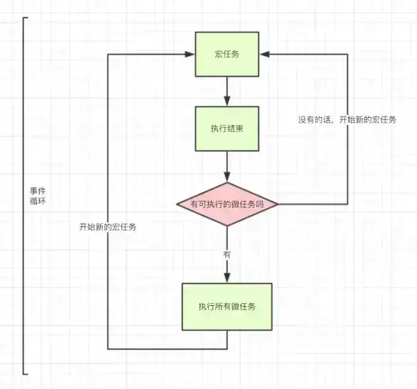

[[toc]]

## 事件循环 {#event-loop}

### 微任务和宏任务 {#micro-macro-task}

除了广义的同步任务和异步任务，我们可以分的更加精细一点：

- macro task（宏任务）：包括整体代码脚本、`setTimeout`、`setInterval`。
- micro task（微任务）：`Promise`、`process.nextTick`、`MutationObserver`。

不同类型的任务会进入到不同的 **事件队列（event queue）**。相同类型的任务会进入相同的事件队列。比如 `setTimeout` 和 `setInterval` 会进入相同的事件队列。



先看一个例子：

```javascript
setTimeout(function() {
    console.log('setTimeout');
}, 0)

new Promise(function(resolve) {
    console.log('promise');
    resolve(true)
    console.log('after resolve')
}).then(function() {
    console.log('then');
})

console.log('console');

// promise
// after resolve
// console
// then
// setTimeout
```

1. 首先会遇到 `setTimeout`，将其放到宏任务 event queue 里面。
2. 然后回到 promise，`new Promise` 会立即执行，`then` 会分发到微任务。
3. 遇到 `console` 立即执行。
4. 整体宏任务执行完成，接下来判断是否有微任务，刚刚放到微任务里面的 `then`，执行。
5. 至此第一轮事件结束，进行第二轮，刚刚我们放在 event queue 的 `setTimeout` 函数内的语句进入到宏任务，立即执行。
6. 结束。

### 为何要区分微任务和宏任务 {#why-differ-micro-macro-task}

区分微任务和宏任务是为了将异步队列任务划分优先级，通俗的理解就是为了插队。

一个事件队列（Event Loop）中，**microtask** 是在 **macrotask** 之后被调用的，**microtask** 会在下一个 Event Loop 之前执行完，**并且会将 microtask 执行当中新注册的 microtask 一并调用执行完，然后才开始下一次 Event Loop，所以如果有新的 Macrotask 就需要一直等待，等到上一个 Event Loop 当中 Microtask 被清空为止**。由此可见，**我们可以在下一次 Event Loop 之前进行插队。**

如果不区分 Microtask 和 Macrotask，那就无法在下一次 Event Loop 之前进行插队，其中新注册的任务得等到下一个 Macrotask 完成之后才能进行，这中间可能你需要的状态就无法在下一个 Macrotask 前得到同步。

一个利用任务执行顺序（**宏任务 => 微任务 => 浏览器渲染**）的案例：

```html
<html>
<head>
    <style>
        div {
            padding: 0;
            margin: 0;
            display: inline-block;
            widtH: 100px;
            height: 100px;
            background: blue;
        }
        #microTaskDom {
            margin-left: 10px;
        }
    </style>
</head>
<body>
<div id="taskDom"></div>
<div id="microTaskDom"></div>
<script>
    window.onload = () => {
        setTimeout(() => {
            taskDom.style.background = 'red'
            setTimeout(() => {
                /**
                 * 使用 `setTimeout` 立马修改背景色，
                 * 会闪现一次红色背景
                 */
                taskDom.style.background = 'black'
            }, 0);

            microTaskDom.style.background = 'red'
            Promise.resolve().then(() => {
                /**
                 * 使用 `Promise` 不会闪现红色背景。
                 * 因为微任务会在渲染之前完成对背景色的修改，
                 * 等到渲染时就只需要渲染黑色
                 */
                microTaskDom.style.background = 'black'
            })
        }, 1000);
    }
</script>
</body>
</html>
```

由此我们可以联想到一个的应用场景：使用主流的 MVVM 或类似框架每次修改数据后，并不是马上就会同步触发视图更新的。我们自己开发渲染库的话，可以在业务开发者多次进行数据修改和页面 DOM 渲染之间，做一个数据改动的汇总的操作，然后根据实际最终得到的变更差异，去渲染 DOM 更新页面视图。如果每次修改数据都同步去更新 DOM，那 DOM 更新的频率就太高了。

* TODO：上面说的可能不对，因为渲染库也可以在所有修改数据动作结束之后，走同步方法做数据改动的汇总操作，然后再去渲染 DOM。

### `setTimeout` 的时间误差 {#set-timeout-accuracy}

在使用 `setTimeout` 的时候，经常会发现设定的时间与自己设定的时间有差异。

如果改成下面这段会发现执行时间远远超过预定的时间：

```javascript
setTimeout(() => {
    task()
},3000)

sleep(10000000)
```

这是为何？

我们来看一下是怎么执行的：

1. `task()` 进入到 `event table` 里面注册计时。
2. 然后主线程执行 `sleep` 函数，但是非常慢。计时任然在继续。
3. 3 秒到了。`task()` 进入 `event queue`，但是主线程依旧没有走完。
4. 终于过了 10000000ms 之后主线程走完了，`task()` 进入到主线程。
5. 所以 `task()` 被调用前的真实延迟时间是远远大于 3 秒的。

### `setTimeout` 第二个参数最小值 {#set-timeout-parameter}

HTML5标准规定了 `setTimeout()` 中第二个参数如果传入小于 0 的值会被修改为 0，如果 `setTimeout` 或者 `setInterval` 嵌套层级超过 5 层，并且第二个参数传入的数值小于 4，那这个数值会被设置为 4。（本段参考了[https://html.spec.whatwg.org/multipage/timers-and-user-prompts.html#dom-settimeout](https://html.spec.whatwg.org/multipage/timers-and-user-prompts.html#dom-settimeout)）

如果第二个参数如果传入 `0`，就表示要尽快调用回调函数，更准确地说 —— 就是要在下一个事件循环（event cycle）中调用回调函数。（本段参考了[setTimeout() global function](https://developer.mozilla.org/en-US/docs/Web/API/setTimeout)）

### `promise` 和 `process.nextTick` {#process-next-tick}

`process.nextTick(callback)` 类似 Node.js 版的 `setTimeout`，在事件循环的下一次循环中调用 `callback` 回调函数。

### 几个例子 {#event-loop-examples}

**例1**

```javascript
setTimeout(() => {
    console.log(1)
}, 0)
new Promise((resolve) => {
    resolve()
}).then(() => {
    console.log(2)
})
```

上面的执行结果是2，1。

从规范上来讲，setTimeout有一个4ms的最短时间，也就是说不管你设定多少，反正最少都要间隔4ms（不是精确时间间隔）才运行里面的回调。
而Promise的异步没有这个问题。

从具体实现上来说，这两个的异步队列不一样，Promise所在的那个异步队列优先级要高一些。

**例2**

```javascript
(function () {
    setTimeout(() => {
        console.log(4)
    }, 0)
    new Promise((resolve) => {
        console.log(1)
        for (let i = 0; i < 10000; i++) {
            i === 9999 && resolve(null)
        }
        console.log(2)
    }).then(() => {
        console.log(5)
    })
    console.log(3)
})()
```

执行结果1，2，3，5，4。为什么执行这样的结果？

1. 创建Promise实例是同步执行的。所以先输出1，2，3，这三行代码都是同步执行。
2. promise.then和setTimeout都是异步执行，会先执行谁呢？

`setTimeout` 异步会放到异步队列中等待执行。`promise.then` 异步会放到 microtask queue 中。microtask 队列中的内容经常是为了需要直接在当前脚本执行完后立即发生的事，所以当同步脚本执行完之后，就调用 microtask 队列中的内容，然后把异步队列中的 `setTimeout` 的回调函数放入执行栈中执行，所以最终结果是先执行 `promise.then` 异步，然后再执行 `setTimeout` 中的异步回调。

这是由于：

Promise 的回调函数属于异步任务，会在同步任务之后执行。但是，Promise 的回调函数不是正常的异步任务，而是微任务（microtask）。它们的区别在于，**正常任务追加到下一轮事件循环，微任务追加到本轮事件循环**。这意味着，微任务的执行时间一定早于正常任务。

注意：目前 microtask 队列中常用的就是 promise.then。

**例3**

```javascript
setTimeout(() => {
    console.log(7)
}, 0)
new Promise((resolve, reject) => {
    console.log(3);
    resolve();
    console.log(4);
}).then(() => {
    console.log(6)
})
console.log(5)
```

执行结果3，4，5，6，7。

**例4**

```javascript
console.log(1)
const promise = new Promise((resolve, reject) => {
    console.log(2)
    setTimeout(() => {
        resolve(3)
        reject(4)
    }, 0)
})

promise.then((data) => {
    console.log(data)
}).catch((err) => {
    console.log('6')
    console.log(err)
})

promise.then((data) => {
    console.log(data)
}).catch((err) => {
    console.log('7')
    console.log(err)
})

console.log(5)
```

上面这段代码会输出：1、2、5、3、3。

::: tip promise 的 resolve、reject

这里需要注意，promise 被 `resolve` 后再触发 `reject` 是无效的，不会触发 `promise.catch` 回调。

### Vue3 的 `nextTick()` {#vue3-next-tick}

A utility for waiting for the next DOM update flush.

When you mutate reactive state in Vue, the resulting DOM updates are not applied synchronously. Instead, Vue buffers them until the "next tick" to ensure that each component updates only once no matter how many state changes you have made.

nextTick() can be used immediately after a state change to wait for the DOM updates to complete. You can either pass a callback as an argument, or await the returned Promise.

```vue
<script setup>
    import { ref, nextTick } from 'vue'

    const count = ref(0)

    async function increment() {
        count.value++

        // DOM not yet updated
        console.log(document.getElementById('counter').textContent) // 0

        await nextTick()
        // DOM is now updated
        console.log(document.getElementById('counter').textContent) // 1
    }
</script>

<template>
    <button id="counter" @click="increment">{{ count }}</button>
</template>
```

**实现原理**

原理部分参考了：[面试官：Vue中的$nextTick有什么作用？](https://vue3js.cn/interview/vue/nexttick.html)。

```javascript
export function nextTick(cb?: Function, ctx?: Object) {
    let _resolve;

    // cb 回调函数会经统一处理压入 callbacks 数组
    callbacks.push(() => {
        if (cb) {
            // 给 cb 回调函数执行加上了 try-catch 错误处理
            try {
                cb.call(ctx);
            } catch (e) {
                handleError(e, ctx, 'nextTick');
            }
        } else if (_resolve) {
            _resolve(ctx);
        }
    });

    // 执行异步延迟函数 timerFunc
    if (!pending) {
        pending = true;
        timerFunc();
    }

    // 当 nextTick 没有传入函数参数的时候，返回一个 Promise 化的调用
    if (!cb && typeof Promise !== 'undefined') {
        return new Promise(resolve => {
            _resolve = resolve;
        });
    }
}
```

上例中，`timerFunc` 函数会根据当前环境支持什么方法则确定调用哪个，分别有：`Promise.then`、`MutationObserver`、`setImmediate`、`setTimeout`。
