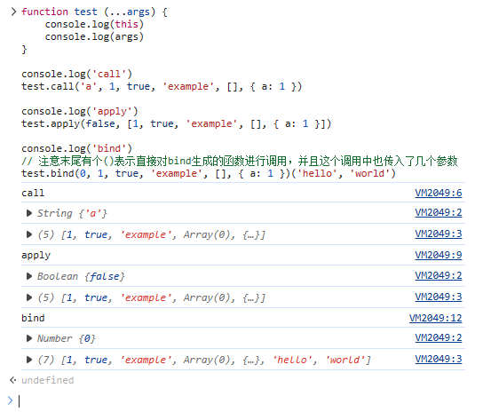
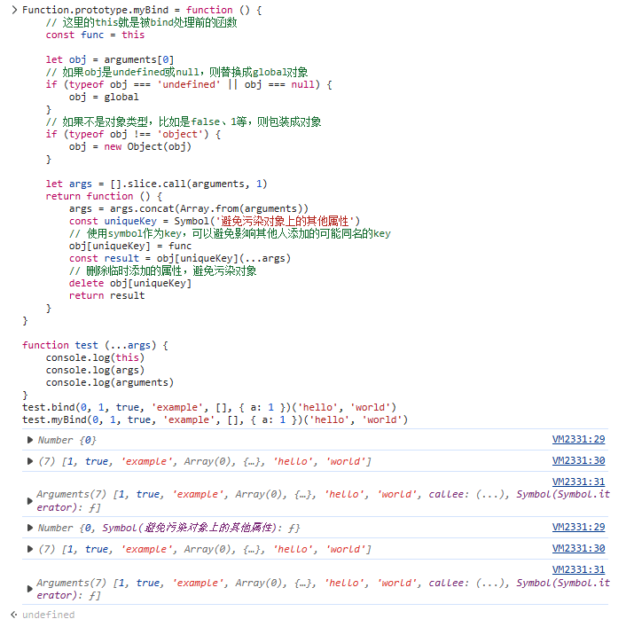

[[toc]]

## JavaScript {#javascript}

### JavaScript数据类型 {#js-data-types}

- 基本数据类型（primitive data type）：共 7 个，分别是：Undefined、Null、Boolean、Number、String、Symbol、BigInt。
- 对象数据类型

参考：[BigInt](https://developer.mozilla.org/en-US/docs/Web/JavaScript/Reference/Global_Objects/BigInt)

::: tip BigInt
bigint 是基础数据类型。通过在整数末尾添加 `n`，或者通过调用 `BigInt(传入整数或字符串)`，可以创建一个 `bigint` 类型的值。

```javascript
const previouslyMaxSafeInteger = 9007199254740991n;

// 十进制
const alsoHuge = BigInt(9007199254740991);
// 9007199254740991n

// 十进制
const hugeString = BigInt("9007199254740991");
// 9007199254740991n

// 十六进制
const hugeHex = BigInt("0x1fffffffffffff");
// 9007199254740991n

// 八进制
const hugeOctal = BigInt("0o377777777777777777");
// 9007199254740991n

// 二进制
const hugeBin = BigInt(
  "0b11111111111111111111111111111111111111111111111111111",
);
// 9007199254740991n
```

注意：
- 因为类型不同，`10n === 10`的值为 `false`（`10n == 10`的值为 `true`）。
- `bigint` 值不支持用 `Math` 对象的原生方法进行处理。
- `typeof 1n === "bigint";` 为 `true`。
- `typeof Object(1n) === "object";` 为 `true`。
:::

### `call`、`apply` 和 `bind` {#call-apply-bind}

`call`：`func.call(obj, param1, param2)`将`func`函数应用于`obj`对象上，此时`func`函数内部的`this`指向`obj`对象。

`apply`：与`call`类似，只是所有要传入的数据都是以**数组**的形式放到第二个参数里的，如`func.apply(obj, [arg1, arg2])`。一个经典用法是来求数组中的最大数：`Math.max.apply(null, [1, 3, 5])`，另一个经典用法是用数组方法去处理非数组对象：`[].slice.call(arguments, 1)`。

`bind`：与`call`类似，但**不会立即执行**，而是生成了一个**新函数**，新函数的`this`指向的是我们传入的`obj`。

::: tip 关于第一个参数
`call`、`apply`、`bind`的第一个参数，如果传了 `null` 或者 `undefined` 会被替换为全局对象（浏览器环境下的话就是 `window` 对象），如果传的是其他基础类型（比如`1`、`'a'`、`false` 等）则会被转换成基础类型对应的对象。
:::

```javascript
function test (...args) {
    console.log(this)
    console.log(args)
}

console.log('call')
test.call('a', 1, true, 'example', [], { a: 1 })

console.log('apply')
test.apply(false, [1, true, 'example', [], { a: 1 }])

console.log('bind')
/**
 * 注意这里我们直接对 `bind` 生成的函数进行调用
 * 并且在这个调用中也传入了几个新参数
 */
test.bind(0, 1, true, 'example', [], { a: 1 })(
    'hello', 'world'
)
```

执行结果见下图：



#### 实现 `bind` {#bind}

::: tip core-js 的实现
core-js 库中 `bind` 的实现见：[https://github.com/zloirock/core-js/blob/master/packages/core-js/internals/function-bind.js](https://github.com/zloirock/core-js/blob/master/packages/core-js/internals/function-bind.js)
:::

我们自己实现一个，注意：

- 调用 `bind` 后生成的是一个新函数（新函数名为 `newFn`）。
- 调用 `bind` 时传的第二个及后续参数会和调用新函数 `newFn` 时传入的参数合并作为入参。
- 调用 `bind` 时会指定 `newFn` 中的 `this` 指向。

```javascript
Function.prototype.myBind = function () {
    // 这里的 `this` 就是被 `bind` 处理前的函数
    const func = this

    let obj = arguments[0]
    // 如果 `obj` 是 `undefined` 或 `null`，则替换成全局对象
    if (typeof obj === 'undefined' || obj === null) {
        obj = globalThis
    }
    // 如果不是对象类型，比如是 `false`、`1` 等，则包装成对象
    if (typeof obj !== 'object') {
        obj = new Object(obj)
    }

    let args = [].slice.call(arguments, 1)
    return function () {
        args = args.concat(Array.from(arguments))
        const uniqueKey = Symbol('避免污染对象上的其他属性')
        /**
         * 使用 `symbol`作为 key，
         * 可以避免影响其他人添加的可能同名的 key
         */
        obj[uniqueKey] = func
        const result = obj[uniqueKey](...args)
        // 删除临时添加的属性，避免污染对象
        delete obj[uniqueKey]
        return result
    }
}

function test (...args) {
    console.log(this)
    console.log(args)
    console.log(arguments)
}
test.bind(0, 1, true, 'example', [], { a: 1 })(
    'hello', 'world'
)
test.myBind(0, 1, true, 'example', [], { a: 1 })(
    'hello', 'world'
)
```

实现结果如下：



### `forEach`、`for-of`、`for-in` 循环 {#for-loop}

```javascript
// `forEach` 循环无法通过 `break` 或 `return` 语句进行中断
arr.forEach(function (elem) {
    console.log(elem)
})

/**
 * for-in循环实际上是为循环对象的可枚举（enumerable）属性而设计的，
 * 也能循环数组，不过不建议，因为key变成了数字
 */
const obj = { a: 1, b: 2, c: 3 }
for (const p in obj) {
    console.log(`obj.${p} = ${obj[p]}`)
}
// 上面的代码依次输出内容如下：
// obj.a = 1
// obj.b = 2
// obj.c = 3

/**
 * for-of能循环很多东西，
 * 包括字符串、数组、map、set、DOM collection等等
 * （但是不能遍历对象，因为对象不是iterable可迭代的）
 */
const iterable = [1, 2, 3]
for (const value of iterable) {
    console.log(value)
}
```

基本上 `for in` 用于大部分常见的由 `key-value` 对构成的对象上以遍历对象内容。但是 `for in` 在遍历数组对象时并不方便，这时候用 `for of` 会很方便。

### IIFE（Immediately-Invoked Function Expression）与分号 {#iife}

如果习惯写完一条语句后不加分号的写法，碰到需要写 IIFE（自执行函数）的时候容易踩到下面的坑：

``` javascript
const a = 1
(function () {})()
```

上述代码会报错，因为第一行的 `1` 会和第二行一起被程序解析成 `const a = 1(function () {})()`，然后报错：`Uncaught TypeError: 1 is not a function`。

这时候可以这样写：

``` javascript
const a = 1
void function () {}()

// 或
const a = 1
void (function () {})()

// 或者下面这种方式，但据说会多一次逻辑运算
const a = 1
!function () {}()
```

### JS中除了使用 `new` 关键字还有什么方法可以创建对象？ {#create-object-except-new}

可以通过 `Object.create(proto, [, propertiesObject])` 实现。详见：[Object.create()](https://developer.mozilla.org/zh-CN/docs/Web/JavaScript/Reference/Global_Objects/Object/create)。

`Object.create()` 静态方法以一个现有对象作为原型，创建一个新对象。

```javascript
const person = {
  isHuman: false,
  printIntroduction: function () {
    console.log(
        `I am ${this.name}. Am I human? ${this.isHuman}`
    );
  },
};

const me = Object.create(person);

// `name` 是 `me` 的属性，不是 `person` 的属性
me.name = 'Matthew';
// 继承过来的属性值可以被重写
me.isHuman = true;

// 打印内容: "I am Matthew. Am I human? true"
me.printIntroduction();
```

**用 `Object.create()` 实现类式继承**

```javascript
// Shape —— 父类
function Shape() {
  this.x = 0;
  this.y = 0;
}

// 父类方法
Shape.prototype.move = function (x, y) {
  this.x += x;
  this.y += y;
  console.info("Shape moved.");
};

// Rectangle —— 子类
function Rectangle() {
  Shape.call(this); // 调用父类构造函数。
}

// 子类继承父类
Rectangle.prototype = Object.create(Shape.prototype, {
    /**
     * 如果不将 `Rectangle.prototype.constructor` 
     * 设置为 `Rectangle`，
     * 它将采用 `Shape`（父类）的 `prototype.constructor`。
     * 为避免这种情况，
     * 我们将 `prototype.constructor` 设置为 `Rectangle`（子类）。
     */
    constructor: {
        value: Rectangle,
        enumerable: false,
        writable: true,
        configurable: true,
    },
});

const rect = new Rectangle();

// true
console.log(
    "rect 是 Rectangle 类的实例吗？",
    rect instanceof Rectangle
);

// true
console.log(
    "rect 是 Shape 类的实例吗？",
    rect instanceof Shape
);

// 打印 'Shape moved.'
rect.move(1, 1);
```

**使用 `Object.create()` 的 `propertyObject` 参数**

`Object.create()` 方法允许对对象创建过程进行精细的控制。实际上，字面量初始化对象语法可视为 `Object.create()` 的一种语法糖。使用 `Object.create()`，我们可以创建具有指定原型和某些属性的对象。请注意，第二个参数将键映射到属性描述符，这意味着你还可以控制每个属性的可枚举性、可配置性等，而这在 `{}` 字面量初始化对象语法中是做不到的。

```javascript
o = {};
// 等价于：
o = Object.create(Object.prototype);

o = Object.create(Object.prototype, {
  // foo 是一个常规数据属性
  foo: {
    writable: true,
    configurable: true,
    value: "hello",
  },
  // bar 是一个访问器属性
  bar: {
    configurable: false,
    get() {
      return 10;
    },
    set(value) {
      console.log("Setting `o.bar` to", value);
    },
  },
});

/**
 * 创建一个新对象
 * 它的原型是一个新的空对象
 * 并添加一个名为 'p'，值为 42 的属性。
 */
o = Object.create({}, { p: { value: 42 } });
```

使用 `Object.create()`，我们可以创建一个原型为 `null` 的对象。在字面量初始化对象语法中，相当于将 `__proto__` 键赋值为 `null`。

```javascript
o = Object.create(null);
// 等价于：
o = { __proto__: null };
```

你可以使用 `Object.create()` 来模仿 `new` 运算符的行为。

```javascript
function Constructor() {}
o = new Constructor();
// 等价于：
o = Object.create(Constructor.prototype);
```

当然，如果 `Constructor` 函数中有实际的初始化代码，那么 `Object.create()` 方法就无法模仿它。

### 生成器函数与 `yield` 语句 {#generator-yield}

```javascript
function* hello (name) {
    yield `hello ${name}!`
    yield 'I am glad to meet you!'
    if (0.6 > 0.5) {
        yield `It is a good day!`
    }
    yield 'See you later!'
}

// Generator函数执行后会返回一个迭代器，通过调用next方法依次yield相应的值
const iterator = hello('Yakima')

iterator.next() // 返回{value: "hello Yakima!", done: false}
iterator.next() // 返回{value: "I am glad to meet you!", done: false}
iterator.next() // 返回{value: "It is a good day!", done: false}
iterator.next() // 返回{value: "See you later!", done: false}
iterator.next() // 返回{value: undefined, done: true}
iterator.next() // 返回{value: undefined, done: true}
```

生成器函数（Generator）与常见的函数的差异：
- 通常的函数以 `function` 开始，而生成器函数以 `function*` 开始；
- 在生成器函数内部，`yield` 是一个关键字，和 `return` 有点像。不同点在于，所有函数（包括生成器函数）都只能 `return` 一次，而在生成器函数中可以 `yield` 任意次。`yield` 表达式暂停了生成器函数的执行，然后可以从暂停的地方恢复执行。

常见的函数不能暂停执行，而生成器函数可以，这是两者最大的区别。

### 扩展运算符进行对象拷贝时是浅拷贝 {#spread-operator}

在[Babeljs.io Try it out](https://babeljs.io/repl)上转义的结果是：

```javascript
function _typeof(o) {
    "@babel/helpers - typeof";
    return _typeof = "function" == typeof Symbol && "symbol" == typeof Symbol.iterator
        ? function (o) {
            return typeof o;
        }
        : function (o) {
            return (
                o
                && "function" == typeof Symbol
                && o.constructor === Symbol
                && o !== Symbol.prototype
            )
                ? "symbol"
                : typeof o;
        },
        _typeof(o);
}

function ownKeys(e, r) {
    var t = Object.keys(e);
    if (Object.getOwnPropertySymbols) {
        var o = Object.getOwnPropertySymbols(e);
        r && (o = o.filter(function (r) {
            return Object.getOwnPropertyDescriptor(e, r).enumerable;
        })), t.push.apply(t, o);
    }
    return t;
}

function _objectSpread(e) {
    for (var r = 1; r < arguments.length; r++) {
        var t = null != arguments[r] ? arguments[r] : {};
        r % 2
            ? ownKeys(Object(t), !0).forEach(function (r) {
                _defineProperty(e, r, t[r]);
            })
            : Object.getOwnPropertyDescriptors
                ? Object.defineProperties(e, Object.getOwnPropertyDescriptors(t))
                : ownKeys(Object(t)).forEach(function (r) {
                    Object.defineProperty(e, r, Object.getOwnPropertyDescriptor(t, r));
                });
    }
    return e;
}

function _defineProperty(obj, key, value) {
    key = _toPropertyKey(key);
    if (key in obj) {
        Object.defineProperty(obj, key, {
            value: value,
            enumerable: true,
            configurable: true,
            writable: true
        });
    } else {
        obj[key] = value;
    }
    return obj;
}

function _toPropertyKey(t) {
    var i = _toPrimitive(t, "string");
    return "symbol" == _typeof(i) ? i : String(i);
}

function _toPrimitive(t, r) {
    if ("object" != _typeof(t) || !t) return t;
    var e = t[Symbol.toPrimitive];
    if (void 0 !== e) {
        var i = e.call(t, r || "default");
        if ("object" != _typeof(i)) return i;
        throw new TypeError("@@toPrimitive must return a primitive value.");
    }
    return ("string" === r ? String : Number)(t);
}
var a = {
  a: 1,
  b: {
    c: 3
  },
  c: 5
};
var d = _objectSpread({}, a);
```

### 常用的异步处理方法

回调函数、事件监听、发布/订阅、Promise对象。

### require, import {#require-import}

本文参考了以下文章：

- [JavaScript Require – How to Use the require() Function in JS](https://www.freecodecamp.org/news/how-to-use-the-javascript-require-function/)

一段时间以来，CommonJS 模块化方案一直是 Node.js 生态中的默认模块化方案。从 Node.js v8.5.0 开始，引入了 ES（ECMAScript） 模块化方案。这两种方案在执行时有一些差异。

- ES 模块化方案是 ECMAScript 语言的官方正式模块化方案，也是大多数浏览器原生支持的方案。使用 `import` 和 `export` 来导入、导出模块。
- Node.js 默认采用 CommonJS 模块化方案。使用 `require` 和 `module.exports` / `exports.<keyName>` 来导入和导出模块。
- `require()` 函数可以在程序的任何地方被调用，`import` 则在文件头部被调用。
- 一般用 `require()` 引入的文件名使用 .js 作为文件名后缀，用 `import` 引入的文件名使用 .mjs 作为文件名后缀。（不绝对）
- `require()` 得到的内容可以视作一个对象，里面有我们需要的属性或者方法。
- `require()` 得到的是原始内容的一个拷贝（如果是对象的话就是浅拷贝），也就是重新又自己声明了一份变量，比如在 `b.js` 文件中声明了 `const { a } = require(./a.js)` 后在 `a.js` 文件中修改 `a` 的值也不会影响 `b.js` 中的 `a` 的值，两个文件中的 `a` 是不一样的。
- `import` 则不会重新声明变量，在上面所述的场景中，`a.js` 和 `b.js` 文件中的 `a` 一直都是同一个变量，值也始终相同。

::: tip `require` 引入 外部模块

`require` 除了支持通过传入一个本地文件路径来引用本地模块，也支持通过传入一个 web 地址来引入外部模块，比如这样：

```javascript
const myVar = require('http://web-module.location');
```

:::
