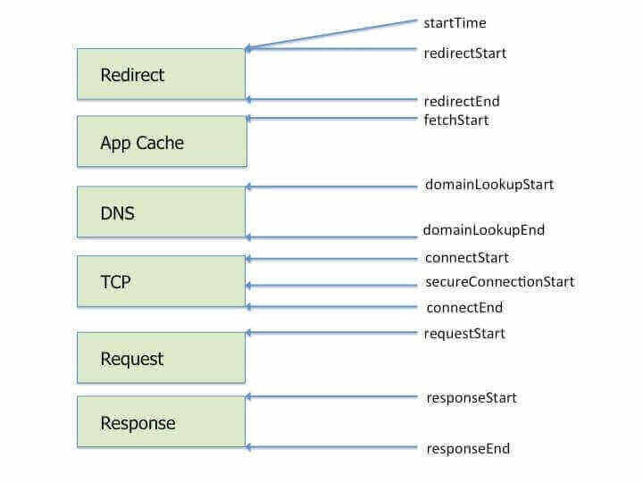

[[toc]]

## Performance 性能数据统计 {#performance}

### 简书性能背景 {#performance-jianshu}

发现简书控制台会输出性能相关的一些统计数据，类似下面这样：

```json
{
    "link": "https://www.jianshu.com/",
    "times": {
        "alltime": 31772,
        "details": {
            "redirect": 0,
            "dns": 0,
            "ttfb": 751,
            "static": 741,
            "render": 31018,
            "onload": 1624684987502
        },
        "lifecycle": {
            "_1": {
                "key": "redirect",
                "desc": "网页重定向的耗时",
                "value": 0
            },
            "_2": {
                "key": "cache",
                "desc": "检查本地缓存的耗时",
                "value": 0
            },
            "_3": {
                "key": "dns",
                "desc": "DNS查询的耗时",
                "value": 0
            },
            "_4": {
                "key": "tcp",
                "desc": "TCP连接的耗时",
                "value": 0
            },
            "_5": {
                "key": "request",
                "desc": "客户端发起请求的耗时",
                "value": 738
            },
            "_6": {
                "key": "response",
                "desc": "服务端响应的耗时",
                "value": 3
            },
            "_7": {
                "key": "render",
                "desc": "渲染页面的耗时",
                "value": 31018
            },
            "__": 31759
        }
    },
    "ua": "Mozilla/5.0 (Macintosh; ... 4 Safari/537.36"
}
```

去把他们编译产物拿出来格式化处理后，我们来一个个看这些值都是怎么取到的。

#### link和ua {#jiainshu-link-ua}

link的取值为`window.location.href.split("?")[0]`。

ua的取值为：`navigator.userAgent`。

#### times {#jianshu-times}

编译产物代码里性能数据的核心代码如下：

```javascript
window.addEventListener("load", function() {
    setTimeout(function() {
        var e = window.performance;
        if (e) {
            var t = e.timing,
                n = {
                    _1: {
                        key: "redirect",
                        desc: "网页重定向的耗时",
                        value: t.redirectEnd - t.redirectStart
                    },
                    _2: {
                        key: "cache",
                        desc: "检查本地缓存的耗时",
                        value: t.domainLookupStart - t.fetchStart
                    },
                    _3: {
                        key: "dns",
                        desc: "DNS查询的耗时",
                        value: t.domainLookupEnd - t.domainLookupStart
                    },
                    _4: {
                        key: "tcp",
                        desc: "TCP连接的耗时",
                        value: t.connectEnd - t.connectStart
                    },
                    _5: {
                        key: "request",
                        desc: "客户端发起请求的耗时",
                        value: t.responseStart - t.requestStart
                    },
                    _6: {
                        key: "response",
                        desc: "服务端响应的耗时",
                        value: t.responseEnd - t.responseStart
                    },
                    _7: {
                        key: "render",
                        desc: "渲染页面的耗时",
                        value: t.domComplete - t.responseEnd
                    }
                },
                o = 0;
            (0, a.default)(n).forEach(function(e) {
                n[e] && n[e].value > 0 && (o += n[e].value)
            }), n.__ = o;
            var r = {
                    redirect: t.redirectEnd - t.redirectStart,
                    dns: t.domainLookupEnd - t.domainLookupStart,
                    ttfb: t.responseStart - t.navigationStart,
                    static: t.responseEnd - t.requestStart,
                    render: t.domComplete - t.responseEnd,
                    onload: t.responseEnd - t.redirectStart
                },
                i = {
                    alltime: t.domComplete - t.navigationStart,
                    details: r,
                    lifecycle: n
                },
                l = Date.now() % 5 == 0;
            if ((0, a.default)(r).forEach(function(e) {
                    (r[e] > 15e3 || r[e] < 0) && (l = !1)
                }), l) {
                var u = "/" === window.location.pathname
                    ? "/index"
                    : window.location.pathname;
                try {
                    d.default.post(
                        "https://tr.jianshu.com/fe/1/mon/atf",
                        (0, s.default)({}, {
                            url: window.location.href.split("?")[0],
                            ua: navigator.userAgent,
                            path: u,
                            total: t.domComplete - t.navigationStart,
                            app: "maleskine",
                            tags: [
                                "undefined" != typeof ParadigmSDKv3
                                    ? "with-Paradigm"
                                    : "without-Paradigm"
                            ]
                        }, r)
                    ).then(function() {}).catch(function() {})
                } catch (e) {}
            }
            console && console.log({
                link: window.location.href.split("?")[0],
                times: i,
                ua: navigator.userAgent
            })
        }
    }, 0)
})
```

可以看出，主要是利用了performance这个性能api，当有该API时，才会记录相关的数据。

```javascript
const timing = performance.timing

// 网页重定向的耗时
const redirect = timing.redirectEnd - timing.redirectStart

// 检查本地缓存的耗时
const cache = timing.domainLookupStart - timing.fetchStart

// DNS查询的耗时
const dns = timing.domainLookupEnd - timing.domainLookupStart

// TCP连接的耗时
const tcp = timing.connectEnd - timing.connectStart

// 客服端发起请求的耗时
const request = timing.responseStart - timing.requestStart

// 服务端响应的耗时
const response = timing.responseEnd - timing.responseStart

// 渲染页面的耗时
const render = timing.domComplete - timing.responseEnd

//
const ttfb = timing.responseStart - timing.navigationStart

// 发起请求到响应结束的耗时
const statics = timing.responseEnd - timing.requestStart

//
const onload = timing.responseEnd - timing.redirectStart

//
const alltime = timing.domComplete - timing.navigationStart
```

#### performance.timing弃用 {#performance-timing}

这个API其实已经被弃用，你可以通过在控制台执行`performance.getEntries()`来查看相关的一些性能数据。

这里面的API和属性太多就不介绍了。

### Resource loading phases {#resource-loading-phases}



### 页面加载、响应、渲染耗时 {#page-times}

我们不看简书上的逻辑，根据[MDN上的例子](https://developer.mozilla.org/en-US/docs/Web/API/Navigation_timing_API#examples)，可知：

**页面加载时间**

```javascript
const perfData = window.performance.timing;
const pageLoadTime = perfData.loadEventEnd - perfData.navigationStart;
```

**请求响应时间**

```javascript
const connectTime = perfData.responseEnd - perfData.requestStart;
```

**页面渲染时间**

```javascript
const renderTime = perfData.domComplete - perfData.domLoading;
```
