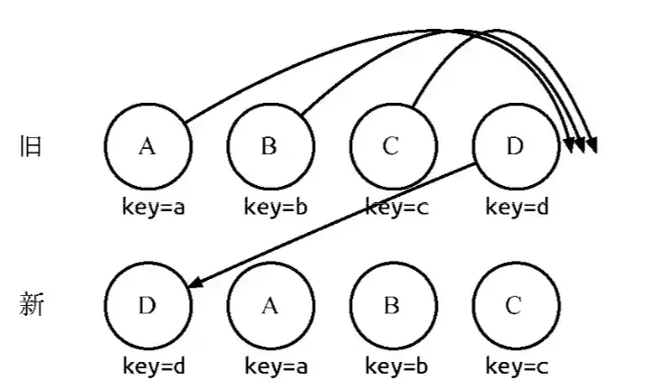

[[toc]]

## React {#react}

### React做了什么 {#what-react-does}

React是用于构建用户界面的JS框架。因此React只负责解决view层的渲染。

- virtual dom模型
- 生命周期管理
- setState机制
- diff算法
- React patch、事件系统

virtual dom 实际上是对实际dom的一个抽象，是一个js对象。react所有的表层操作实际上是在操作virtual dom。经过diff算法会计算出virtual dom的差异，然后针对这些差异进行实际的dom操作进而更新页面。

### React组件的生命周期 {#react-lifecycle}


**mount流程**

- getDefaultProps
- getInitialState
- componentWillMount
- render
- componentDidMount

**update过程**

- componentWillReceiveProps
- shouldComponentUpdate
- componentWillUpdate
- render
- componentDidUpdate

**unmount过程**

- componentWillUnmount

### diff算法 {#react-diff}

diff算法用于计算出两个virtual dom的差异，是react中开销最大的地方。

传统diff算法通过循环递归对比差异，算法复杂度为O(n^3)。

react diff算法制定了三条策略，将算法复杂度从 O(n^3)降低到O(n)。

- WebUI中DOM节点跨节点的操作特别少，可以忽略不计。
- 拥有相同类的组件会拥有相似的DOM结构。拥有不同类的组件会生成不同的DOM结构。
- 同一层级的子节点，可以根据唯一的ID来区分。

针对这三个策略，react diff实施的具体策略是:

- diff对树进行分层比较，只对比两棵树同级别的节点。跨层级移动节点，将会导致节点删除，重新插入，无法复用。
- diff对组件进行类比较，类相同的递归diff子节点，不同的直接销毁重建。diff对同一层级的子节点进行处理时，会根据key进行简要的复用。两棵树中存在相同key的节点时，只会移动节点。

另外，在对比同一层级的子节点时:

diff算法会以新树的第一个子节点作为起点遍历新树，寻找旧树中与之相同的节点。

如果节点存在，则移动位置。如果不存在，则新建一个节点。

在这过程中，维护了一个字段lastIndex，这个字段表示已遍历的所有新树子节点在旧树中最大的index。
在移动操作时，只有旧index小于lastIndex的才会移动。

这个顺序优化方案实际上是基于一个假设，大部分的列表操作应该是保证列表基本有序的。
可以推倒倒序的情况下，子节点列表diff的算法复杂度为O(n^2)




### React性能优化方案 {#react-optimize}

由于react中性能主要耗费在于update阶段的diff算法，因此性能优化也主要针对diff算法。

#### 减少diff算法触发次数 {#react-reduce-trigger}

减少diff算法触发次数实际上就是减少update流程的次数。

正常进入update流程有三种方式：

##### setState {#react-optimize-set-state}

setState机制在正常运行时，由于批更新策略，已经降低了update过程的触发次数。

因此，setState优化主要在于非批更新阶段中(timeout/Promise回调)，减少setState的触发次数。

常见的业务场景即处理接口回调时，无论数据处理多么复杂，保证最后只调用一次setState。

##### 父组件render {#react-parent-render}

父组件的render必然会触发子组件进入update阶段（无论props是否更新）。此时最常用的优化方案即为shouldComponentUpdate方法。
最常见的方式是对this.props和this.state进行浅比较来判断组件是否需要更新。或者直接使用PureComponent，原理一致。

需要注意的是，父组件的render函数如果写的不规范，将会导致上述的策略失效。

```jsx
/**
 * Bad case
 * 每次父组件触发render 将导致传入的handleClick参数都是一个全新的匿名函数引用。
 * 如果this.list 一直都是undefined，每次传入的默认值[]都是一个全新的Array。
 * hitSlop的属性值每次render都会生成一个新对象
 */
class Father extends Component {
    onClick() {}
    render() {
        return (
            <Child
                handleClick={() => this.onClick()}
                list={this.list || []}
                hitSlop={{ top: 10, left: 10}}
            />
        )
    }
}

/**
 * Good case
 * 在构造函数中绑定函数，给变量赋值
 * render中用到的常量提取成模块变量或静态成员
 */
const hitSlop = {top: 10, left: 10};
class Father extends Component {
    constructor(props) {
        super(props);
        this.onClick = this.onClick.bind(this);
        this.list = [];
    }
    onClick() {}
    render() {
        return (
            <Child
                handleClick={this.onClick}
                list={this.list}
                hitSlop={hitSlop}
            />
        )
    }
}
```

##### forceUpdate {#react-force-update}

forceUpdate方法调用后将会直接进入componentWillUpdate阶段，无法拦截，因此在实际项目中应该弃用。

##### 其他优化策略 {#react-other-optimize-strategies}

**shouldComponentUpdate**

使用shouldComponentUpdate钩子，根据具体的业务状态，减少不必要的props变化导致的渲染。如一个不用于渲染的props导致的update。

另外，也要尽量避免在`shouldComponentUpdate`中做一些比较复杂的操作，比如超大数据的pick操作等。

**合理设计state**

不需要渲染的state，尽量使用实例成员变量。

**合理设计props**

不需要渲染的props，合理使用context机制，或公共模块（比如一个单例服务）变量来替换。

#### 正确使用diff算法 {#react-correctly-diff}

- 不使用跨层级移动节点的操作（因为会导致节点无法复用）。
- 对于条件渲染多个节点时，尽量采用隐藏等方式切换节点，而不是替换节点。
- 尽量避免将后面的子节点移动到前面的操作，当节点数量较多时，会产生一定的性能问题。

### Redux {#redux}

#### 预备知识 {#why-redux}

先提出个疑问：我们为什么需要状态管理？

对于SPA应用来说，前端所需要管理的状态越来越多，需要查询、更新、传递的状态也越来越多，如果让每个组件都存储自身相关的状态，理论上来讲不会影响应用的运行，但在开发及后续维护阶段，我们将花费大量精力去查询状态的变化过程，在多组合组件通信或客户端与服务端有较多交互过程中，我们往往需要去更新、维护并监听每一个组件的状态，在这种情况下，如果有一种可以对状态做集中管理的地方是不是会更好呢？

状态管理好比是一个集中在一处的配置箱，当需要更新状态的时候，我们仅对这个黑箱进行输入，而不用去关心状态是如何分发到每一个组件内部的，这可以让开发者将精力更好的放在业务逻辑上。

但状态管理并不是必需品，当你的UI层比较简单、没有较多的交互去改变状态的场景下，使用状态管理方式反倒会让你的项目变的复杂。例如Redux的发明者Dan Abramov就说过这样一句话：

> 只有遇到React实在解决不了的问题，你才需要Redux。

一般来讲，在以下场景下你或许需要使用状态管理机制去维护应用：

- 用户操作较为繁琐，导致组件间需要有状态依赖关系，如根据多筛选条件来控制其他组件的功能。
- 客户端权限较多且有不同的使用方式，如管理层、普通层级等。
- 客户端与服务端有大量交互，例如请求信息实时性要求较高导致需要保证鲜活度。
- 前端数据缓存部分较多，如记录用户对表单的提交前操作、分页控制等。

Redux之类的状态管理库充当了一个应用的业务模型层，并不会受限于如React之类的View层。

#### 与react结合使用

#### 原理

#### 数据流向

我们先来看一下一个完整的Redux数据流是怎样的：


### setState机制 {#react-set-state}

**理想情况**

setState是“异步”的，调用setState只会提交一次state修改到队列中，不会直接修改this.state。

等到满足一定条件时，react会合并队列中的所有修改，触发一次update流程，更新this.state。

因此setState机制减少了update流程的触发次数，从而提高了性能。

由于setState会触发update过程，因此在update过程必经的生命周期中调用setState会存在循环调用的风险。

另外如果要监听state更新完成，可以使用setState方法的第二个参数，回调函数。在这个回调中读取this.state就是已经批量更新后的结果。

**特殊情况**

在实际开发中，setState的表现有时会不同于理想情况。主要是以下两种。

- 在mount流程中调用setState。
- 在setTimeout/Promise回调中调用setState。

在第一种情况下，不会进入update流程，队列在mount时合并修改并render。

在第二种情况下，setState将不会进行队列的批更新，而是直接触发一次update流程。

这是由于setState的两种更新机制导致的，只有在批量更新模式中，才会是“异步”的。

### useState的实现原理 {#react-use-state}

#### 基本用法 {#react-use-state-hook}

```jsx harmony
import React, { useState } from "react";
import ReactDOM from "react-dom";

function App() {
    const [count, setCount] = useState(0);
    return (
        <div>
            <p>count: {count}</p>
            <button
                onClick={() => setCount(count + 1)}
            >
                +1
            </button>
        </div>
    );
}

const rootElement = document.getElementById("root");
ReactDOM.render(<App />, rootElement);
```

按照React 16.8.0版本之前的机制，我们知道如果某个组件是函数组件，则这个function就相当于Class组件中的render()，不能拥有自己的状态（故又称其为无状态组件，stateless components），所以数据（输入）必须是来自父组件的props。

而在>=16.8.0中，函数组件支持通过使用Hooks来为其引入state的能力，例如上面所展示的例子：这个App组件提供了一个按钮，每次点击这个都会执行setCount使得count增加1，并更新在视图上。

#### 模拟实现 {#react-mock-use-state}

React.useState() 里都做了些什么：

1. 将初始值赋给一个变量我们称之为 state
2. 返回这个变量 state 以及改变这个 state 的回调函数我们称之为 setState
3. 当 setState() 被调用时， state 被其传入的新值重新赋值，并且更新根视图

```jsx
function useState(initialState) {
    let _state = initialState;
    const setState = (newState) => {
        _state = newState;
        ReactDOM.render(<App />, rootElement);
    };
    return [_state, setState];
}
```

4. 每次更新时，函数组件会被重新调用，也就是说useState()会被重新调用，为了使state的新值被记录（而不是一直被重新赋上initialState），需要将其提到外部作用域声明。

```jsx
let _state;
function useState(initialState) {
    _state = _state === undefined ? initialState : _state;
    const setState = (newState) => {
        _state = newState;
        ReactDOM.render(<App />, rootElement);
    };
    return [_state, setState];
}
```

通过时上面的处理，目前暂时是达到了React.useState()一样的效果。

5. 但是，如果添加多个useState()，就一定会出现BUG了。因为当前的_state只能存放一个单一变量。如果我将_state改成数组存储呢？让这个数组_state根据当前操作useState()的索引向内添加state。

```jsx
let _state = []
let _index = 0
function useState(initialState) {
    let curIndex = _index; // 记录当前操作的索引
    _state[curIndex] = _state[curIndex] === undefined
        ? initialState
        : _state[curIndex]
    const setState = (newState) => {
        _state[curIndex] = newState;
        ReactDOM.render(<App />, rootElement);
        /**
         * 每更新一次都需要将_index归零，才不会不断重复增加_state
         * 说明1：
         * useState只在每次渲染App函数的时候执行，
         * 将_index重置为0是为了下一次render App时，
         * useState重新从_index为0开始计算顺序
         * 
         * 说明2：
         * 其实也可以在最后一个useState触发后将_index归0，
         * 或者App组件函数调用完毕后归0，
         * 只是逻辑不太好写
         */
        _index = 0;
    }
    // 下一个操作的索引
    _index += 1
    return [_state[curIndex], setState];
}
```

虽然通过使用数组存储_state成功模拟了多个useState()的情况，但这要求我们保证useState()的调用顺序，所以我们不能在循环、条件或嵌套函数中调用useState()，这在React.useState()同样要求，官网还给出了专门的解释。

实际上，React并不是真的是这样实现的。上面提到的_state其实对应React的memoizedState，而_index实际上是利用了链表。
