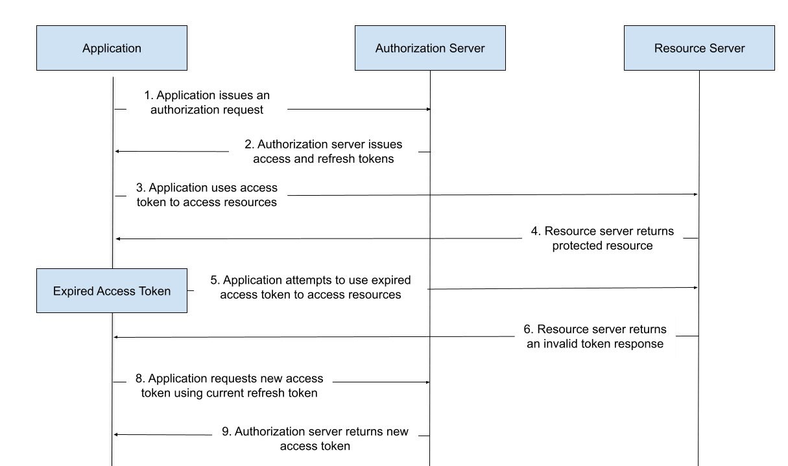

[[toc]]

## 安全 {#safety}

### CSRF：Cross-site request forgery，跨站请求伪装 {#csrf}

攻击者会在用户不知情的情况下通过用户浏览器向网站后端发起请求。攻击者可以通过XSS攻击的方式触发CSRF攻击。

比如，在一个未做好安全防范的聊天室或者论坛上，攻击者发送了一个img标签：

```html
<!-- 注意：这个img标签的src属性值并非一个真正的图片地址，而是一个请求银行网站的链接地址 -->

```

如果一个用户在访问这个渲染好的html片段之前正好访问过这个银行网站，
并且cookie信息未过期，且银行方也没有做除了cookie之外的其他校验，那么这个用户的钱就有可能被直接转走了！

通过img标签触发的都是get请求，那是不是转账这种敏感请求都用post不用get就没这个问题了呢？也不是的，因为攻击者也可以通过构造form表单或者直接注入js脚本来实现非get请求。

```html
<form action="https://bank.example.com/withdraw" method="POST">
  <input type="hidden" name="account" value="bob" />
  <input type="hidden" name="amount" value="1000000" />
  <input type="hidden" name="for" value="mallory" />
</form>
<script>
  window.addEventListener('DOMContentLoaded', () => {
      document.querySelector('form').submit();
  })
</script>
```

上面这段代码，只要是放在一个看不叫的iframe标签内部的话，触发时就不会导致页面跳转，也就不会被用户感知到。

预防措施：

- GET接口应该是幂等的。用别的比如POST接口去处理会产生变化且不以查询数据为目的的请求。POST接口应避免同时支持解析GET请求和查询字符串参数。
- 对所有可能会执行“改动操作”的非GET请求，应在请求体中携带一个可以区分不同用户的CSRF token。服务端在接收到请求后，校验token是否有效，如无效则忽视该请求。
- 这种预防措施生效的前提是假定攻击者无法获取到程序下发给用户的CSRF token。
- 每次登录都需要重新生成新的token。
- 用于敏感操作的cookie的有效期应该设置得短一点，同时响应头里的SameSite属性值应设置为Strict。在支持SameSite响应头的浏览器中，这个设置能保证跨域请求不会携带该敏感cookie，进而服务端校验请求时可以直接拦截。
- 应同时采用CSRF token和SameSite cookie。这样即便在SameSite cookie无效的情况下（比如从子域名发起的攻击请求。

### XSS：Cross-site scripting，跨站脚本攻击 {#xss}

跨站脚本攻击（XSS）是攻击者通过向网站的客户端注入恶意代码来实现的。
受害者执行这段代码之后，攻击者就可以绕过访问权限的拦截，模拟用户行为。

如果Web应用没有采用足够的校验和编码措施来进行预防的话，这些攻击就可能会得逞。
用户的浏览器无法判断这些恶意脚本是“恶意的”，所以会允许它们访问cookie、token或者其他网站敏感信息，也会允许这些代码去修改HTML内容。

当动态内容，或者来自不可信来源（通常是网络请求）的数据，在未经校验是否有恶意内容的情况下被发送给用户时，就容易出现跨站脚本攻击。

这些恶意内容通常包括JavaScript代码，有时候也包括HTML、Flash，或者其他浏览器可以执行的代码。XSS攻击有很多类型，但通常包括：
- 将cookie或者session信息等私有数据传输给攻击者；
- 将用户重定向到一个由攻击者控制的网页上；
- 伪装成站点身份在用户的机器上执行其他恶意的操作。

我们可以将跨站脚本攻击分成3类：
- 存储型跨站脚本攻击。攻击者注入的脚本会被永久存储在目标服务器上，当受害者通过浏览器向服务端请求数据时，恶意脚本被发送给了受害者。
- 反射型跨站脚本攻击。当用户被诱导去点击恶意链接、提交恶意表单、或者访问恶意网站时，恶意内容被注入到目标网站，目标网站通过错误提示、搜索结果或者其他响应形式将注入代码返回到用户浏览器。此时，用户浏览器认为这些恶意代码来自可信任的来源，就正常去执行它们了。
- DOM型跨站脚本攻击。注入脚本将原先正常客户端脚本所需的DOM环境进行了恶意修改。导致客户端代码的运行结果不在预期内。

### 前端加密的意义 {#frontend-encrypt-meanings}

**前端加密的意义不是为了防止中间人，而是提供一种隐私保护服务。**

这样即使因为使用的是http协议导致通信过程被攻击者拦截，
攻击者直接拿到的也不是用户的原始密码，而是加密字符串，这个加密字符串可以直接被用于当前网站。
但是当攻击者拿这个加密字符串去其他网站尝试使用时，只要其他网站使用的不是同一套加密逻辑，就没有用。
就是说用户在其他网站使用这个密码还是相对安全的。

攻击者如果能拿到密码明文的话，还是很危险的，前端加密一定程度上可以增加这个难度（增加了攻击者从加密字符串破解出明文密码的过程）。

### 如何安全传输密码？ {#safe-transfer-pwd}

**一般做法是使用https协议，并且对密码采用非对称加密算法（如RSA）处理后再进行传输。**

#### 使用https协议 {#use-https}

使用https协议，可以避免用户密码在网络上裸奔。http协议是明文传输的，有3大风险：

- 窃听/嗅探风险：第三方可以截获通信数据。
- 数据篡改风险：第三方获取到通信数据后，会进行恶意修改。
- 身份伪造风险：第三方可以冒充他人身份参与通信。

https原理是什么呢？为什么它能解决http的三大风险呢？

> https = http + SSL/TLS, SSL/TLS 是传输层加密协议，
它提供内容加密、身份认证、数据完整性校验，
以解决数据传输的安全性问题。

一次完整的https请求流程如下：


1. 客户端发起https请求
2. 服务器必须要有一套数字证书，可以自己制作，也可以向权威机构申请。这套证书其实就是一对公私钥。
3. 服务器将自己的数字证书（含有公钥、证书的颁发机构等）发送给客户端。
4. 客户端收到服务器端的数字证书之后，会对其进行验证，主要验证公钥是否有效，比如颁发机构，过期时间等等。如果不通过，则弹出警告框。如果证书没问题，则生成一个密钥（对称加密算法的密钥，其实是一个随机值），并且用证书的公钥对这个随机值加密。
5. 客户端会发起https中的第二个请求，将加密之后的客户端密钥(随机值)发送给服务器。
6. 服务器接收到客户端发来的密钥之后，会用自己的私钥对其进行非对称解密，解密之后得到客户端密钥，然后用客户端密钥对返回数据进行对称加密，这样数据就变成了密文。
7. 服务器将加密后的密文返回给客户端。
8. 客户端收到服务器发返回的密文，用自己的密钥（客户端密钥）对其进行对称解密，得到服务器返回的数据。

https的数据传输过程，数据都是密文的。
但是，即时使用了https协议传输密码信息，也不一定就安全了。
比如，https完全就是建立在证书可信的基础上的。
如果遇到中间人伪造证书，一旦客户端通过验证，安全性就没了。
通过伪造证书，https也是可能被抓包的。

#### 加密算法 {#encryption}

如上所述，即使用了https协议传输用户密码，只要用户信任了伪造证书，也还是会有安全隐患的。所以，对于密码，传输前还是需要先进行加密的。

加密算法有对称加密和非对称加密两种。

##### 对称加密算法 {#symmetrical-encryption}

加密和解密使用“相同密钥”的加密算法。
**使用对称加密算法时，需要考虑如何将密钥给到客户端的问题，如果还是通过网络传输的方式，如果密钥在传输过程中被中间人拿到的话，还是有风险的。**


常见的对称加密算法有：

- DES：基于使用56位密钥的对称算法。
- 3DES：每个数据块应用三次数据加密标准（DES）算法。
- AES：密码学中的高级加密标准。
- RC5：一种因简洁著称的对称分组加密算法。
- RC6：基于RC5设计的，以更好地符合AES的要求。

##### 非对称加密算法 {#asymmetrical-encryption}

非对称加密算法需要2个密钥（公钥和私钥）。公钥和私钥是成对存在的，用公钥对数据进行加密，用对应的私钥才能解密。
**使用费对称加密算法时，也需要考虑如何将密钥、公钥给到客户端的问题，
如果公钥在网络传输过程中被中间人拿到的话，中间人可以伪造公钥，把伪造的公钥给客户端，然后用自己的私钥解密从客户端过来的加密数据。**


常见的非对称加密算法有：

- RSA：基于因子分解。
- Elgamal：基于离散对数。
- DSA：Digital Signature Algorithm，数字签名算法。
- D-H：（Diffie-Hellman）密钥交换算法。
- ECC：（Elliptical Curve Cryptography）——椭圆曲线加密。

### 如何安全存储密码？ {#safe-store-pwd}

密码安全送达服务端后，一定不能明文存储密码到数据库。可以先用**哈希摘要算法**加密密码，然后再保存到数据库。

> 哈希摘要算法：只能从明文生成一个对应的哈希值，不能反过来根据哈希值得到对应的明文。

#### MD5加密

MD5是一种非常经典的哈希摘要算法，被广泛应用于数据完整性校验、数据摘要、数据加密等。

**直接MD5加密**

对原始密码直接进行MD5加密的话是很不安全的。因为攻击者用彩虹表可以很容易破解出密码。
如果把所有20位以内的数字和字母组合的密码全部计算其MD5哈希值，并把密码和对应哈希值存到一个超大数据库里，就是一个彩虹表了。

提醒：网络上已经有很多MD5免费破解网站了，可以自己随便试。

**优化方案：密码加盐后再进行MD5加密**

先对字段进行加盐处理，再进行MD5加密，即MD5(password + salt)。只要salt够长，是没有办法通过彩虹表反查的。

> 在密码学中，通过在密码任意固定位置插入特定的字符串，让散列后的结果和使用原始密码的散列结果不相符，这个过程称为“加盐”。

::: warning 加盐有几个注意事项
- 不能再代码中写死盐，且盐需要有一定的长度（盐写死太简单的话，攻击者可能注册几个账号反推出来）。
- 每个密码都有独立的盐，并且盐要长一点，比如超过20位。（如果盐和原始密码都太短的话，容易被破解）。
- 盐最好是随机的值，并且是全球唯一的，这样就不可能有现成的彩虹表可以用于破解。
  :::

#### BCrypt

即使MD5加密前加了盐，密码仍有可能被暴力破解。可以采取更**慢一点**的算法，增加攻击者破解密码所需的成本，迫使攻击者放弃攻击。

为了应对暴力破解，我们需要非常耗时而非高效的哈希算法。
BCrypt算法的特点是可以通过参数设置重复计算的次数，重复计算的次数越多耗时越长。
如果计算一个哈希值需要耗时1秒以上，破解一个6位纯数字密码就需要耗时11.5天以上，更不要说高安全级别的密码了。暴力破解密码的可能性就很低了。

> 实际上，Spring Security 已经废弃了MessageDigestPasswordEncoder，推荐使用BCryptPasswordEncoder，也就是BCrypt来进行密码哈希。

#### 如何应对暴力破解

感知到暴力破解危害时，应开启短信验证、图形验证码、账号暂时锁定等防御机制来进行抵御。

如何明确是暴力破解的话，可以采取封IP等措施。


### refresh token 和 access token {#refresh-token-access-token}

本文参考了以下文章：

- [What Are Refresh Tokens and How Can They Boost Your Security?](https://stateful.com/blog/refresh-tokens-security)

access token 是用来临时授权用户访问受保护的资源或执行特定操作用的，通常有效期较短（分钟级），以减少 token 被泄露带来的风险（攻击者可用于 access token 获取保密资源的时间越少越好）。refresh token 则是用于在 access token 过期后获取新的 access token 用的，从而减少用户因为 access token 过期而总是需要重复登录的问题。



**refresh token 的一些最佳实践**

1、轮转 refresh token （RTR，Refresh token rotation）

RTR 通过降低 refresh token 的有效期来提高了安全性。Refresh token rotation 的意思是，每次使用 refresh token 去获取 access token 时，服务端就让旧的 refresh token 失效，并返回给前端一个新的 refresh token。基本上可以认为，在该方案下，每个 refresh token 只能使用一次。这样，当攻击者获取到 refresh token 后，该 refresh token 失效的可能性将大大增加。

2、监测 refresh token 的复用

除了轮转 refresh token，还应该监测 refresh token 的复用。如果授权服务器发现有请求尝试使用一个已经用过的、无效了的 refresh token 去获取新 access token 的行为的话，授权服务器应让相关的 token 全部失效，包括所有已经下发给用户的 access token 和最近下发的 refresh token。

3、安全地存储 refresh token

4、设置合理的过期时间

度量过期时间时，其起始时间除了用下发 token 的时间，也可以用 token 最后一次被使用的时间。

5、监控 refresh token 的异常使用情况

在一个应用中，服务端解析 access token 的场景要比解析 refresh token 的场景多得多，我们可以在 access token 中仅包好较少的用户信息，而在 refresh token 中包含较多的信息（比如用户 ip 地址），然后在 refresh token 刷 access token 的请求中，对用户 ip 地址是否有变动等进行检查。
